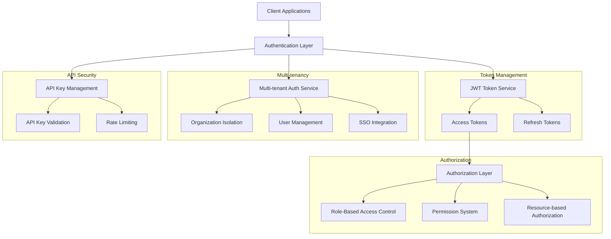
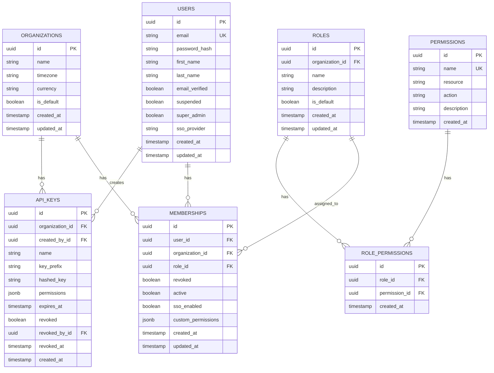

# Authentication & Authorization Technical Architecture

## 1. Architecture Design



## 2. Technology Stack

- **Authentication**: JWT tokens with RS256 signing
- **Multi-tenancy**: Organization-based isolation with tenant-aware queries
- **Authorization**: Role-based access control (RBAC) with permissions
- **SSO Integration**: SAML 2.0, OAuth 2.0, OpenID Connect
- **API Security**: API key management with HMAC signatures
- **Session Management**: Redis-backed session store with TTL
- **Password Security**: bcrypt with salt, password complexity validation

## 3. JWT Token Implementation

### 3.1 Token Service

```ruby
# app/services/auth/jwt_token_service.rb
module Auth
  class JwtTokenService
    ALGORITHM = 'RS256'
    ACCESS_TOKEN_EXPIRY = 15.minutes
    REFRESH_TOKEN_EXPIRY = 7.days
    
    def initialize
      @private_key = OpenSSL::PKey::RSA.new(ENV['JWT_PRIVATE_KEY'])
      @public_key = OpenSSL::PKey::RSA.new(ENV['JWT_PUBLIC_KEY'])
    end
    
    def generate_access_token(user, organization = nil)
      payload = build_access_token_payload(user, organization)
      
      JWT.encode(payload, @private_key, ALGORITHM)
    end
    
    def generate_refresh_token(user)
      payload = {
        user_id: user.id,
        token_type: 'refresh',
        jti: SecureRandom.uuid, # JWT ID for revocation
        exp: REFRESH_TOKEN_EXPIRY.from_now.to_i,
        iat: Time.current.to_i
      }
      
      token = JWT.encode(payload, @private_key, ALGORITHM)
      
      # Store refresh token for revocation
      store_refresh_token(user, payload[:jti])
      
      token
    end
    
    def generate_api_key_token(api_key, organization)
      payload = {
        api_key_id: api_key.id,
        organization_id: organization.id,
        permissions: api_key.permissions,
        token_type: 'api_key',
        exp: 1.hour.from_now.to_i,
        iat: Time.current.to_i
      }
      
      JWT.encode(payload, @private_key, ALGORITHM)
    end
    
    def decode_token(token)
      JWT.decode(token, @public_key, true, algorithm: ALGORITHM)
    rescue JWT::DecodeError => e
      raise TokenError.new("Invalid token: #{e.message}")
    end
    
    def validate_access_token(token)
      payload, header = decode_token(token)
      
      validate_token_type(payload, 'access')
      validate_expiration(payload)
      validate_user_status(payload)
      validate_organization_access(payload)
      
      payload
    end
    
    def validate_refresh_token(token)
      payload, header = decode_token(token)
      
      validate_token_type(payload, 'refresh')
      validate_expiration(payload)
      validate_refresh_token_revocation(payload)
      
      payload
    end
    
    def revoke_refresh_token(user, jti)
      Redis.current.del(refresh_token_key(user, jti))
    end
    
    def revoke_all_user_tokens(user)
      pattern = "refresh_tokens:#{user.id}:*"
      Redis.current.scan_each(match: pattern) do |key|
        Redis.current.del(key)
      end
    end
    
    private
    
    def build_access_token_payload(user, organization)
      payload = {
        user_id: user.id,
        email: user.email,
        token_type: 'access',
        jti: SecureRandom.uuid,
        exp: ACCESS_TOKEN_EXPIRY.from_now.to_i,
        iat: Time.current.to_i,
        permissions: user.permissions,
        roles: user.roles.map(&:name)
      }
      
      if organization
        payload[:organization_id] = organization.id
        payload[:organization_name] = organization.name
        payload[:organization_role] = user.organization_role(organization)
      end
      
      payload
    end
    
    def store_refresh_token(user, jti)
      key = refresh_token_key(user, jti)
      Redis.current.setex(key, REFRESH_TOKEN_EXPIRY, 'active')
    end
    
    def refresh_token_key(user, jti)
      "refresh_tokens:#{user.id}:#{jti}"
    end
    
    def validate_token_type(payload, expected_type)
      unless payload['token_type'] == expected_type
        raise TokenError.new("Invalid token type. Expected #{expected_type}")
      end
    end
    
    def validate_expiration(payload)
      exp = payload['exp']
      
      if exp.nil? || Time.at(exp) < Time.current
        raise TokenError.new('Token has expired')
      end
    end
    
    def validate_user_status(payload)
      user = User.find_by(id: payload['user_id'])
      
      if user.nil? || !user.active?
        raise TokenError.new('User account is invalid or inactive')
      end
      
      if user.suspended?
        raise TokenError.new('User account is suspended')
      end
    end
    
    def validate_organization_access(payload)
      organization_id = payload['organization_id']
      return unless organization_id
      
      user = User.find_by(id: payload['user_id'])
      organization = Organization.find_by(id: organization_id)
      
      if organization.nil?
        raise TokenError.new('Organization not found')
      end
      
      unless user.organizations.include?(organization)
        raise TokenError.new('User does not have access to organization')
      end
      
      membership = user.memberships.find_by(organization: organization)
      if membership.nil? || membership.revoked?
        raise TokenError.new('Organization access has been revoked')
      end
    end
    
    def validate_refresh_token_revocation(payload)
      jti = payload['jti']
      user_id = payload['user_id']
      
      key = "refresh_tokens:#{user_id}:#{jti}"
      
      unless Redis.current.exists?(key)
        raise TokenError.new('Refresh token has been revoked')
      end
    end
  end
  
  class TokenError < StandardError; end
end
```

### 3.2 Token Middleware

```ruby
# app/middleware/jwt_authentication.rb
class JwtAuthentication
  def initialize(app)
    @app = app
  end
  
  def call(env)
    request = ActionDispatch::Request.new(env)
    
    # Skip authentication for public endpoints
    return @app.call(env) if public_path?(request.path)
    
    # Check for API key authentication
    if api_key_request?(request)
      authenticate_api_key(request)
    else
      authenticate_jwt_token(request)
    end
    
    @app.call(env)
  rescue Auth::JwtTokenService::TokenError => e
    unauthorized_response(e.message)
  rescue Auth::ApiKeyService::ApiKeyError => e
    unauthorized_response(e.message)
  end
  
  private
  
  def public_path?(path)
    public_paths = [
      '/health',
      '/api-docs',
      '/auth/login',
      '/auth/refresh',
      '/auth/password-reset'
    ]
    
    public_paths.any? { |public_path| path.start_with?(public_path) }
  end
  
  def api_key_request?(request)
    request.headers['X-API-Key'].present? || 
    request.headers['Authorization']&.start_with?('Bearer api_key_')
  end
  
  def authenticate_api_key(request)
    api_key_service = Auth::ApiKeyService.new
    
    if request.headers['X-API-Key'].present?
      api_key = request.headers['X-API-Key']
      token = api_key_service.validate_api_key_token(api_key)
    else
      bearer_token = request.headers['Authorization']&.gsub('Bearer ', '')
      token = api_key_service.validate_api_key_token(bearer_token)
    end
    
    set_current_user_from_api_key(request, token)
  end
  
  def authenticate_jwt_token(request)
    token_service = Auth::JwtTokenService.new
    
    bearer_token = request.headers['Authorization']&.gsub('Bearer ', '')
    
    if bearer_token.blank?
      raise Auth::JwtTokenService::TokenError.new('Missing authorization token')
    end
    
    payload = token_service.validate_access_token(bearer_token)
    
    set_current_user(request, payload)
  end
  
  def set_current_user(request, payload)
    user = User.find_by(id: payload['user_id'])
    
    if user.nil?
      raise Auth::JwtTokenService::TokenError.new('User not found')
    end
    
    request.env['current_user'] = user
    request.env['current_user_payload'] = payload
    
    # Set current organization if present
    if payload['organization_id']
      organization = Organization.find_by(id: payload['organization_id'])
      request.env['current_organization'] = organization if organization
    end
  end
  
  def set_current_user_from_api_key(request, payload)
    api_key = ApiKey.find_by(id: payload['api_key_id'])
    
    if api_key.nil? || !api_key.active?
      raise Auth::ApiKeyService::ApiKeyError.new('Invalid API key')
    end
    
    request.env['current_api_key'] = api_key
    request.env['current_organization'] = api_key.organization
    request.env['api_permissions'] = payload['permissions']
  end
  
  def unauthorized_response(message)
    [
      401,
      { 'Content-Type' => 'application/json' },
      [{ error: 'Unauthorized', message: message }.to_json]
    ]
  end
end
```

## 4. Multi-tenant Authentication

### 4.1 Organization-based Authorization

```ruby
# app/services/auth/organization_authorization.rb
module Auth
  class OrganizationAuthorization
    def initialize(user, organization = nil)
      @user = user
      @organization = organization
    end
    
    def can_access_organization?(organization)
      return false unless @user.active?
      
      membership = @user.memberships.find_by(organization: organization)
      
      membership.present? && !membership.revoked? && membership.active?
    end
    
    def can_perform_action?(action, resource = nil)
      return false unless @user.active?
      
      if @organization
        return false unless can_access_organization?(@organization)
        
        # Check organization-specific permissions
        organization_permission = @user.organization_permission(@organization, action)
        return organization_permission if organization_permission.present?
      end
      
      # Check global user permissions
      @user.has_permission?(action)
    end
    
    def accessible_organizations
      @user.organizations.where(memberships: { revoked: false, active: true })
    end
    
    def organization_role
      return nil unless @organization
      
      membership = @user.memberships.find_by(organization: @organization)
      membership&.role
    end
    
    def organization_permissions
      return [] unless @organization
      
      membership = @user.memberships.find_by(organization: @organization)
      return [] unless membership
      
      role_permissions = membership.role&.permissions || []
      custom_permissions = membership.custom_permissions || []
      
      role_permissions + custom_permissions
    end
    
    def can_manage_organization?(organization)
      return false unless can_access_organization?(organization)
      
      membership = @user.memberships.find_by(organization: organization)
      
      membership&.role&.name == 'admin' || 
      membership&.permissions&.include?('organization.manage')
    end
    
    def can_manage_billing?(organization)
      return false unless can_access_organization?(organization)
      
      membership = @user.memberships.find_by(organization: organization)
      
      membership&.permissions&.include?('billing.manage') ||
      membership&.role&.permissions&.include?('billing.manage')
    end
    
    def scoped_query(query, resource_class)
      case resource_class.name
      when 'Organization'
        query.where(id: accessible_organizations.pluck(:id))
      when 'Customer'
        if @organization
          query.where(organization: @organization)
        else
          query.where(organization: accessible_organizations)
        end
      when 'Invoice'
        if @organization
          query.joins(:customer).where(customers: { organization: @organization })
        else
          query.joins(customer: :organization)
               .where(customers: { organizations: accessible_organizations })
        end
      else
        query
      end
    end
  end
end
```

### 4.2 Tenant-aware Database Queries

```ruby
# app/models/concerns/tenant_scoped.rb
module TenantScoped
  extend ActiveSupport::Concern
  
  included do
    # Add default scope for organization isolation
    default_scope -> { where(organization_id: Current.organization_id) if Current.organization_id }
    
    # Validate organization presence
    validates :organization_id, presence: true
    
    # Add organization associations
    belongs_to :organization
  end
  
  class_methods do
    def accessible_by(user)
      if user.super_admin?
        all
      else
        accessible_organizations = user.organizations.pluck(:id)
        where(organization_id: accessible_organizations)
      end
    end
    
    def in_organization(organization)
      where(organization_id: organization.id)
    end
  end
  
  def accessible_by?(user)
    return true if user.super_admin?
    
    user.organizations.include?(organization)
  end
end

# app/models/current.rb
class Current < ActiveSupport::Current
  attribute :user
  attribute :organization
  attribute :api_key
  
  def organization_id
    organization&.id
  end
  
  def user_id
    user&.id
  end
end

# app/controllers/application_controller.rb
class ApplicationController < ActionController::API
  before_action :set_current_organization
  
  private
  
  def set_current_organization
    if request.env['current_organization']
      Current.organization = request.env['current_organization']
    elsif request.env['current_user']
      # Set default organization for user
      Current.user = request.env['current_user']
      Current.organization = Current.user.default_organization
    end
  end
end
```

## 5. Role-Based Access Control (RBAC)

### 5.1 Permission System

```ruby
# app/models/permission.rb
class Permission < ApplicationRecord
  has_many :role_permissions
  has_many :roles, through: :role_permissions
  
  validates :name, presence: true, uniqueness: true
  validates :resource, presence: true
  validates :action, presence: true
  
  scope :for_resource, ->(resource) { where(resource: resource) }
  scope :for_action, ->(action) { where(action: action) }
  
  def self.seed_permissions
    permissions = [
      # Organization permissions
      { name: 'organization.view', resource: 'organization', action: 'view' },
      { name: 'organization.manage', resource: 'organization', action: 'manage' },
      { name: 'organization.delete', resource: 'organization', action: 'delete' },
      
      # Customer permissions
      { name: 'customer.view', resource: 'customer', action: 'view' },
      { name: 'customer.create', resource: 'customer', action: 'create' },
      { name: 'customer.update', resource: 'customer', action: 'update' },
      { name: 'customer.delete', resource: 'customer', action: 'delete' },
      
      # Subscription permissions
      { name: 'subscription.view', resource: 'subscription', action: 'view' },
      { name: 'subscription.create', resource: 'subscription', action: 'create' },
      { name: 'subscription.update', resource: 'subscription', action: 'update' },
      { name: 'subscription.cancel', resource: 'subscription', action: 'cancel' },
      
      # Invoice permissions
      { name: 'invoice.view', resource: 'invoice', action: 'view' },
      { name: 'invoice.create', resource: 'invoice', action: 'create' },
      { name: 'invoice.update', resource: 'invoice', action: 'update' },
      { name: 'invoice.delete', resource: 'invoice', action: 'delete' },
      
      # Payment permissions
      { name: 'payment.view', resource: 'payment', action: 'view' },
      { name: 'payment.refund', resource: 'payment', action: 'refund' },
      
      # Analytics permissions
      { name: 'analytics.view', resource: 'analytics', action: 'view' },
      { name: 'analytics.export', resource: 'analytics', action: 'export' },
      
      # Integration permissions
      { name: 'integration.view', resource: 'integration', action: 'view' },
      { name: 'integration.manage', resource: 'integration', action: 'manage' },
      
      # User management permissions
      { name: 'user.view', resource: 'user', action: 'view' },
      { name: 'user.invite', resource: 'user', action: 'invite' },
      { name: 'user.update', resource: 'user', action: 'update' },
      { name: 'user.remove', resource: 'user', action: 'remove' }
    ]
    
    permissions.each do |permission_attrs|
      Permission.find_or_create_by(permission_attrs)
    end
  end
end

# app/models/role.rb
class Role < ApplicationRecord
  include TenantScoped
  
  has_many :role_permissions
  has_many :permissions, through: :role_permissions
  has_many :memberships
  has_many :users, through: :memberships
  
  validates :name, presence: true, uniqueness: { scope: :organization_id }
  validates :organization_id, presence: true
  
  scope :default, -> { where(is_default: true) }
  scope :custom, -> { where(is_default: false) }
  
  def self.seed_roles(organization)
    roles = [
      {
        name: 'admin',
        description: 'Full access to all organization resources',
        is_default: true,
        permissions: Permission.all
      },
      {
        name: 'billing_manager',
        description: 'Manage billing and invoicing',
        is_default: true,
        permissions: Permission.where(resource: ['invoice', 'payment', 'customer'])
      },
      {
        name: 'customer_support',
        description: 'View and manage customer information',
        is_default: true,
        permissions: Permission.where(resource: ['customer', 'subscription']).where.not(action: 'delete')
      },
      {
        name: 'viewer',
        description: 'Read-only access to organization data',
        is_default: true,
        permissions: Permission.where(action: 'view')
      }
    ]
    
    roles.each do |role_attrs|
      permissions = role_attrs.delete(:permissions)
      role = organization.roles.find_or_create_by(role_attrs)
      role.permissions = permissions
      role.save!
    end
  end
  
  def has_permission?(permission_name)
    permissions.exists?(name: permission_name)
  end
  
  def add_permission(permission)
    permissions << permission unless permissions.include?(permission)
  end
  
  def remove_permission(permission)
    permissions.delete(permission)
  end
end
```

### 5.2 Authorization Service

```ruby
# app/services/auth/authorization_service.rb
module Auth
  class AuthorizationService
    def initialize(user, organization = nil)
      @user = user
      @organization = organization
    end
    
    def authorize!(action, resource)
      unless can?(action, resource)
        raise AuthorizationError.new("Not authorized to #{action} #{resource.class.name}")
      end
      
      true
    end
    
    def can?(action, resource)
      return false unless @user.active?
      
      # Super admin can do everything
      return true if @user.super_admin?
      
      # Check organization access if resource is organization-scoped
      if resource.respond_to?(:organization_id)
        return false unless can_access_organization?(resource.organization)
      end
      
      # Check specific resource permissions
      check_resource_permission(action, resource)
    end
    
    def accessible_customers
      return Customer.all if @user.super_admin?
      
      if @organization
        Customer.in_organization(@organization)
      else
        Customer.where(organization: accessible_organizations)
      end
    end
    
    def accessible_invoices
      return Invoice.all if @user.super_admin?
      
      if @organization
        Invoice.joins(:customer).where(customers: { organization: @organization })
      else
        Invoice.joins(customer: :organization)
               .where(customers: { organizations: accessible_organizations })
      end
    end
    
    private
    
    def check_resource_permission(action, resource)
      case resource
      when Organization
        check_organization_permission(action, resource)
      when Customer
        check_customer_permission(action, resource)
      when Subscription
        check_subscription_permission(action, resource)
      when Invoice
        check_invoice_permission(action, resource)
      when Payment
        check_payment_permission(action, resource)
      else
        # Generic permission check
        has_permission?("#{resource.class.name.downcase}.#{action}")
      end
    end
    
    def check_organization_permission(action, organization)
      membership = @user.memberships.find_by(organization: organization)
      return false unless membership
      
      case action
      when :view
        true # Any organization member can view their organization
      when :manage, :update
        membership.role.permissions.exists?(name: 'organization.manage')
      when :delete
        membership.role.permissions.exists?(name: 'organization.delete')
      else
        false
      end
    end
    
    def check_customer_permission(action, customer)
      return false unless can_access_organization?(customer.organization)
      
      case action
      when :view
        has_permission?('customer.view')
      when :create
        has_permission?('customer.create')
      when :update
        has_permission?('customer.update')
      when :delete
        has_permission?('customer.delete')
      else
        false
      end
    end
    
    def check_subscription_permission(action, subscription)
      return false unless can_access_organization?(subscription.customer.organization)
      
      case action
      when :view
        has_permission?('subscription.view')
      when :create
        has_permission?('subscription.create')
      when :update
        has_permission?('subscription.update')
      when :cancel
        has_permission?('subscription.cancel')
      else
        false
      end
    end
    
    def check_invoice_permission(action, invoice)
      return false unless can_access_organization?(invoice.customer.organization)
      
      case action
      when :view
        has_permission?('invoice.view')
      when :create
        has_permission?('invoice.create')
      when :update
        has_permission?('invoice.update')
      when :delete
        has_permission?('invoice.delete')
      else
        false
      end
    end
    
    def check_payment_permission(action, payment)
      return false unless can_access_organization?(payment.customer.organization)
      
      case action
      when :view
        has_permission?('payment.view')
      when :refund
        has_permission?('payment.refund')
      else
        false
      end
    end
    
    def has_permission?(permission_name)
      return false unless @organization
      
      membership = @user.memberships.find_by(organization: @organization)
      return false unless membership
      
      membership.role.has_permission?(permission_name) ||
      membership.custom_permissions.include?(permission_name)
    end
    
    def can_access_organization?(organization)
      return true if @user.super_admin?
      
      membership = @user.memberships.find_by(organization: organization)
      membership.present? && !membership.revoked? && membership.active?
    end
    
    def accessible_organizations
      @user.organizations.where(memberships: { revoked: false, active: true })
    end
  end
  
  class AuthorizationError < StandardError; end
end
```

## 6. API Key Management

### 6.1 API Key Service

```ruby
# app/services/auth/api_key_service.rb
module Auth
  class ApiKeyService
    def initialize
      @jwt_service = JwtTokenService.new
    end
    
    def create_api_key(organization, name, permissions = [], expires_at = nil)
      api_key = organization.api_keys.create!(
        name: name,
        permissions: permissions,
        expires_at: expires_at,
        key_prefix: generate_key_prefix,
        hashed_key: generate_hashed_key
      )
      
      # Generate the actual API key (only shown once)
      full_key = "#{api_key.key_prefix}.#{generate_random_key}"
      
      # Store hash of the key
      api_key.update!(hashed_key: hash_key(full_key))
      
      {
        api_key: api_key,
        full_key: full_key
      }
    end
    
    def validate_api_key_token(token)
      payload = @jwt_service.decode_token(token)
      
      validate_api_key_payload(payload)
      validate_api_key_status(payload)
      validate_api_key_permissions(payload)
      
      payload
    rescue JWT::DecodeError => e
      raise ApiKeyError.new("Invalid API key token: #{e.message}")
    end
    
    def validate_api_key_header(header_key)
      api_key = find_api_key_by_header(header_key)
      
      if api_key.nil?
        raise ApiKeyError.new('Invalid API key')
      end
      
      if api_key.expired?
        raise ApiKeyError.new('API key has expired')
      end
      
      if api_key.revoked?
        raise ApiKeyError.new('API key has been revoked')
      end
      
      # Track usage
      track_api_key_usage(api_key)
      
      api_key
    end
    
    def revoke_api_key(api_key)
      api_key.update!(
        revoked: true,
        revoked_at: Time.current,
        revoked_by: Current.user
      )
      
      # Revoke any active JWT tokens
      revoke_api_key_tokens(api_key)
    end
    
    def rotate_api_key(api_key)
      # Generate new key
      new_full_key = "#{api_key.key_prefix}.#{generate_random_key}"
      
      # Update with new hash
      api_key.update!(
        hashed_key: hash_key(new_full_key),
        last_rotated_at: Time.current
      )
      
      {
        api_key: api_key,
        new_key: new_full_key
      }
    end
    
    private
    
    def generate_key_prefix
      "lago_#{SecureRandom.alphanumeric(8)}".downcase
    end
    
    def generate_random_key
      SecureRandom.base64(32).tr('+/=', 'xyz').gsub(/[^a-zA-Z0-9]/, '')[0..31]
    end
    
    def hash_key(key)
      Digest::SHA256.hexdigest(key)
    end
    
    def find_api_key_by_header(header_key)
      prefix = header_key.split('.').first
      
      api_key = ApiKey.find_by(key_prefix: prefix, revoked: false)
      return nil unless api_key
      
      # Verify the full key
      if api_key.hashed_key == hash_key(header_key)
        api_key
      else
        nil
      end
    end
    
    def validate_api_key_payload(payload)
      required_fields = ['api_key_id', 'organization_id', 'token_type']
      
      missing_fields = required_fields - payload.keys
      
      if missing_fields.any?
        raise ApiKeyError.new("Missing required fields: #{missing_fields.join(', ')}")
      end
      
      if payload['token_type'] != 'api_key'
        raise ApiKeyError.new('Invalid token type for API key')
      end
    end
    
    def validate_api_key_status(payload)
      api_key = ApiKey.find_by(id: payload['api_key_id'])
      
      if api_key.nil?
        raise ApiKeyError.new('API key not found')
      end
      
      if api_key.expired?
        raise ApiKeyError.new('API key has expired')
      end
      
      if api_key.revoked?
        raise ApiKeyError.new('API key has been revoked')
      end
    end
    
    def validate_api_key_permissions(payload)
      permissions = payload['permissions'] || []
      
      if permissions.empty?
        raise ApiKeyError.new('API key has no permissions')
      end
      
      # Validate permissions against current organization
      organization = Organization.find_by(id: payload['organization_id'])
      
      if organization.nil?
        raise ApiKeyError.new('Organization not found')
      end
      
      # Additional validation can be added here
    end
    
    def track_api_key_usage(api_key)
      Redis.current.multi do |transaction|
        # Increment usage counter
        transaction.incr("api_key_usage:#{api_key.id}:#{Date.current}")
        
        # Set expiration for daily counters
        transaction.expire("api_key_usage:#{api_key.id}:#{Date.current}", 86400 * 30)
        
        # Track last used
        transaction.set("api_key_last_used:#{api_key.id}", Time.current.to_i)
      end
    end
    
    def revoke_api_key_tokens(api_key)
      # Revoke all JWT tokens for this API key
      pattern = "api_key_tokens:#{api_key.id}:*"
      
      Redis.current.scan_each(match: pattern) do |key|
        Redis.current.del(key)
      end
    end
  end
  
  class ApiKeyError < StandardError; end
end
```

### 6.2 API Key Model

```ruby
# app/models/api_key.rb
class ApiKey < ApplicationRecord
  include TenantScoped
  
  belongs_to :created_by, class_name: 'User', optional: true
  belongs_to :revoked_by, class_name: 'User', optional: true
  
  validates :name, presence: true
  validates :key_prefix, presence: true, uniqueness: true
  validates :hashed_key, presence: true
  validates :permissions, presence: true
  
  serialize :permissions, Array
  
  scope :active, -> { where(revoked: false).where('expires_at IS NULL OR expires_at > ?', Time.current) }
  scope :expired, -> { where('expires_at IS NOT NULL AND expires_at <= ?', Time.current) }
  scope :revoked, -> { where(revoked: true) }
  
  def active?
    !revoked? && !expired?
  end
  
  def expired?
    expires_at.present? && expires_at <= Time.current
  end
  
  def usage_stats
    {
      total_usage: get_total_usage,
      daily_usage: get_daily_usage,
      last_used_at: get_last_used_at
    }
  end
  
  def rotate
    service = Auth::ApiKeyService.new
    service.rotate_api_key(self)
  end
  
  def revoke(revoked_by_user = nil)
    service = Auth::ApiKeyService.new
    service.revoke_api_key(self)
    
    update!(revoked_by: revoked_by_user) if revoked_by_user
  end
  
  private
  
  def get_total_usage
    keys = Redis.current.keys("api_key_usage:#{id}:*")
    Redis.current.mget(*keys).map(&:to_i).sum
  end
  
  def get_daily_usage
    Redis.current.get("api_key_usage:#{id}:#{Date.current}").to_i
  end
  
  def get_last_used_at
    timestamp = Redis.current.get("api_key_last_used:#{id}")
    Time.at(timestamp.to_i) if timestamp
  end
end
```

## 7. SSO Integration

### 7.1 SAML Integration

```ruby
# app/services/auth/saml_service.rb
module Auth
  class SamlService
    def initialize(organization)
      @organization = organization
      @settings = build_saml_settings
    end
    
    def create_auth_request
      auth_request = OneLogin::RubySaml::Authrequest.new
      auth_request.create(@settings)
    end
    
    def process_auth_response(saml_response)
      response = OneLogin::RubySaml::Response.new(saml_response)
      
      unless response.is_valid?
        raise SamlError.new("Invalid SAML response: #{response.errors.join(', ')}")
      end
      
      # Extract user attributes
      user_attributes = extract_user_attributes(response)
      
      # Find or create user
      user = find_or_create_user_from_saml(user_attributes)
      
      # Create organization membership if needed
      create_organization_membership(user) unless user.organizations.include?(@organization)
      
      user
    end
    
    def create_logout_request(user)
      logout_request = OneLogin::RubySaml::Logoutrequest.new
      logout_request.create(@settings, { name_id: user.email })
    end
    
    def process_logout_response(logout_response)
      logout_response = OneLogin::RubySaml::Logoutresponse.new(logout_response, @settings)
      
      unless logout_response.success?
        raise SamlError.new("SAML logout failed: #{logout_response.errors.join(', ')}")
      end
      
      logout_response.success?
    end
    
    def metadata
      metadata = OneLogin::RubySaml::Metadata.new
      metadata.generate(@settings)
    end
    
    private
    
    def build_saml_settings
      settings = OneLogin::RubySaml::Settings.new
      
      settings.assertion_consumer_service_url = "#{ENV['APP_URL']}/auth/saml/acs"
      settings.sp_entity_id = "#{ENV['APP_URL']}/auth/saml/metadata"
      settings.name_identifier_format = "urn:oasis:names:tc:SAML:1.1:nameid-format:emailAddress"
      
      # IdP settings
      settings.idp_entity_id = @organization.saml_entity_id
      settings.idp_sso_target_url = @organization.saml_sso_url
      settings.idp_slo_target_url = @organization.saml_slo_url
      settings.idp_cert = @organization.saml_certificate
      settings.idp_cert_fingerprint = @organization.saml_cert_fingerprint
      
      # Security settings
      settings.security[:authn_requests_signed] = true
      settings.security[:logout_requests_signed] = true
      settings.security[:logout_responses_signed] = true
      settings.security[:want_assertions_signed] = true
      settings.security[:want_assertions_encrypted] = true
      settings.security[:want_name_id] = true
      settings.security[:metadata_signed] = true
      settings.security[:digest_method] = XMLSecurity::Document::SHA256
      settings.security[:signature_method] = XMLSecurity::Document::RSA_SHA256
      
      settings
    end
    
    def extract_user_attributes(response)
      {
        email: response.name_id,
        first_name: response.attributes['first_name'] || response.attributes['givenName'],
        last_name: response.attributes['last_name'] || response.attributes['surname'],
        groups: response.attributes['groups'] || []
      }
    end
    
    def find_or_create_user_from_saml(attributes)
      user = User.find_by(email: attributes[:email])
      
      if user.nil?
        user = User.create!(
          email: attributes[:email],
          first_name: attributes[:first_name],
          last_name: attributes[:last_name],
          password: SecureRandom.hex(32), # Random password for SSO users
          sso_provider: 'saml',
          email_verified: true
        )
      end
      
      user
    end
    
    def create_organization_membership(user)
      role = @organization.roles.find_by(name: 'member') || @organization.roles.first
      
      Membership.create!(
        user: user,
        organization: @organization,
        role: role,
        sso_enabled: true
      )
    end
  end
  
  class SamlError < StandardError; end
end
```

### 7.2 OAuth Integration

```ruby
# app/services/auth/oauth_service.rb
module Auth
  class OAuthService
    PROVIDERS = {
      google: {
        client_id: ENV['GOOGLE_OAUTH_CLIENT_ID'],
        client_secret: ENV['GOOGLE_OAUTH_CLIENT_SECRET'],
        scope: 'email profile',
        auth_url: 'https://accounts.google.com/o/oauth2/auth',
        token_url: 'https://oauth2.googleapis.com/token',
        user_info_url: 'https://www.googleapis.com/oauth2/v2/userinfo'
      },
      github: {
        client_id: ENV['GITHUB_OAUTH_CLIENT_ID'],
        client_secret: ENV['GITHUB_OAUTH_CLIENT_SECRET'],
        scope: 'user:email',
        auth_url: 'https://github.com/login/oauth/authorize',
        token_url: 'https://github.com/login/oauth/access_token',
        user_info_url: 'https://api.github.com/user'
      }
    }
    
    def initialize(provider, organization = nil)
      @provider = provider.to_sym
      @organization = organization
      @config = PROVIDERS[@provider]
      
      raise OAuthError.new("Unsupported provider: #{provider}") unless @config
    end
    
    def create_authorization_url(state)
      params = {
        client_id: @config[:client_id],
        redirect_uri: callback_url,
        response_type: 'code',
        scope: @config[:scope],
        state: state,
        access_type: 'offline',
        prompt: 'consent'
      }
      
      "#{@config[:auth_url]}?#{params.to_query}"
    end
    
    def process_callback(code)
      # Exchange code for access token
      token_response = exchange_code_for_token(code)
      
      unless token_response.success?
        raise OAuthError.new("Failed to exchange code for token: #{token_response.body}")
      end
      
      access_token = parse_token_response(token_response.body)
      
      # Fetch user information
      user_info = fetch_user_info(access_token)
      
      # Find or create user
      user = find_or_create_user_from_oauth(user_info)
      
      # Create organization membership if needed
      create_organization_membership(user) if @organization && !user.organizations.include?(@organization)
      
      {
        user: user,
        access_token: access_token,
        refresh_token: token_response['refresh_token']
      }
    end
    
    def refresh_access_token(refresh_token)
      response = HTTParty.post(@config[:token_url], {
        body: {
          client_id: @config[:client_id],
          client_secret: @config[:client_secret],
          refresh_token: refresh_token,
          grant_type: 'refresh_token'
        },
        headers: { 'Accept' => 'application/json' }
      })
      
      unless response.success?
        raise OAuthError.new("Failed to refresh token: #{response.body}")
      end
      
      parse_token_response(response.body)
    end
    
    private
    
    def exchange_code_for_token(code)
      HTTParty.post(@config[:token_url], {
        body: {
          client_id: @config[:client_id],
          client_secret: @config[:client_secret],
          code: code,
          redirect_uri: callback_url,
          grant_type: 'authorization_code'
        },
        headers: { 'Accept' => 'application/json' }
      })
    end
    
    def parse_token_response(response_body)
      JSON.parse(response_body)
    rescue JSON::ParserError
      # Handle form-encoded responses (GitHub)
      Hash[URI.decode_www_form(response_body)]
    end
    
    def fetch_user_info(access_token)
      response = HTTParty.get(@config[:user_info_url], {
        headers: {
          'Authorization' => "Bearer #{access_token}",
          'Accept' => 'application/json'
        }
      })
      
      unless response.success?
        raise OAuthError.new("Failed to fetch user info: #{response.body}")
      end
      
      parse_user_info_response(response.body)
    end
    
    def parse_user_info_response(response_body)
      data = JSON.parse(response_body)
      
      case @provider
      when :google
        {
          email: data['email'],
          first_name: data['given_name'],
          last_name: data['family_name'],
          avatar_url: data['picture'],
          email_verified: data['verified_email']
        }
      when :github
        {
          email: data['email'] || fetch_github_email(data['login']),
          first_name: data['name']&.split&.first,
          last_name: data['name']&.split&.last,
          avatar_url: data['avatar_url'],
          username: data['login']
        }
      end
    end
    
    def fetch_github_email(username)
      # GitHub doesn't always return email in user info
      emails_response = HTTParty.get('https://api.github.com/user/emails', {
        headers: {
          'Authorization' => "Bearer #{@access_token}",
          'Accept' => 'application/json'
        }
      })
      
      if emails_response.success?
        emails = JSON.parse(emails_response.body)
        primary_email = emails.find { |email| email['primary'] }
        primary_email&.dig('email')
      end
    end
    
    def find_or_create_user_from_oauth(user_info)
      user = User.find_by(email: user_info[:email])
      
      if user.nil?
        user = User.create!(
          email: user_info[:email],
          first_name: user_info[:first_name],
          last_name: user_info[:last_name],
          password: SecureRandom.hex(32),
          sso_provider: @provider.to_s,
          email_verified: user_info[:email_verified] || false,
          avatar_url: user_info[:avatar_url]
        )
      else
        # Update user information from OAuth
        user.update!(
          first_name: user_info[:first_name] || user.first_name,
          last_name: user_info[:last_name] || user.last_name,
          avatar_url: user_info[:avatar_url] || user.avatar_url
        )
      end
      
      user
    end
    
    def create_organization_membership(user)
      role = @organization.roles.find_by(name: 'member') || @organization.roles.first
      
      Membership.create!(
        user: user,
        organization: @organization,
        role: role,
        sso_enabled: true
      )
    end
    
    def callback_url
      "#{ENV['APP_URL']}/auth/oauth/#{@provider}/callback"
    end
  end
  
  class OAuthError < StandardError; end
end
```

## 8. Session Management

### 8.1 Session Store

```ruby
# app/services/auth/session_service.rb
module Auth
  class SessionService
    SESSION_TTL = 24.hours
    
    def initialize
      @redis = Redis.current
    end
    
    def create_session(user, organization = nil, metadata = {})
      session_id = SecureRandom.uuid
      
      session_data = {
        user_id: user.id,
        organization_id: organization&.id,
        created_at: Time.current.to_i,
        last_activity: Time.current.to_i,
        metadata: metadata,
        ip_address: metadata[:ip_address],
        user_agent: metadata[:user_agent]
      }
      
      # Store session data
      @redis.setex(session_key(session_id), SESSION_TTL, session_data.to_json)
      
      # Track user sessions
      track_user_session(user, session_id)
      
      session_id
    end
    
    def get_session(session_id)
      session_data = @redis.get(session_key(session_id))
      return nil unless session_data
      
      JSON.parse(session_data)
    end
    
    def update_session_activity(session_id)
      session_data = get_session(session_id)
      return nil unless session_data
      
      session_data['last_activity'] = Time.current.to_i
      
      @redis.setex(session_key(session_id), SESSION_TTL, session_data.to_json)
      
      session_data
    end
    
    def destroy_session(session_id)
      session_data = get_session(session_id)
      return unless session_data
      
      user_id = session_data['user_id']
      
      # Remove session data
      @redis.del(session_key(session_id))
      
      # Remove from user sessions tracking
      remove_user_session(user_id, session_id)
    end
    
    def destroy_all_user_sessions(user_id)
      session_ids = get_user_sessions(user_id)
      
      session_ids.each do |session_id|
        destroy_session(session_id)
      end
    end
    
    def get_user_sessions(user_id)
      @redis.smembers(user_sessions_key(user_id))
    end
    
    def get_active_session_count(user_id)
      session_ids = get_user_sessions(user_id)
      
      session_ids.count do |session_id|
        get_session(session_id).present?
      end
    end
    
    def cleanup_expired_sessions
      # Redis automatically expires keys, but we can clean up user session tracking
      User.find_each do |user|
        session_ids = get_user_sessions(user.id)
        
        session_ids.each do |session_id|
          unless get_session(session_id)
            remove_user_session(user.id, session_id)
          end
        end
      end
    end
    
    def get_session_info(session_id)
      session_data = get_session(session_id)
      return nil unless session_data
      
      user = User.find_by(id: session_data['user_id'])
      organization = Organization.find_by(id: session_data['organization_id'])
      
      {
        session_id: session_id,
        user: user,
        organization: organization,
        created_at: Time.at(session_data['created_at']),
        last_activity: Time.at(session_data['last_activity']),
        metadata: session_data['metadata']
      }
    end
    
    private
    
    def session_key(session_id)
      "session:#{session_id}"
    end
    
    def user_sessions_key(user_id)
      "user_sessions:#{user_id}"
    end
    
    def track_user_session(user, session_id)
      @redis.multi do |transaction|
        transaction.sadd(user_sessions_key(user.id), session_id)
        transaction.expire(user_sessions_key(user.id), SESSION_TTL)
      end
    end
    
    def remove_user_session(user_id, session_id)
      @redis.srem(user_sessions_key(user_id), session_id)
    end
  end
end
```

### 8.2 Session Controller

```ruby
# app/controllers/auth/sessions_controller.rb
module Auth
  class SessionsController < ApplicationController
    skip_before_action :authenticate_user!, only: [:create, :destroy]
    
    def create
      # Validate credentials
      user = authenticate_user(login_params[:email], login_params[:password])
      
      if user.nil?
        return render json: { error: 'Invalid credentials' }, status: 401
      end
      
      unless user.email_verified?
        return render json: { error: 'Email not verified' }, status: 403
      end
      
      if user.suspended?
        return render json: { error: 'Account suspended' }, status: 403
      end
      
      # Create session
      session_service = SessionService.new
      session_id = session_service.create_session(
        user,
        login_params[:organization_id],
        {
          ip_address: request.remote_ip,
          user_agent: request.user_agent
        }
      )
      
      # Generate JWT tokens
      token_service = JwtTokenService.new
      access_token = token_service.generate_access_token(user, Current.organization)
      refresh_token = token_service.generate_refresh_token(user)
      
      render json: {
        session_id: session_id,
        access_token: access_token,
        refresh_token: refresh_token,
        token_type: 'Bearer',
        expires_in: 15.minutes.to_i
      }
    end
    
    def destroy
      session_id = params[:session_id]
      
      if session_id.present?
        session_service = SessionService.new
        session_service.destroy_session(session_id)
      end
      
      # Revoke JWT tokens
      if Current.user
        token_service = JwtTokenService.new
        token_service.revoke_all_user_tokens(Current.user)
      end
      
      head :no_content
    end
    
    def info
      session_service = SessionService.new
      session_info = session_service.get_session_info(params[:session_id])
      
      if session_info.nil?
        return render json: { error: 'Session not found' }, status: 404
      end
      
      render json: {
        session: session_info,
        user: serialize_user(session_info[:user]),
        organization: serialize_organization(session_info[:organization])
      }
    end
    
    def active_sessions
      session_service = SessionService.new
      session_ids = session_service.get_user_sessions(Current.user.id)
      
      sessions = session_ids.map do |session_id|
        session_service.get_session_info(session_id)
      end.compact
      
      render json: { sessions: sessions }
    end
    
    def terminate_session
      session_service = SessionService.new
      session_service.destroy_session(params[:session_id])
      
      head :no_content
    end
    
    def terminate_all_sessions
      session_service = SessionService.new
      session_service.destroy_all_user_sessions(Current.user.id)
      
      # Revoke all JWT tokens
      token_service = JwtTokenService.new
      token_service.revoke_all_user_tokens(Current.user)
      
      head :no_content
    end
    
    private
    
    def login_params
      params.require(:session).permit(:email, :password, :organization_id)
    end
    
    def authenticate_user(email, password)
      user = User.find_by(email: email.downcase)
      return nil unless user
      
      if user.authenticate(password)
        user
      else
        nil
      end
    end
    
    def serialize_user(user)
      {
        id: user.id,
        email: user.email,
        first_name: user.first_name,
        last_name: user.last_name,
        avatar_url: user.avatar_url,
        roles: user.roles.map(&:name),
        permissions: user.permissions
      }
    end
    
    def serialize_organization(organization)
      return nil unless organization
      
      {
        id: organization.id,
        name: organization.name,
        timezone: organization.timezone,
        currency: organization.currency
      }
    end
  end
end
```

## 9. Data Models



## 10. Security Monitoring and Audit

```ruby
# app/services/auth/security_monitor.rb
module Auth
  class SecurityMonitor
    def track_login_attempt(email, success, ip_address, user_agent)
      LoginAttempt.create!(
        email: email.downcase,
        success: success,
        ip_address: ip_address,
        user_agent: user_agent,
        attempted_at: Time.current
      )
      
      # Check for suspicious activity
      check_suspicious_activity(email, ip_address)
      
      # Rate limiting
      check_rate_limit(ip_address, email)
    end
    
    def track_password_reset(email, ip_address, success)
      PasswordResetAttempt.create!(
        email: email.downcase,
        success: success,
        ip_address: ip_address,
        attempted_at: Time.current
      )
      
      check_password_reset_suspicious_activity(email, ip_address)
    end
    
    def track_failed_token_attempt(token, ip_address)
      FailedTokenAttempt.create!(
        token_hash: Digest::SHA256.hexdigest(token),
        ip_address: ip_address,
        attempted_at: Time.current
      )
      
      check_token_suspicious_activity(ip_address)
    end
    
    private
    
    def check_suspicious_activity(email, ip_address)
      # Check for multiple failed attempts
      recent_attempts = LoginAttempt
        .where(email: email.downcase)
        .where('attempted_at > ?', 1.hour.ago)
        .where(success: false)
      
      if recent_attempts.count >= 5
        # Too many failed attempts
        handle_suspicious_activity(email, ip_address, 'multiple_failed_logins')
      end
      
      # Check for login from different locations
      successful_attempts = LoginAttempt
        .where(email: email.downcase)
        .where(success: true)
        .where('attempted_at > ?', 24.hours.ago)
      
      if successful_attempts.pluck(:ip_address).uniq.count > 3
        handle_suspicious_activity(email, ip_address, 'multiple_locations')
      end
    end
    
    def check_rate_limit(ip_address, email)
      # IP-based rate limiting
      recent_attempts = LoginAttempt
        .where(ip_address: ip_address)
        .where('attempted_at > ?', 1.hour.ago)
      
      if recent_attempts.count >= 20
        # Too many attempts from this IP
        handle_rate_limit_exceeded(ip_address, email)
      end
      
      # Email-based rate limiting
      email_attempts = LoginAttempt
        .where(email: email.downcase)
        .where('attempted_at > ?', 1.hour.ago)
      
      if email_attempts.count >= 10
        handle_email_rate_limit_exceeded(email)
      end
    end
    
    def handle_suspicious_activity(email, ip_address, reason)
      # Log suspicious activity
      Rails.logger.warn "Suspicious activity detected: #{reason} for email #{email} from IP #{ip_address}"
      
      # Send security alert
      SecurityMailer.suspicious_activity_alert(email, ip_address, reason).deliver_later
      
      # Optionally suspend account for high-risk activities
      if reason == 'multiple_failed_logins'
        user = User.find_by(email: email)
        user&.suspend! if user.login_attempts.failed.recent.count >= 10
      end
    end
    
    def handle_rate_limit_exceeded(ip_address, email)
      # Block IP temporarily
      Redis.current.setex("blocked_ip:#{ip_address}", 1.hour, 'blocked')
      
      Rails.logger.warn "Rate limit exceeded for IP #{ip_address}"
    end
    
    def handle_email_rate_limit_exceeded(email)
      # Add delay for this email
      Redis.current.setex("rate_limited_email:#{email}", 30.minutes, 'rate_limited')
      
      Rails.logger.warn "Rate limit exceeded for email #{email}"
    end
    
    def check_password_reset_suspicious_activity(email, ip_address)
      recent_attempts = PasswordResetAttempt
        .where(email: email.downcase)
        .where('attempted_at > ?', 1.hour.ago)
      
      if recent_attempts.count >= 3
        handle_suspicious_activity(email, ip_address, 'multiple_password_reset_attempts')
      end
    end
    
    def check_token_suspicious_activity(ip_address)
      recent_attempts = FailedTokenAttempt
        .where(ip_address: ip_address)
        .where('attempted_at > ?', 1.hour.ago)
      
      if recent_attempts.count >= 10
        handle_suspicious_activity(nil, ip_address, 'multiple_invalid_tokens')
      end
    end
  end
end
```