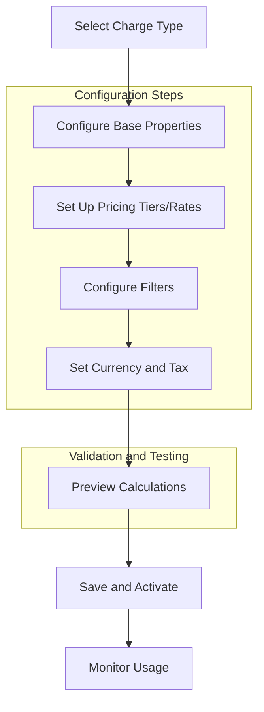
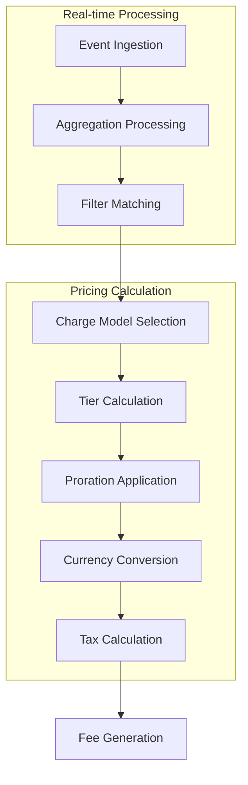

# Charge Models & Pricing Engine - Product Requirements Document

## 1. Product Overview

The Charge Models & Pricing Engine is a comprehensive billing calculation system that supports multiple pricing models, real-time price calculations, and complex billing scenarios. This engine enables businesses to implement sophisticated pricing strategies including tiered pricing, volume discounts, percentage-based fees, and custom pricing models.

The system handles multi-currency support, tax calculations, proration for partial billing periods, and grouped pricing based on customer properties. It provides real-time pricing calculations for usage-based billing, subscription services, and hybrid pricing models.

## 2. Core Features

### 2.1 User Roles

| Role | Registration Method | Core Permissions |
|------|---------------------|------------------|
| Billing Administrator | Organization invitation | Configure pricing models, set up charge types, manage currencies |
| Product Manager | Organization invitation | Define pricing tiers, configure volume discounts, set up filters |
| Finance Manager | Organization invitation | View pricing calculations, manage tax settings, audit pricing changes |
| Developer | API key authentication | Access pricing APIs, integrate billing calculations |

### 2.2 Feature Module

Our pricing engine consists of the following main components:

1. **Charge Model Configuration**: Set up and manage different pricing models including standard, graduated, volume, package, and percentage-based charges.

2. **Pricing Calculation Engine**: Real-time calculation of charges based on usage, events, and configured pricing models with support for proration and currency conversion.

3. **Filter and Group Management**: Create property-based filters to apply different pricing rules to different customer segments or usage patterns.

4. **Tax and Currency Management**: Configure multi-currency pricing, apply taxes at charge level, and handle currency conversions with precision.

### 2.3 Page Details

| Page Name | Module Name | Feature Description |
|-----------|-------------|---------------------|
| Charge Models Dashboard | Model Overview | View all configured charge models, their types, and usage statistics. Display summary cards for each model type with key metrics. |
| Standard Charge Setup | Basic Pricing | Configure simple per-unit pricing with amount and currency. Set minimum amounts and display names. Enable pay-in-advance and proration options. |
| Graduated Charge Builder | Tiered Pricing | Create pricing tiers with from/to ranges, per-unit amounts, and flat fees. Configure multiple tiers with automatic overflow handling. Preview tier calculations. |
| Volume Charge Configuration | Volume Discounts | Set up volume-based pricing with ranges and corresponding rates. Configure single rate for all units based on total volume. Preview volume discounts. |
| Package Charge Setup | Bundle Pricing | Define package sizes and per-package pricing. Configure free units and calculate package counts. Display package breakdown and pricing. |
| Percentage Charge Model | Percentage Fees | Configure percentage rates with optional fixed fees. Set free units per events and total aggregation. Enable per-transaction min/max amounts. |
| Charge Filter Management | Property Filters | Create filters based on billable metric properties. Configure multiple filter values and display names. Set up "all values" wildcard filters. |
| Currency Configuration | Multi-Currency | Configure custom pricing units with codes, names, and conversion rates. Set decimal precision and display formats. Manage currency symbols. |
| Tax Application Settings | Tax Configuration | Configure tax rates for different charge types. Set up tax-inclusive vs tax-exclusive pricing. Apply taxes at charge level with precision handling. |
| Pricing Preview | Calculation Testing | Test pricing calculations with sample usage data. View detailed breakdowns of tier calculations, proration, and tax applications. Export calculation details. |
| Real-time Calculator | Live Pricing | Calculate charges in real-time with current usage data. View projected amounts for partial billing periods. Monitor calculation performance. |

## 3. Core Process

### 3.1 Charge Model Creation Flow

### 3.2 Real-time Pricing Calculation Flow

### 3.3 Billing Administrator Flow

1. **Initial Setup**: Configure organization-wide currency settings and tax rates
2. **Model Creation**: Set up charge models based on business requirements
3. **Filter Configuration**: Create property-based filters for customer segmentation
4. **Testing**: Use pricing preview to validate calculations
5. **Deployment**: Activate models for production usage
6. **Monitoring**: Track model performance and usage patterns

### 3.4 Product Manager Flow

1. **Pricing Strategy**: Define pricing tiers and volume discounts
2. **Model Configuration**: Set up graduated, volume, or package pricing
3. **Filter Design**: Create customer segments with property filters
4. **Testing**: Validate pricing calculations with sample data
5. **Optimization**: Adjust tiers based on usage patterns
6. **Reporting**: Analyze pricing effectiveness and revenue impact

## 4. User Interface Design

### 4.1 Design Style

- **Primary Colors**: Professional blue (#2563EB) for primary actions, green (#10B981) for success states
- **Secondary Colors**: Gray scale for neutral elements, red (#EF4444) for errors and warnings
- **Button Style**: Rounded corners (8px radius), clear hover states, consistent sizing
- **Typography**: Inter font family, 14px base size, clear hierarchy with font weights
- **Layout**: Card-based design with clear sections, generous whitespace, responsive grid
- **Icons**: Feather icons for consistency, appropriate sizing for different contexts

### 4.2 Page Design Overview

| Page Name | Module Name | UI Elements |
|-----------|-------------|-------------|
| Charge Models Dashboard | Model Cards | Grid layout with model type cards showing usage statistics, configuration status, and quick actions. Color-coded by model type with clear status indicators. |
| Standard Charge Setup | Pricing Form | Clean form with currency input, amount field, and toggle switches for advanced options. Real-time validation with helpful error messages. |
| Graduated Charge Builder | Tier Editor | Interactive tier builder with drag-and-drop interface, range inputs, and live preview. Visual tier representation with clear boundaries. |
| Volume Charge Configuration | Volume Editor | Range slider for volume thresholds, rate input fields, and preview table showing volume discount effects. |
| Package Charge Setup | Package Config | Package size input, pricing per package, and visual package breakdown calculator. |
| Percentage Charge Model | Percentage Form | Rate input with percentage formatting, fixed fee options, and advanced min/max settings in collapsible section. |
| Charge Filter Management | Filter Builder | Multi-select property filters with search functionality, value validation, and filter preview. |
| Currency Configuration | Currency Manager | Table view of currencies with conversion rates, inline editing, and bulk import options. |
| Tax Application Settings | Tax Config | Tax rate inputs with region selection, tax type toggles, and calculation preview. |
| Pricing Preview | Calculator | Input fields for test usage data, detailed calculation breakdown, and export functionality. |
| Real-time Calculator | Live Monitor | Real-time usage display, current charge calculations, and performance metrics dashboard. |

### 4.3 Responsiveness

- **Desktop-First Design**: Optimized for desktop usage with comprehensive feature access
- **Mobile Adaptive**: Responsive design for tablet and mobile access to key features
- **Touch Optimization**: Touch-friendly interface elements for mobile devices
- **Progressive Enhancement**: Core functionality available on all devices with enhanced features on larger screens

### 4.4 Accessibility

- **WCAG 2.1 Compliance**: Full keyboard navigation support
- **Screen Reader Support**: Proper ARIA labels and semantic HTML
- **High Contrast Mode**: Support for accessibility preferences
- **Focus Management**: Clear focus indicators and logical tab order

## 5. Technical Requirements

### 5.1 Performance Requirements

- **Real-time Calculations**: Sub-second response time for individual charge calculations
- **Bulk Processing**: Handle 10,000+ events per second for aggregation
- **Currency Precision**: Maintain precision to 15 decimal places for financial calculations
- **Memory Usage**: Efficient memory utilization for large-scale event processing

### 5.2 Integration Requirements

- **API Compatibility**: RESTful APIs with JSON responses
- **Webhook Support**: Real-time notifications for pricing events
- **Export Formats**: CSV, JSON, and PDF export for pricing data
- **Third-party Integration**: Support for payment processors and accounting systems

### 5.3 Security Requirements

- **Data Encryption**: End-to-end encryption for sensitive pricing data
- **Access Control**: Role-based permissions for pricing configuration
- **Audit Trail**: Complete audit log for all pricing changes
- **Rate Limiting**: API rate limiting to prevent abuse

## 6. Success Metrics

### 6.1 User Experience Metrics

- **Configuration Time**: Average time to set up a new charge model under 5 minutes
- **Calculation Accuracy**: 100% accuracy in pricing calculations
- **User Satisfaction**: Net Promoter Score above 8 for pricing configuration
- **Error Rate**: Less than 1% error rate in pricing calculations

### 6.2 Business Metrics

- **Revenue Impact**: Measurable improvement in revenue optimization
- **Customer Retention**: Reduced churn through flexible pricing options
- **Operational Efficiency**: 50% reduction in billing configuration time
- **Market Expansion**: Support for new pricing models and markets

## 7. Future Enhancements

### 7.1 Advanced Pricing Models

- **Dynamic Pricing**: Real-time price adjustments based on market conditions
- **Usage Forecasting**: Predictive pricing based on usage patterns
- **A/B Testing**: Built-in support for pricing experiment management
- **Machine Learning**: AI-powered pricing optimization recommendations

### 7.2 Enhanced Analytics

- **Revenue Analytics**: Detailed revenue analysis by pricing model
- **Customer Segmentation**: Advanced customer behavior analysis
- **Pricing Optimization**: Data-driven pricing recommendations
- **Predictive Analytics**: Forecasting tools for pricing strategy