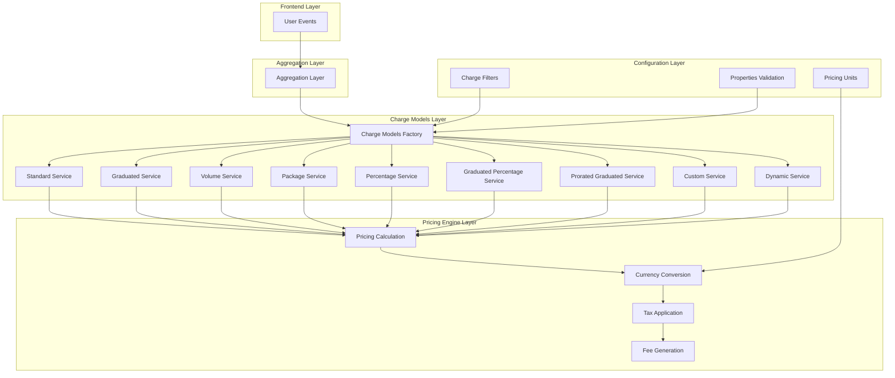
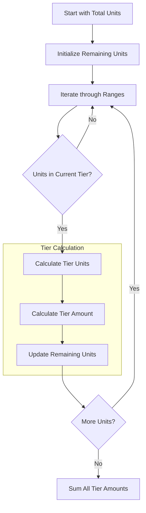
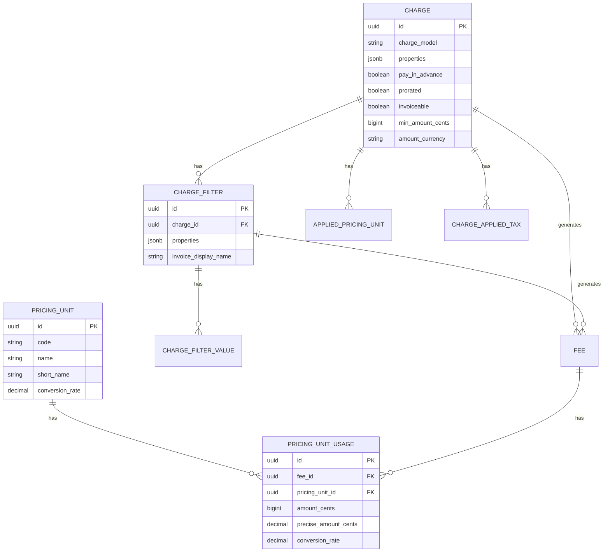

# Charge Models & Pricing Engine - Technical Architecture

## 1. Architecture Design



## 2. Technology Description

- **Backend**: Ruby on Rails 7+ with PostgreSQL
- **Charge Models**: Service-oriented architecture with factory pattern
- **Currency Handling**: Custom currency conversion with BigDecimal precision
- **Pricing Units**: Configurable unit system for multi-currency support
- **Validation**: Comprehensive property validation per charge model
- **Aggregation**: Event-based aggregation with multiple aggregation types

## 3. Core Components

### 3.1 Charge Models Factory

The `ChargeModels::Factory` serves as the central entry point for charge model instantiation:

```ruby
module ChargeModels
  class Factory
    def self.new_instance(chargeable:, aggregation_result:, properties:, period_ratio: 1.0, calculate_projected_usage: false)
      # Determines appropriate charge model class based on chargeable type and configuration
      # Handles prorated vs non-prorated model selection
      # Manages grouped vs individual charge processing
    end
  end
end
```

### 3.2 Base Service Architecture

All charge models inherit from `ChargeModels::BaseService` which provides:

- **Result Structure**: Standardized result format with units, amounts, and details
- **Projection Support**: Built-in support for usage projection calculations
- **Error Handling**: Consistent error handling and validation
- **Period Ratio**: Support for proration and partial billing periods

## 4. Charge Model Implementations

### 4.1 Standard Charge Model

**Purpose**: Simple linear pricing per unit

**Mathematical Formula**:
```
Total Amount = Units × Unit Price
```

**Implementation**:
```ruby
def compute_amount
  (units * BigDecimal(properties["amount"]))
end

def compute_projected_amount
  projected_units * BigDecimal(properties["amount"])
end

def unit_amount
  total_units = aggregation_result.full_units_number || units
  return 0 if total_units.zero?
  
  compute_amount / total_units
end
```

**Use Cases**: Basic per-unit pricing, simple subscription models

### 4.2 Graduated Charge Model

**Purpose**: Tiered pricing where different usage ranges have different prices

**Mathematical Formula**:
```
For each tier:
- Tier Units = min(Units in Tier, Remaining Units)
- Tier Amount = (Tier Units × Per Unit Price) + Flat Fee
- Total Amount = Sum of all Tier Amounts
```

**Implementation**:
```ruby
def ranges
  properties["graduated_ranges"]&.map(&:with_indifferent_access)
end

def compute_amount
  amount_details.fetch(:graduated_ranges).sum { |e| e[:total_with_flat_amount] }
end

def compute_projected_amount
  return BigDecimal("0") if projected_units.zero?
  
  remaining_units_to_price = projected_units
  total_amount = BigDecimal("0")
  priced_units_count = BigDecimal("0")
  
  ranges.each do |range|
    range_to = range[:to_value] ? BigDecimal(range[:to_value].to_s) : Float::INFINITY
    tier_capacity = range_to - priced_units_count
    units_in_this_tier = [remaining_units_to_price, tier_capacity].min
    
    if units_in_this_tier > 0
      range_per_unit = BigDecimal(range[:per_unit_amount] || 0)
      range_flat_amount = BigDecimal(range[:flat_amount] || 0)
      range_amount = (units_in_this_tier * range_per_unit) + range_flat_amount
      total_amount += range_amount
      remaining_units_to_price -= units_in_this_tier
      priced_units_count += units_in_this_tier
    end
    break if remaining_units_to_price <= 0
  end
  
  total_amount
end
```

**Use Cases**: Utility billing, API usage with tiered pricing, volume discounts

### 4.3 Volume Charge Model

**Purpose**: Single price applies to all units based on total volume

**Mathematical Formula**:
```
Total Amount = Total Units × Price per Unit (based on volume tier)
```

**Implementation**:
```ruby
def ranges
  properties["volume_ranges"]&.map(&:with_indifferent_access)&.sort_by { |h| h[:from_value] }
end

def compute_amount
  return 0 if units.zero?
  
  per_unit_total_amount + flat_unit_amount
end

def matching_range
  @matching_range ||= ranges.find do |range|
    range[:from_value] <= number_of_units&.ceil && (!range[:to_value] || number_of_units <= range[:to_value])
  end
end
```

**Use Cases**: Bulk pricing, wholesale models, enterprise licensing

### 4.4 Package Charge Model

**Purpose**: Units are grouped into packages with fixed pricing

**Mathematical Formula**:
```
Package Count = ceil(Units / Package Size)
Total Amount = Package Count × Price per Package
```

**Implementation**:
```ruby
def compute_amount
  return 0 if paid_units.negative?
  
  # Check how many packages (groups of units) are consumed
  # It's rounded up, because a group counts from its first unit
  package_count = paid_units.fdiv(per_package_size).ceil
  package_count * per_package_unit_amount
end

def paid_units
  @paid_units ||= units - free_units
end
```

**Use Cases**: SaaS seat licensing, bundled services, group subscriptions

### 4.5 Percentage Charge Model

**Purpose**: Percentage-based pricing with optional fixed fees and free units

**Mathematical Formula**:
```
Paid Units = max(0, Total Units - Free Units)
Percentage Amount = Paid Units × Rate / 100
Fixed Amount = (Event Count - Free Events) × Fixed Fee per Event
Total Amount = Percentage Amount + Fixed Amount
```

**Implementation**:
```ruby
def compute_amount
  # If min/max per transaction are applied, compute amount on per transaction basis
  return compute_amount_with_transaction_min_max if should_apply_min_max?
  
  compute_percentage_amount + compute_fixed_amount
end

def compute_percentage_amount
  return 0 if free_units_value > units
  
  (units - free_units_value) * rate / 100
end

def compute_fixed_amount
  return 0.0 if units.zero?
  return 0.0 if fixed_amount.nil?
  return 0.0 if free_units_count >= aggregation_result.count
  
  (aggregation_result.count - free_units_count) * fixed_amount
end
```

**Advanced Features**:
- Per-transaction min/max amounts
- Free units (per events and per total aggregation)
- Running total support for progressive calculations

**Use Cases**: Payment processing fees, revenue sharing, commission-based pricing

### 4.6 Graduated Percentage Charge Model

**Purpose**: Combination of graduated tiers with percentage-based pricing

**Mathematical Formula**:
```
For each tier:
- Tier Units = Units in Tier Range
- Tier Percentage Amount = Tier Units × Tier Rate / 100
- Tier Flat Amount = Tier Flat Fee
- Tier Total = Tier Percentage Amount + Tier Flat Amount
- Total Amount = Sum of all Tier Totals
```

**Implementation**:
```ruby
def ranges
  properties["graduated_percentage_ranges"]&.map(&:with_indifferent_access)
end

def compute_amount
  amount_details.fetch(:graduated_percentage_ranges).sum { |e| e[:total_with_flat_amount] }
end
```

**Use Cases**: Progressive tax calculations, complex commission structures, tiered revenue sharing

### 4.7 Prorated Graduated Charge Model

**Purpose**: Graduated pricing with proration support for partial periods

**Key Features**:
- Event-level proration calculation
- Overflow handling across tiers
- Complex proration coefficient calculations

**Implementation**:
```ruby
def compute_amount
  full_units = per_event_aggregation_result.event_aggregation
  prorated_units = per_event_aggregation_result.event_prorated_aggregation
  
  # Complex algorithm handling event-level proration
  # with overflow calculations across tier boundaries
end

def prorated_coefficient(prorated_value, full_value)
  prorated_value.fdiv(full_value)
end
```

**Use Cases**: Mid-cycle upgrades, partial month billing, usage-based proration

## 5. Tier Calculation Algorithms

### 5.1 Graduated Tier Processing



### 5.2 Boundary Conditions

**Upper Boundaries**:
- `to_value: nil` represents infinite upper bound
- Last tier always captures remaining units
- Overflow handling for events spanning multiple tiers

**Lower Boundaries**:
- `from_value: 0` represents no lower bound
- First tier handles all units below first threshold
- Zero-unit handling with appropriate edge cases

**Edge Cases**:
- Empty ranges array
- Single tier configuration
- Overlapping or invalid range definitions
- Negative unit values

## 6. Proration Logic

### 6.1 Period Ratio Calculation

```ruby
def calculate_period_ratio
  from_date = boundaries.charges_from_datetime.to_date
  to_date = boundaries.charges_to_datetime.to_date
  current_date = Time.current.to_date
  
  total_days = (to_date - from_date).to_i + 1
  charges_duration = boundaries.charges_duration || total_days
  
  return 1.0 if current_date >= to_date
  return 0.0 if current_date < from_date
  
  days_passed = (current_date - from_date).to_i + 1
  ratio = days_passed.fdiv(charges_duration)
  ratio.clamp(0.0, 1.0)
end
```

### 6.2 Proration Types

**Time-based Proration**:
- Daily proration for partial billing periods
- Support for custom duration definitions
- Boundary condition handling

**Usage-based Proration**:
- Event-level proration for graduated models
- Per-event aggregation with proration coefficients
- Overflow handling in prorated contexts

**Projection Support**:
- Current usage projection to full period
- Ratio-based amount scaling
- Boundary-aware projections

## 7. Currency Handling and Precision Management

### 7.1 Currency Conversion System

```ruby
class PricingUnitUsage < ApplicationRecord
  def self.build_from_fiat_amounts(amount:, unit_amount:, applied_pricing_unit:)
    pricing_unit = applied_pricing_unit.pricing_unit
    
    rounded_amount = amount.round(pricing_unit.exponent)
    amount_cents = rounded_amount * pricing_unit.subunit_to_unit
    precise_amount_cents = amount * pricing_unit.subunit_to_unit.to_d
    unit_amount_cents = unit_amount * pricing_unit.subunit_to_unit
    
    new(
      organization: pricing_unit.organization,
      pricing_unit:,
      short_name: pricing_unit.short_name,
      conversion_rate: applied_pricing_unit.conversion_rate,
      amount_cents:,
      precise_amount_cents:,
      unit_amount_cents:,
      precise_unit_amount: unit_amount
    )
  end
  
  def to_fiat_currency_cents(currency)
    adjusted_amount = amount_cents.to_d * conversion_rate / pricing_unit.subunit_to_unit
    adjusted_unit_amount = unit_amount_cents.to_d * conversion_rate / pricing_unit.subunit_to_unit
    
    {
      amount_cents: adjusted_amount.round(currency.exponent) * currency.subunit_to_unit,
      precise_amount_cents: adjusted_amount * currency.subunit_to_unit.to_d,
      unit_amount_cents: adjusted_unit_amount * currency.subunit_to_unit,
      precise_unit_amount: adjusted_unit_amount
    }
  end
end
```

### 7.2 Precision Management

**BigDecimal Usage**:
- All monetary calculations use BigDecimal for precision
- Configurable decimal places per currency
- Automatic rounding at currency boundaries

**Dual Precision Storage**:
- `amount_cents`: Rounded values for display
- `precise_amount_cents`: Full precision for calculations
- Automatic conversion between precision levels

**Conversion Rate Handling**:
- Support for custom pricing units
- Real-time conversion rate application
- Precision preservation during conversions

## 8. Tax Application at Charge Level

### 8.1 Tax Application Service

```ruby
if apply_taxes
  taxes_result = Fees::ApplyTaxesService.call(fee: new_fee)
  taxes_result.raise_if_error!
end
```

**Features**:
- Charge-level tax calculation
- Multiple tax support per charge
- Tax amount precision handling
- Integration with fee generation process

### 8.2 Tax Calculation Flow

1. **Fee Creation**: Base fee amount calculated
2. **Tax Application**: Taxes applied to base amount
3. **Amount Updates**: Total amounts updated with taxes
4. **Precision Handling**: Tax amounts handled with same precision as base amounts

## 9. Grouped Properties and Filters

### 9.1 Charge Filter System

```ruby
class ChargeFilter < ApplicationRecord
  has_many :values, class_name: "ChargeFilterValue", dependent: :destroy
  has_many :billable_metric_filters, through: :values
  
  def pricing_group_keys
    properties["pricing_group_keys"].presence || properties["grouped_by"]
  end
  
  def to_h
    @to_h ||= values.each_with_object({}) do |filter_value, result|
      result[filter_value.billable_metric_filter.key] = filter_value.values
    end.freeze
  end
end
```

### 9.2 Filter Processing

**Filter Matching**:
- Event property matching against filter values
- Support for "all values" wildcard filters
- Multiple filter combination logic

**Grouped Processing**:
- Per-filter fee generation
- Individual pricing for each filter group
- Fallback to default charge properties

**Aggregation Integration**:
- Filter-aware aggregation
- Grouped aggregation results
- Filter-specific amount calculations

## 10. Real-time Price Calculation Engines

### 10.1 Aggregation Factory

```ruby
def aggregator(charge_filter:)
  BillableMetrics::AggregationFactory.new_instance(
    charge:,
    current_usage:,
    subscription:,
    boundaries: {
      from_datetime: boundaries.charges_from_datetime,
      to_datetime: boundaries.charges_to_datetime,
      charges_duration: boundaries.charges_duration,
      max_timestamp: boundaries.max_timestamp
    },
    filters: aggregation_filters(charge_filter:),
    bypass_aggregation:
  )
end
```

### 10.2 Cache Middleware

```ruby
@cache_middleware = cache_middleware || Subscriptions::ChargeCacheMiddleware.new(
  subscription:, charge:, to_datetime: boundaries.charges_to_datetime, cache: false
)
```

**Features**:
- Intelligent caching of aggregation results
- Cache key generation based on charge and filter parameters
- Performance optimization for repeated calculations

### 10.3 Real-time Processing

**Event Streaming**:
- Real-time event ingestion
- Immediate aggregation updates
- Live price calculations

**Performance Optimization**:
- Intelligent caching strategies
- Batch processing for bulk events
- Memory-efficient aggregation

## 11. Data Models

### 11.1 Core Entities



### 11.2 Property Structures

**Standard Properties**:
```json
{
  "amount": "0.10",
  "free_units": 100,
  "package_size": 1000
}
```

**Graduated Properties**:
```json
{
  "graduated_ranges": [
    {
      "from_value": 0,
      "to_value": 1000,
      "per_unit_amount": "0.05",
      "flat_amount": "0.00"
    },
    {
      "from_value": 1001,
      "to_value": null,
      "per_unit_amount": "0.03",
      "flat_amount": "10.00"
    }
  ]
}
```

**Percentage Properties**:
```json
{
  "rate": "2.5",
  "fixed_amount": "0.30",
  "free_units_per_events": 10,
  "free_units_per_total_aggregation": "100.00",
  "per_transaction_min_amount": "0.10",
  "per_transaction_max_amount": "5.00"
}
```

## 12. Validation System

### 12.1 Property Validation

```ruby
module ChargePropertiesValidation
  PROPERTIES_VALIDATORS = {
    standard: Charges::Validators::StandardService,
    graduated: Charges::Validators::GraduatedService,
    package: Charges::Validators::PackageService,
    percentage: Charges::Validators::PercentageService,
    volume: Charges::Validators::VolumeService,
    graduated_percentage: Charges::Validators::GraduatedPercentageService
  }.freeze
  
  def validate_charge_model_properties(charge_model)
    return unless charge_model
    
    validator = PROPERTIES_VALIDATORS[charge_model.to_sym]
    validator ||= Charges::Validators::BaseService
    
    instance = validator.new(charge: self)
    return if instance.valid?
    
    instance.result.error.messages.values.flatten.each { errors.add(:properties, it) }
  end
end
```

### 12.2 Validation Rules

**Standard Model**:
- Amount must be present and positive
- Currency must be valid

**Graduated Model**:
- Ranges must be present and valid
- No overlapping ranges
- Consistent from/to values

**Package Model**:
- Package size must be positive integer
- Amount must be present and positive

**Percentage Model**:
- Rate must be between 0 and 100
- Fixed amount must be non-negative
- Min/max amounts must be valid if present

## 13. Integration Points

### 13.1 Fee Generation Integration

```ruby
# Fee creation with charge model application
new_fee = Fee.new(
  invoice:,
  charge:,
  amount_cents:,
  precise_amount_cents:,
  amount_currency: currency,
  units:,
  unit_amount_cents:,
  precise_unit_amount:,
  amount_details: amount_result.amount_details,
  grouped_by: amount_result.grouped_by || {},
  charge_filter_id: charge_filter&.id,
  pricing_unit_usage:
)
```

### 13.2 Invoice Integration

- Automatic fee inclusion in invoice generation
- Tax calculation integration
- Currency conversion support
- Adjustment and credit handling

### 13.3 Subscription Integration

- Pay-in-advance charge processing
- Proration support for subscription changes
- Filter-based charge grouping
- Usage projection for current periods

## 14. Performance Considerations

### 14.1 Aggregation Optimization

- Intelligent caching of aggregation results
- Batch processing for multiple charges
- Memory-efficient event processing
- Database query optimization

### 14.2 Calculation Performance

- BigDecimal precision management
- Efficient tier traversal algorithms
- Minimal object instantiation
- Result memoization where appropriate

### 14.3 Scalability Features

- Horizontal scaling support
- Event streaming integration
- Background job processing
- Database sharding compatibility

## 15. Error Handling and Edge Cases

### 15.1 Common Edge Cases

**Zero Units**:
- All models handle zero units gracefully
- Appropriate amount_details generation
- Unit amount calculation safety

**Negative Units**:
- Validation prevents negative units
- Graceful handling in calculations
- Error message standardization

**Invalid Properties**:
- Comprehensive validation before processing
- Clear error messages for property issues
- Fallback to safe default values

### 15.2 Error Recovery

**Calculation Errors**:
- BigDecimal arithmetic error handling
- Division by zero protection
- Overflow/underflow management

**Data Integrity**:
- Transaction-based fee creation
- Rollback support for calculation failures
- Consistency validation

## 16. Testing Strategy

### 16.1 Unit Testing

- Individual charge model testing
- Property validation testing
- Edge case coverage
- Mathematical accuracy verification

### 16.2 Integration Testing

- End-to-end charge processing
- Filter integration testing
- Currency conversion testing
- Tax application testing

### 16.3 Performance Testing

- Large dataset aggregation testing
- Concurrent processing testing
- Memory usage validation
- Response time benchmarking

## 17. Monitoring and Observability

### 17.1 Metrics Collection

- Charge processing time metrics
- Aggregation performance metrics
- Error rate tracking
- Cache hit/miss ratios

### 17.2 Logging Strategy

- Structured logging for all charge operations
- Error context preservation
- Performance bottleneck identification
- Debug information for complex calculations

### 17.3 Alerting

- Calculation error alerts
- Performance degradation alerts
- Data integrity violation alerts
- System health monitoring