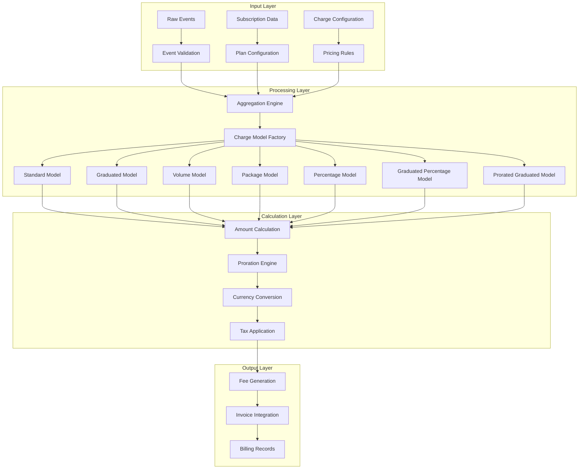
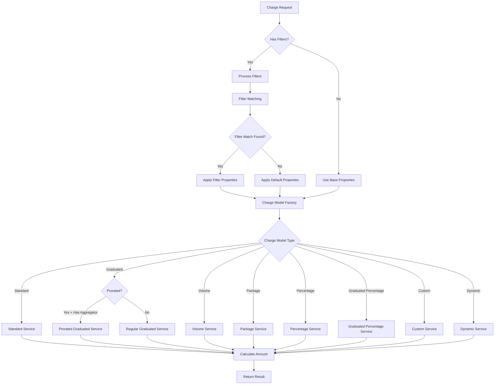

# Charge Models - Pricing Workflows and Process Flows

## 1. Overall Pricing System Architecture



## 2. Charge Model Selection Workflow



## 3. Graduated Charge Model Processing Flow

```mermaid
graph TD
    A[Graduated Model Request] --> B[Extract Ranges]
    B --> C[Sort Ranges by from_value]
    C --> D[Initialize Variables]
    
    D --> E[remaining_units = total_units]
    E --> F[total_amount = 0]
    F --> G[priced_units = 0]
    
    G --> H{More Ranges?}
    H -->|Yes| I[Get Current Range]
    I --> J[Calculate Tier Capacity]
    J --> K[capacity = to_value - priced_units]
    
    K --> L[Calculate Units in Tier]
    L --> M[units_in_tier = min(remaining_units, capacity)]
    
    M --> N{units_in_tier > 0?}
    N -->|Yes| O[Calculate Tier Amount]
    O --> P[tier_amount = (units_in_tier × per_unit) + flat_amount]
    P --> Q[Update Totals]
    Q --> R[total_amount += tier_amount]
    R --> S[remaining_units -= units_in_tier]
    S --> T[priced_units += units_in_tier]
    
    N -->|No| U{remaining_units <= 0?}
    U -->|Yes| V[Break Loop]
    U -->|No| H
    T --> U
    
    H -->|No| W[Return total_amount]
    V --> W
```

## 4. Percentage Charge Model with Min/Max Processing

```mermaid
graph TD
    A[Percentage Model Request] --> B{Has Min/Max?}
    B -->|Yes| C[Check License]
    B -->|No| D[Basic Calculation]
    
    C --> E{License Valid?}
    E -->|Yes| F[Per-Transaction Processing]
    E -->|No| D
    
    F --> G[Initialize Variables]
    G --> H[remaining_free_events = free_units_per_events]
    I --> J[remaining_free_amount = free_units_per_total_aggregation]
    
    J --> K{More Events?}
    K -->|Yes| L[Get Event Value]
    L --> M{Free Units Available?}
    
    M -->|Yes| N[Apply Free Events]
    N --> O[remaining_free_events -= 1]
    O --> P{remaining_free_amount > 0?}
    
    P -->|Yes| Q{remaining_free_amount > value?}
    Q -->|Yes| R[Use All Free Amount]
    R --> S[remaining_free_amount -= value]
    S --> T[event_amount = 0]
    
    Q -->|No| U[Partial Free Amount]
    U --> V[value -= remaining_free_amount]
    V --> W[remaining_free_amount = 0]
    W --> X[remaining_free_events = 0]
    
    M -->|No| Y[Calculate Event Amount]
    Y --> Z[base_amount = (value × rate) ÷ 100]
    Z --> AA[base_amount += fixed_amount]
    
    AA --> AB[Apply Min/Max]
    AB --> AC{amount < min_amount?}
    AC -->|Yes| AD[event_amount = min_amount]
    AC -->|No| AE{amount > max_amount?}
    AE -->|Yes| AF[event_amount = max_amount]
    AE -->|No| AG[event_amount = base_amount]
    
    AD --> AH[Add to Total]
    AG --> AH
    AF --> AH
    T --> AH
    X --> AH
    
    AH --> AI[total_amount += event_amount]
    AI --> K
    
    K -->|No| AJ[Return total_amount]
    D --> AK[Basic Percentage Calc]
    AK --> AJ
```

## 5. Prorated Graduated Processing Flow

```mermaid
graph TD
    A[Prorated Graduated Request] --> B[Initialize Variables]
    B --> C[full_units = per_event_aggregation]
    C --> D[prorated_units = per_event_prorated_aggregation]
    
    D --> E[index = 0]
    E --> F[overflow = 0]
    F --> G[full_sum = 0]
    G --> H[prorated_sum = 0]
    I --> J[result_amount = 0]
    
    J --> K{Events to Process OR Overflow?}
    K -->|Yes| L[Determine Current Range]
    L --> M[range = range(full_sum, overflow, next_full_unit)]
    
    M --> N{overflow > 0?}
    N -->|Yes| O[Handle Previous Overflow]
    O --> P[prorated_sum += overflow × coefficient]
    P --> Q{range[:to_value] AND full_sum >= to_value?}
    
    Q -->|Yes| R[Calculate New Overflow]
    R --> S[overflow = full_sum - to_value]
    S --> T[Adjust Prorated Sum]
    T --> U[prorated_sum -= overflow × coefficient]
    U --> V[Apply to Result]
    V --> W[result_amount += prorated_sum × per_unit_amount]
    W --> X[Reset prorated_sum = 0]
    
    Q -->|No| Y{No More Events?}
    Y -->|Yes| Z[Break Loop]
    
    N -->|No| AA[Process Current Event]
    AA --> AB{prorated_units[index].nil?}
    AB -->|Yes| Z
    AB -->|No| AC[Update Sums]
    
    AC --> AD[full_sum += full_units[index]]
    AD --> AE[Update Max]
    AE --> AF[max_full_sum = max(max_full_sum, full_sum)]
    AF --> AG[prorated_sum += prorated_units[index]]
    
    AG --> AH[index += 1]
    AH --> AI{Skip Overflow Calc?}
    AI -->|Yes| K
    AI -->|No| AJ[Calculate Overflow]
    
    AJ --> AK[overflow = calculate_overflow(full_sum, to_value, from_value)]
    AK --> AL[Adjust Prorated Sum]
    AL --> AM[prorated_sum -= overflow × coefficient]
    AM --> AN[Apply to Result]
    AN --> AO[result_amount += prorated_sum × per_unit_amount]
    AO --> AP[Reset prorated_sum = 0]
    
    AP --> K
    K -->|No| AQ[Apply Final Amount]
    AQ --> AR[result_amount += prorated_sum × per_unit_amount]
    AR --> AS[Add Flat Amounts]
    AS --> AT[result_with_flat_amount(result_amount, full_sum, max_full_sum)]
    AT --> AU[Return Final Amount]
```

## 6. Currency Conversion and Precision Workflow

```mermaid
graph TD
    A[Amount Calculation] --> B{Has Pricing Unit?}
    B -->|Yes| C[Build PricingUnitUsage]
    B -->|No| D[Standard Currency Conversion]
    
    C --> E[Extract Pricing Unit]
    E --> F[Calculate Conversion]
    F --> G[rounded_amount = amount.round(pricing_unit.exponent)]
    G --> H[amount_cents = rounded_amount × pricing_unit.subunit_to_unit]
    H --> I[precise_amount_cents = amount × pricing_unit.subunit_to_unit.to_d]
    I --> J[unit_amount_cents = unit_amount × pricing_unit.subunit_to_unit]
    
    D --> K[Standard Conversion]
    K --> L[rounded_amount = amount.round(currency.exponent)]
    L --> M[amount_cents = rounded_amount × currency.subunit_to_unit]
    M --> N[precise_amount_cents = amount × currency.subunit_to_unit.to_d]
    N --> O[unit_amount_cents = unit_amount × currency.subunit_to_unit]
    
    J --> P[Create PricingUnitUsage]
    O --> Q[Set Direct Values]
    
    P --> R[Convert to Target Currency]
    Q --> R
    
    R --> S[Calculate Adjusted Amounts]
    S --> T[adjusted_amount = amount_cents × conversion_rate ÷ pricing_unit.subunit_to_unit]
    T --> U[adjusted_unit_amount = unit_amount_cents × conversion_rate ÷ pricing_unit.subunit_to_unit]
    
    U --> V[Apply Final Conversion]
    V --> W[amount_cents = adjusted_amount.round(target_currency.exponent) × target_currency.subunit_to_unit]
    W --> X[precise_amount_cents = adjusted_amount × target_currency.subunit_to_unit.to_d]
    X --> Y[unit_amount_cents = adjusted_unit_amount × target_currency.subunit_to_unit]
    Y --> Z[precise_unit_amount = adjusted_unit_amount]
    
    Z --> AA[Return Converted Values]
```

## 7. Filter Processing and Grouping Workflow

```mermaid
graph TD
    A[Charge with Filters] --> B{Has Filters?}
    B -->|Yes| C[Process Each Filter]
    B -->|No| D[Process Base Properties]
    
    C --> E[Iterate through Filters]
    E --> F[Get Filter Properties]
    F --> G[Match Events to Filter]
    G --> H{Events Match Filter?}
    
    H -->|Yes| I[Apply Filter Properties]
    H -->|No| J[Skip Filter]
    
    I --> K[Process with Filter]
    K --> L[Calculate Filter Amount]
    L --> M[Create Filter Fee]
    M --> N[Add to Results]
    
    J --> O{More Filters?}
    O -->|Yes| E
    O -->|No| P[Process Unmatched Events]
    
    P --> Q[Create Default Filter]
    Q --> R[Apply Base Properties]
    R --> S[Process Default Fee]
    S --> T[Add to Results]
