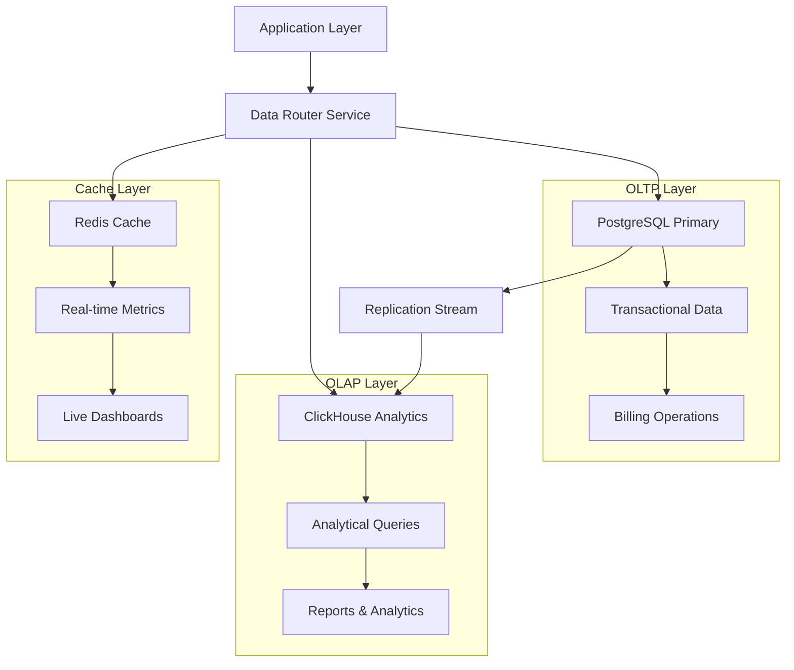

# Data Storage & Analytics Technical Architecture

## 1. Architecture Design



## 2. Technology Stack

- **Primary Database**: PostgreSQL 14+ with partitioning
- **Analytics Database**: ClickHouse for time-series and analytical queries
- **Caching**: Redis for real-time metrics and session data
- **Data Pipeline**: Kafka for event streaming and replication
- **Query Engine**: Custom SQL builders for complex billing calculations
- **Backup Strategy**: WAL archiving and point-in-time recovery

## 3. PostgreSQL Schema Design

### 3.1 Core Tables with Partitioning

```sql
-- Partitioned events table for time-series data
CREATE TABLE events (
    id UUID DEFAULT gen_random_uuid(),
    transaction_id VARCHAR(255) NOT NULL,
    organization_id UUID NOT NULL,
    customer_id UUID NOT NULL,
    code VARCHAR(100) NOT NULL,
    timestamp TIMESTAMP WITH TIME ZONE NOT NULL,
    properties JSONB NOT NULL DEFAULT '{}',
    billable BOOLEAN DEFAULT true,
    created_at TIMESTAMP WITH TIME ZONE DEFAULT NOW(),
    PRIMARY KEY (id, timestamp)
) PARTITION BY RANGE (timestamp);

-- Create monthly partitions
CREATE TABLE events_2024_01 PARTITION OF events
    FOR VALUES FROM ('2024-01-01') TO ('2024-02-01');
CREATE TABLE events_2024_02 PARTITION OF events
    FOR VALUES FROM ('2024-02-01') TO ('2024-03-01');

-- Automatic partition creation function
CREATE OR REPLACE FUNCTION create_monthly_partition()
RETURNS void AS $$
DECLARE
    start_date date;
    end_date date;
    partition_name text;
BEGIN
    start_date := date_trunc('month', CURRENT_DATE + interval '1 month');
    end_date := start_date + interval '1 month';
    partition_name := 'events_' || to_char(start_date, 'YYYY_MM');
    
    EXECUTE format('CREATE TABLE IF NOT EXISTS %I PARTITION OF events 
                    FOR VALUES FROM (%L) TO (%L)',
                    partition_name, start_date, end_date);
END;
$$ LANGUAGE plpgsql;

-- Scheduled partition creation
CREATE OR REPLACE FUNCTION auto_create_partitions()
RETURNS void AS $$
BEGIN
    PERFORM create_monthly_partition();
    PERFORM create_monthly_partition() FROM generate_series(1, 3);
END;
$$ LANGUAGE plpgsql;
```

### 3.2 Optimized Indexing Strategy

```sql
-- Composite indexes for common query patterns
CREATE INDEX idx_events_org_customer_time ON events(organization_id, customer_id, timestamp DESC);
CREATE INDEX idx_events_code_time ON events(code, timestamp DESC);
CREATE INDEX idx_events_transaction_id ON events(transaction_id);
CREATE INDEX idx_events_billable_time ON events(billable, timestamp DESC) WHERE billable = true;

-- GIN indexes for JSONB queries
CREATE INDEX idx_events_properties_gin ON events USING gin(properties);
CREATE INDEX idx_events_properties_code ON events ((properties->>'code'));
CREATE INDEX idx_events_properties_amount ON events ((properties->>'amount')::numeric);

-- Partial indexes for specific conditions
CREATE INDEX idx_events_active_subscriptions ON events(customer_id, timestamp DESC) 
WHERE code = 'subscription' AND properties->>'status' = 'active';

-- BRIN indexes for time-series data
CREATE INDEX idx_events_timestamp_brin ON events USING brin(timestamp);
```

### 3.3 Advanced Query Optimization

```sql
-- Materialized view for pre-aggregated usage metrics
CREATE MATERIALIZED VIEW daily_usage_metrics AS
SELECT 
    organization_id,
    customer_id,
    code as metric_code,
    date_trunc('day', timestamp) as usage_date,
    COUNT(*) as event_count,
    SUM((properties->>'value')::numeric) as total_value,
    AVG((properties->>'value')::numeric) as avg_value,
    MAX((properties->>'value')::numeric) as max_value,
    MIN((properties->>'value')::numeric) as min_value,
    COUNT(DISTINCT transaction_id) as unique_transactions
FROM events
WHERE billable = true
GROUP BY organization_id, customer_id, code, date_trunc('day', timestamp);

-- Create indexes on materialized view
CREATE UNIQUE INDEX idx_daily_usage_metrics_unique 
ON daily_usage_metrics(organization_id, customer_id, metric_code, usage_date);

CREATE INDEX idx_daily_usage_metrics_date ON daily_usage_metrics(usage_date DESC);

-- Refresh strategy
CREATE OR REPLACE FUNCTION refresh_daily_usage_metrics()
RETURNS void AS $$
BEGIN
    REFRESH MATERIALIZED VIEW CONCURRENTLY daily_usage_metrics;
END;
$$ LANGUAGE plpgsql;

-- Scheduled refresh
CREATE EXTENSION IF NOT EXISTS pg_cron;
SELECT cron.schedule('refresh-daily-usage', '0 1 * * *', 'SELECT refresh_daily_usage_metrics()');
```

## 4. ClickHouse Analytics Architecture

### 4.1 ClickHouse Table Design

```sql
-- Analytics events table with MergeTree engine
CREATE TABLE analytics.events (
    organization_id UUID,
    customer_id UUID,
    event_code String,
    timestamp DateTime,
    usage_date Date DEFAULT toDate(timestamp),
    properties String, -- JSON string for complex analytics
    billable UInt8,
    value Float64 DEFAULT 0,
    transaction_id String,
    created_at DateTime DEFAULT now()
) ENGINE = MergeTree()
PARTITION BY toYYYYMM(timestamp)
ORDER BY (organization_id, customer_id, event_code, timestamp)
TTL timestamp + INTERVAL 3 YEAR;

-- AggregatingMergeTree for pre-aggregated data
CREATE TABLE analytics.hourly_usage (
    organization_id UUID,
    customer_id UUID,
    event_code String,
    hour DateTime,
    usage_date Date,
    event_count AggregateFunction(count, UInt64),
    total_value AggregateFunction(sum, Float64),
    avg_value AggregateFunction(avg, Float64),
    unique_transactions AggregateFunction(uniq, String)
) ENGINE = AggregatingMergeTree()
PARTITION BY toYYYYMM(hour)
ORDER BY (organization_id, customer_id, event_code, hour);

-- Populate hourly aggregation
CREATE MATERIALIZED VIEW analytics.hourly_usage_mv TO analytics.hourly_usage AS
SELECT 
    organization_id,
    customer_id,
    event_code,
    toStartOfHour(timestamp) as hour,
    usage_date,
    countState() as event_count,
    sumState(value) as total_value,
    avgState(value) as avg_value,
    uniqState(transaction_id) as unique_transactions
FROM analytics.events
WHERE billable = 1
GROUP BY organization_id, customer_id, event_code, hour, usage_date;
```

### 4.2 Advanced Analytics Queries

```sql
-- Monthly recurring revenue calculation
CREATE FUNCTION calculate_mrr AS (organization_id, customer_id, month_date) -> 
SELECT 
    organization_id,
    customer_id,
    month_date,
    SUM(amount) as mrr
FROM (
    SELECT 
        organization_id,
        customer_id,
        amount,
        ROW_NUMBER() OVER (PARTITION BY organization_id, customer_id ORDER BY timestamp DESC) as rn
    FROM analytics.events
    WHERE event_code = 'subscription_payment'
    AND toYYYYMM(timestamp) = toYYYYMM(month_date)
) 
WHERE rn = 1
GROUP BY organization_id, customer_date, month_date;

-- Customer lifetime value calculation
CREATE FUNCTION calculate_cltv AS (organization_id, customer_id) ->
SELECT 
    organization_id,
    customer_id,
    SUM(revenue) as total_revenue,
    COUNT(DISTINCT month) as months_active,
    AVG(revenue) as avg_monthly_revenue,
    total_revenue / months_active as cltv
FROM (
    SELECT 
        organization_id,
        customer_id,
        toYYYYMM(timestamp) as month,
        SUM(value) as revenue
    FROM analytics.events
    WHERE event_code IN ('subscription_payment', 'usage_charge')
    GROUP BY organization_id, customer_id, toYYYYMM(timestamp)
)
GROUP BY organization_id, customer_id;

-- Churn analysis with window functions
SELECT 
    organization_id,
    toYYYYMM(timestamp) as month,
    COUNT(DISTINCT customer_id) as active_customers,
    COUNT(DISTINCT CASE WHEN 
        LAG(toYYYYMM(timestamp)) OVER (PARTITION BY customer_id ORDER BY toYYYYMM(timestamp)) = 
        toYYYYMM(timestamp) - INTERVAL 1 MONTH 
        THEN NULL 
        ELSE customer_id 
    END) as new_customers,
    COUNT(DISTINCT CASE WHEN 
        LEAD(toYYYYMM(timestamp)) OVER (PARTITION BY customer_id ORDER BY toYYYYMM(timestamp)) IS NULL 
        AND timestamp < toStartOfMonth(now()) 
        THEN customer_id 
    END) as churned_customers,
    (churned_customers::Float64 / active_customers) * 100 as churn_rate
FROM analytics.events
WHERE event_code = 'subscription_active'
GROUP BY organization_id, toYYYYMM(timestamp)
ORDER BY month DESC;
```

## 5. Data Pipeline and Replication

### 5.1 Kafka Event Streaming

```ruby
# app/services/data_pipeline/kafka_producer.rb
module DataPipeline
  class KafkaProducer
    def initialize
      @producer = Kafka.new(
        seed_brokers: ENV['KAFKA_BROKERS'],
        client_id: 'lago-api'
      ).async_producer(
        delivery_threshold: 100,
        delivery_interval: 5
      )
    end
    
    def publish_event(event)
      topic = determine_topic(event)
      payload = build_payload(event)
      
      @producer.produce(
        payload.to_json,
        topic: topic,
        key: event.customer_id,
        partition_key: event.organization_id
      )
    end
    
    def publish_analytics_event(event)
      @producer.produce(
        build_analytics_payload(event).to_json,
        topic: 'analytics-events',
        key: event.transaction_id
      )
    end
    
    private
    
    def determine_topic(event)
      case event.code
      when /^subscription_/
        'subscription-events'
      when /^usage_/
        'usage-events'
      when /^payment_/
        'payment-events'
      else
        'billing-events'
      end
    end
    
    def build_payload(event)
      {
        event_id: event.id,
        transaction_id: event.transaction_id,
        organization_id: event.organization_id,
        customer_id: event.customer_id,
        code: event.code,
        timestamp: event.timestamp.iso8601,
        properties: event.properties,
        billable: event.billable,
        created_at: event.created_at.iso8601
      }
    end
    
    def build_analytics_payload(event)
      {
        organization_id: event.organization_id,
        customer_id: event.customer_id,
        event_code: event.code,
        timestamp: event.timestamp.iso8601,
        usage_date: event.timestamp.to_date,
        properties: event.properties.to_json,
        billable: event.billable ? 1 : 0,
        value: extract_numeric_value(event),
        transaction_id: event.transaction_id,
        created_at: Time.current.iso8601
      }
    end
    
    def extract_numeric_value(event)
      # Extract numeric value for analytics
      if event.properties['amount'].present?
        event.properties['amount'].to_f
      elsif event.properties['value'].present?
        event.properties['value'].to_f
      else
        1.0
      end
    end
  end
end
```

### 5.2 ClickHouse Data Ingestion

```ruby
# app/services/data_pipeline/clickhouse_ingestion.rb
module DataPipeline
  class ClickHouseIngestion
    def initialize
      @client = ClickHouse.connect(
        host: ENV['CLICKHOUSE_HOST'],
        port: ENV['CLICKHOUSE_PORT'],
        database: 'analytics'
      )
    end
    
    def bulk_insert_events(events)
      return if events.empty?
      
      data = events.map do |event|
        [
          event.organization_id,
          event.customer_id,
          event.code,
          event.timestamp,
          event.timestamp.to_date,
          event.properties.to_json,
          event.billable ? 1 : 0,
          extract_value(event),
          event.transaction_id,
          Time.current
        ]
      end
      
      @client.insert('events', data, [
        'organization_id',
        'customer_id',
        'event_code',
        'timestamp',
        'usage_date',
        'properties',
        'billable',
        'value',
        'transaction_id',
        'created_at'
      ])
    end
    
    def insert_aggregated_metrics(metrics)
      data = metrics.map do |metric|
        [
          metric.organization_id,
          metric.customer_id,
          metric.metric_code,
          metric.hour,
          metric.usage_date,
          "countState()",
          "sumState(#{metric.total_value})",
          "avgState(#{metric.avg_value})",
          "uniqState(#{metric.unique_transactions})"
        ]
      end
      
      @client.insert('hourly_usage', data)
    end
    
    def execute_analytics_query(query)
      @client.query(query).to_a
    end
    
    private
    
    def extract_value(event)
      event.properties['value']&.to_f || 
      event.properties['amount']&.to_f || 
      1.0
    end
  end
end
```

## 6. Data Retention and Archival

### 6.1 Retention Policies

```sql
-- PostgreSQL retention with automated cleanup
CREATE OR REPLACE FUNCTION cleanup_old_events()
RETURNS void AS $$
DECLARE
    cutoff_date date;
BEGIN
    cutoff_date := CURRENT_DATE - INTERVAL '3 years';
    
    -- Archive to cold storage first
    PERFORM archive_events_to_s3(cutoff_date);
    
    -- Drop old partitions
    FOR partition_name IN 
        SELECT tablename 
        FROM pg_tables 
        WHERE tablename LIKE 'events_%' 
        AND tablename < 'events_' || to_char(cutoff_date, 'YYYY_MM')
    LOOP
        EXECUTE format('DROP TABLE IF EXISTS %I', partition_name);
    END LOOP;
END;
$$ LANGUAGE plpgsql;

-- Schedule retention cleanup
SELECT cron.schedule('event-retention-cleanup', '0 2 * * 0', 'SELECT cleanup_old_events()');

-- ClickHouse TTL configuration
ALTER TABLE analytics.events 
MODIFY TTL timestamp + INTERVAL 3 YEAR;

ALTER TABLE analytics.hourly_usage 
MODIFY TTL hour + INTERVAL 5 YEAR;
```

### 6.2 Archival Strategy

```ruby
# app/services/data_pipeline/archival_service.rb
module DataPipeline
  class ArchivalService
    def initialize
      @s3_client = Aws::S3::Client.new(
        region: ENV['AWS_REGION'],
        access_key_id: ENV['AWS_ACCESS_KEY_ID'],
        secret_access_key: ENV['AWS_SECRET_ACCESS_KEY']
      )
      @bucket = ENV['S3_ARCHIVE_BUCKET']
    end
    
    def archive_events_to_s3(date)
      events = fetch_events_for_archival(date)
      
      return if events.empty?
      
      # Compress and upload to S3
      csv_data = events_to_csv(events)
      gzipped_data = gzip_data(csv_data)
      
      key = "events/#{date.strftime('%Y/%m')}/events_#{date.strftime('%Y%m%d')}.csv.gz"
      
      @s3_client.put_object(
        bucket: @bucket,
        key: key,
        body: gzipped_data,
        content_type: 'application/gzip',
        server_side_encryption: 'AES256'
      )
      
      # Verify upload and update archival status
      verify_and_update_status(events, key)
    end
    
    def restore_events_from_s3(date_range)
      date_range.each do |date|
        key = "events/#{date.strftime('%Y/%m')}/events_#{date.strftime('%Y%m%d')}.csv.gz"
        
        object = @s3_client.get_object(bucket: @bucket, key: key)
        csv_data = ungzip_data(object.body.read)
        
        events = csv_to_events(csv_data)
        bulk_restore_events(events)
      end
    end
    
    private
    
    def fetch_events_for_archival(date)
      Event.where('timestamp::date = ?', date)
           .where(archived: false)
           .includes(:organization, :customer)
    end
    
    def events_to_csv(events)
      CSV.generate do |csv|
        csv << ['id', 'transaction_id', 'organization_id', 'customer_id', 
                'code', 'timestamp', 'properties', 'billable', 'created_at']
        
        events.each do |event|
          csv << [
            event.id,
            event.transaction_id,
            event.organization_id,
            event.customer_id,
            event.code,
            event.timestamp.iso8601,
            event.properties.to_json,
            event.billable,
            event.created_at.iso8601
          ]
        end
      end
    end
    
    def gzip_data(data)
      Zlib::GzipWriter.new(StringIO.new).tap do |gz|
        gz.write(data)
        gz.close
      end.string
    end
    
    def ungzip_data(data)
      Zlib::GzipReader.new(StringIO.new(data)).read
    end
    
    def csv_to_events(csv_data)
      events = []
      CSV.parse(csv_data, headers: true) do |row|
        events << Event.new(
          id: row['id'],
          transaction_id: row['transaction_id'],
          organization_id: row['organization_id'],
          customer_id: row['customer_id'],
          code: row['code'],
          timestamp: Time.parse(row['timestamp']),
          properties: JSON.parse(row['properties']),
          billable: row['billable'] == 'true',
          created_at: Time.parse(row['created_at']),
          archived: true
        )
      end
      events
    end
    
    def bulk_restore_events(events)
      Event.insert_all(events.map(&:attributes))
    end
    
    def verify_and_update_status(events, s3_key)
      # Verify S3 upload
      head = @s3_client.head_object(bucket: @bucket, key: s3_key)
      
      if head.content_length > 0
        # Update archival status
        Event.where(id: events.map(&:id)).update_all(archived: true, archived_at: Time.current)
      end
    end
  end
end
```

## 7. Real-time Analytics with Redis

### 7.1 Real-time Metrics Storage

```ruby
# app/services/analytics/real_time_metrics.rb
module Analytics
  class RealTimeMetrics
    def initialize(organization_id)
      @organization_id = organization_id
      @redis = Redis.current
    end
    
    def increment_metric(metric_name, value = 1, tags = {})
      key = build_metric_key(metric_name, tags)
      
      @redis.multi do |transaction|
        transaction.incrby(key, value)
        transaction.expire(key, 3600) # 1 hour TTL
      end
    end
    
    def set_gauge(metric_name, value, tags = {})
      key = build_metric_key(metric_name, tags)
      @redis.setex(key, 300, value) # 5 minute TTL
    end
    
    def get_metric(metric_name, tags = {})
      key = build_metric_key(metric_name, tags)
      @redis.get(key).to_f
    end
    
    def get_metrics_with_wildcard(pattern)
      keys = @redis.keys(pattern)
      
      return {} if keys.empty?
      
      values = @redis.mget(*keys)
      
      keys.zip(values).to_h.transform_values(&:to_f)
    end
    
    def record_event(event)
      # Record event in time-series format
      key = "events:#{@organization_id}:#{event.timestamp.to_i}"
      
      @redis.multi do |transaction|
        transaction.hset(key, {
          'type' => event.code,
          'customer' => event.customer_id,
          'value' => event.properties['value'] || 0
        })
        transaction.expire(key, 86400) # 24 hours
      end
    end
    
    def get_dashboard_metrics
      {
        total_revenue: get_metric('revenue:total'),
        active_customers: get_metric('customers:active'),
        mrr: get_metric('mrr:current'),
        churn_rate: get_metric('churn:rate'),
        new_customers_today: get_metric('customers:new', { date: Date.current.to_s }),
        events_processed_today: get_metric('events:processed', { date: Date.current.to_s })
      }
    end
    
    private
    
    def build_metric_key(metric_name, tags)
      key_parts = ["metrics", @organization_id, metric_name]
      
      tags.each do |tag_name, tag_value|
        key_parts << "#{tag_name}:#{tag_value}"
      end
      
      key_parts.join(':')
    end
  end
end
```

### 7.2 Time-series Data with Redis Streams

```ruby
# app/services/analytics/redis_streams.rb
module Analytics
  class RedisStreams
    def initialize
      @redis = Redis.current
    end
    
    def add_event(stream_name, event_data)
      @redis.xadd(stream_name, event_data, id: '*', maxlen: 10000)
    end
    
    def get_events(stream_name, count = 100, start_id = '-')
      @redis.xrange(stream_name, start_id, '+', count: count)
    end
    
    def create_consumer_group(stream_name, group_name)
      @redis.xgroup(:create, stream_name, group_name, '$', mkstream: true)
    end
    
    def read_from_consumer_group(stream_name, group_name, consumer_name, count = 10)
      @redis.xreadgroup(group_name, consumer_name, stream_name, '>', count: count, block: 1000)
    end
    
    def acknowledge_message(stream_name, group_name, message_id)
      @redis.xack(stream_name, group_name, message_id)
    end
    
    def process_analytics_stream
      stream_name = 'analytics-events'
      group_name = 'analytics-consumers'
      consumer_name = "consumer-#{Process.pid}"
      
      create_consumer_group(stream_name, group_name)
      
      loop do
        messages = read_from_consumer_group(stream_name, group_name, consumer_name)
        
        messages.each do |stream, entries|
          entries.each do |message_id, data|
            process_analytics_event(data)
            acknowledge_message(stream_name, group_name, message_id)
          end
        end
        
        sleep 0.1
      end
    end
    
    private
    
    def process_analytics_event(data)
      # Process analytics event and update metrics
      event_type = data['type']
      organization_id = data['organization_id']
      
      metrics_service = RealTimeMetrics.new(organization_id)
      
      case event_type
      when 'subscription_created'
        metrics_service.increment_metric('customers:new')
        metrics_service.increment_metric('subscriptions:created')
      when 'invoice_paid'
        amount = data['amount'].to_f
        metrics_service.increment_metric('revenue:total', amount)
        metrics_service.increment_metric('invoices:paid')
      when 'usage_recorded'
        usage_value = data['usage_value'].to_f
        metrics_service.increment_metric('usage:total', usage_value)
      end
    end
  end
end
```

## 8. Query Performance Optimization

### 8.1 Query Builder for Complex Billing Calculations

```ruby
# app/services/analytics/query_builder.rb
module Analytics
  class QueryBuilder
    def initialize(organization_id)
      @organization_id = organization_id
      @conditions = []
      @joins = []
      @select_fields = []
      @group_by_fields = []
      @order_by_fields = []
      @limit_value = nil
    end
    
    def select(*fields)
      @select_fields.concat(fields)
      self
    end
    
    def where(condition)
      @conditions << condition
      self
    end
    
    def where_customer(customer_id)
      @conditions << "customer_id = '#{customer_id}'"
      self
    end
    
    def where_date_range(start_date, end_date)
      @conditions << "timestamp >= '#{start_date}' AND timestamp <= '#{end_date}'"
      self
    end
    
    def where_metric_code(code)
      @conditions << "code = '#{code}'"
      self
    end
    
    def group_by(*fields)
      @group_by_fields.concat(fields)
      self
    end
    
    def order_by(field, direction = 'ASC')
      @order_by_fields << "#{field} #{direction}"
      self
    end
    
    def limit(count)
      @limit_value = count
      self
    end
    
    def build
      query = "SELECT #{@select_fields.empty? ? '*' : @select_fields.join(', ')}"
      query += " FROM events"
      query += " WHERE organization_id = '#{@organization_id}'"
      
      @conditions.each do |condition|
        query += " AND #{condition}"
      end
      
      if @group_by_fields.any?
        query += " GROUP BY #{@group_by_fields.join(', ')}"
      end
      
      if @order_by_fields.any?
        query += " ORDER BY #{@order_by_fields.join(', ')}"
      end
      
      if @limit_value
        query += " LIMIT #{@limit_value}"
      end
      
      query
    end
    
    def execute
      ActiveRecord::Base.connection.execute(build)
    end
    
    # Predefined query patterns
    def monthly_usage(metric_code, customer_id = nil)
      select(
        "date_trunc('month', timestamp) as month",
        "COUNT(*) as event_count",
        "SUM((properties->>'value')::numeric) as total_value",
        "AVG((properties->>'value')::numeric) as avg_value"
      )
        .where_metric_code(metric_code)
        .where_customer(customer_id) if customer_id
        .group_by("date_trunc('month', timestamp)")
        .order_by('month', 'DESC')
    end
    
    def customer_lifetime_metrics(customer_id)
      select(
        "COUNT(DISTINCT date(timestamp)) as active_days",
        "COUNT(*) as total_events",
        "SUM(CASE WHEN billable THEN 1 ELSE 0 END) as billable_events",
        "SUM((properties->>'amount')::numeric) as total_amount"
      )
        .where_customer(customer_id)
    end
    
    def top_customers_by_usage(limit = 10)
      select(
        "customer_id",
        "COUNT(*) as event_count",
        "SUM((properties->>'value')::numeric) as total_value",
        "MAX((properties->>'value')::numeric) as max_value"
      )
        .group_by('customer_id')
        .order_by('total_value', 'DESC')
        .limit(limit)
    end
  end
end
```

### 8.2 ClickHouse Query Optimization

```ruby
# app/services/analytics/clickhouse_optimizer.rb
module Analytics
  class ClickHouseOptimizer
    def initialize
      @client = ClickHouse.connect(
        host: ENV['CLICKHOUSE_HOST'],
        port: ENV['CLICKHOUSE_PORT'],
        database: 'analytics'
      )
    end
    
    def optimize_query_performance
      # Analyze query performance
      slow_queries = fetch_slow_queries
      
      slow_queries.each do |query|
        optimize_single_query(query)
      end
    end
    
    def create_optimized_views
      # Create materialized views for common patterns
      create_mrr_view
      create_churn_view
      create_usage_aggregation_view
    end
    
    private
    
    def create_mrr_view
      query = <<-SQL
        CREATE MATERIALIZED VIEW analytics.monthly_mrr
        ENGINE = AggregatingMergeTree()
        PARTITION BY toYYYYMM(month)
        ORDER BY (organization_id, customer_id, month)
        AS
        SELECT 
          organization_id,
          customer_id,
          toYYYYMM(timestamp) as month,
          argMaxState(timestamp, value) as latest_payment_date,
          sumState(value) as mrr
        FROM analytics.events
        WHERE event_code = 'subscription_payment'
        GROUP BY organization_id, customer_id, toYYYYMM(timestamp)
      SQL
      
      @client.execute(query)
    end
    
    def create_churn_view
      query = <<-SQL
        CREATE MATERIALIZED VIEW analytics.customer_churn
        ENGINE = MergeTree()
        PARTITION BY toYYYYMM(month)
        ORDER BY (organization_id, month)
        AS
        SELECT 
          organization_id,
          toYYYYMM(timestamp) as month,
          COUNT(DISTINCT customer_id) as active_customers,
          COUNT(DISTINCT CASE WHEN 
            LAG(toYYYYMM(timestamp)) OVER (PARTITION BY customer_id ORDER BY toYYYYMM(timestamp)) = 
            toYYYYMM(timestamp) - 1 
            THEN NULL 
            ELSE customer_id 
          END) as new_customers,
          COUNT(DISTINCT CASE WHEN 
            LEAD(toYYYYMM(timestamp)) OVER (PARTITION BY customer_id ORDER BY toYYYYMM(timestamp)) IS NULL 
            AND timestamp < toStartOfMonth(now()) 
            THEN customer_id 
          END) as churned_customers
        FROM analytics.events
        WHERE event_code = 'subscription_active'
        GROUP BY organization_id, toYYYYMM(timestamp)
      SQL
      
      @client.execute(query)
    end
    
    def fetch_slow_queries
      query = <<-SQL
        SELECT 
          query,
          query_duration_ms,
          read_rows,
          read_bytes
        FROM system.query_log
        WHERE query_duration_ms > 1000
        AND event_date >= today() - 1
        ORDER BY query_duration_ms DESC
        LIMIT 100
      SQL
      
      @client.query(query).to_a
    end
    
    def optimize_single_query(query_info)
      query = query_info['query']
      
      # Add query-specific optimizations
      optimized_query = add_optimizations(query)
      
      # Test performance improvement
      original_time = benchmark_query(query)
      optimized_time = benchmark_query(optimized_query)
      
      if optimized_time < original_time * 0.8
        # Significant improvement, log and apply
        log_optimization(query, optimized_query, original_time, optimized_time)
      end
    end
    
    def add_optimizations(query)
      optimizations = []
      
      # Add PREWHERE clauses for better filtering
      if query.include?('WHERE') && !query.include?('PREWHERE')
        query = add_prewhere_optimization(query)
      end
      
      # Add appropriate indexes hints
      if query.include?('GROUP BY')
        query = add_aggregation_optimization(query)
      end
      
      query
    end
    
    def add_prewhere_optimization(query)
      # Move selective filters to PREWHERE
      query.sub(/WHERE/, 'PREWHERE organization_id = \'current_org\' WHERE')
    end
    
    def add_aggregation_optimization(query)
      # Add SETTINGS for better aggregation performance
      query + " SETTINGS max_threads = 8, max_memory_usage = 10000000000"
    end
    
    def benchmark_query(query)
      start_time = Time.current
      @client.execute(query)
      ((Time.current - start_time) * 1000).round(2)
    end
    
    def log_optimization(original, optimized, original_time, optimized_time)
      Rails.logger.info <<-LOG
        Query Optimization Applied:
        Original: #{original_time}ms
        Optimized: #{optimized_time}ms
        Improvement: #{((1 - optimized_time/original_time) * 100).round(2)}%
      LOG
    end
  end
end
```

## 9. Monitoring and Health Checks

```ruby
# app/services/analytics/health_monitor.rb
module Analytics
  class HealthMonitor
    def perform_health_check
      results = {}
      
      results[:postgresql] = check_postgresql_health
      results[:clickhouse] = check_clickhouse_health
      results[:redis] = check_redis_health
      results[:kafka] = check_kafka_health
      results[:overall] = calculate_overall_health(results)
      
      results
    end
    
    private
    
    def check_postgresql_health
      {
        status: test_postgresql_connection,
        replication_lag: get_replication_lag,
        disk_usage: get_postgresql_disk_usage,
        active_connections: get_active_connections,
        slow_queries: get_slow_query_count
      }
    end
    
    def check_clickhouse_health
      {
        status: test_clickhouse_connection,
        disk_usage: get_clickhouse_disk_usage,
        memory_usage: get_clickhouse_memory_usage,
        query_performance: get_query_performance_stats,
        replication_status: get_replication_status
      }
    end
    
    def check_redis_health
      {
        status: test_redis_connection,
        memory_usage: get_redis_memory_usage,
        hit_rate: get_cache_hit_rate,
        connected_clients: get_connected_clients
      }
    end
    
    def check_kafka_health
      {
        status: test_kafka_connection,
        lag: get_consumer_lag,
        throughput: get_throughput_stats
      }
    end
    
    def test_postgresql_connection
      ActiveRecord::Base.connection.execute('SELECT 1')
      'healthy'
    rescue => e
      "error: #{e.message}"
    end
    
    def test_clickhouse_connection
      client = ClickHouse.connect(
        host: ENV['CLICKHOUSE_HOST'],
        port: ENV['CLICKHOUSE_PORT']
      )
      client.execute('SELECT 1')
      'healthy'
    rescue => e
      "error: #{e.message}"
    end
    
    def test_redis_connection
      Redis.current.ping == 'PONG' ? 'healthy' : 'error'
    rescue => e
      "error: #{e.message}"
    end
    
    def test_kafka_connection
      kafka = Kafka.new(seed_brokers: ENV['KAFKA_BROKERS'])
      kafka.topics
      'healthy'
    rescue => e
      "error: #{e.message}"
    end
    
    def calculate_overall_health(checks)
      statuses = checks.values.map { |check| check[:status] }
      
      if statuses.all? { |s| s == 'healthy' }
        'healthy'
      elsif statuses.any? { |s| s.start_with?('error') }
        'critical'
      else
        'degraded'
      end
    end
  end
end
```