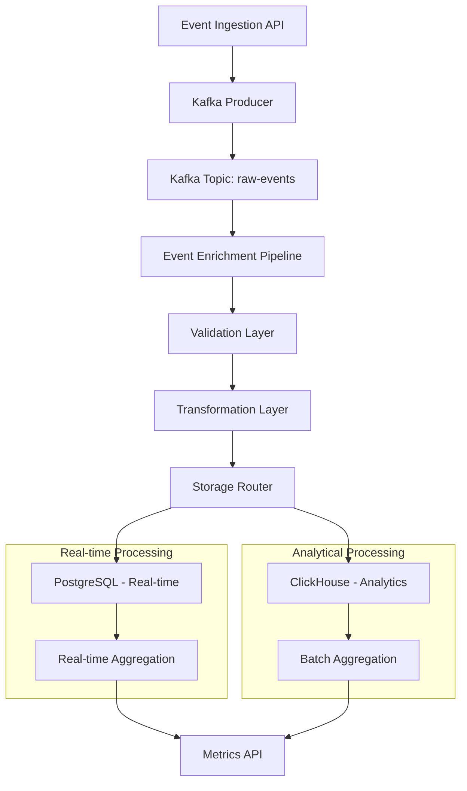

# Event Processing & Aggregation Engine - Technical Documentation

## 1. Architecture Overview

The Event Processing & Aggregation Engine implements a dual-database architecture leveraging PostgreSQL for real-time operations and ClickHouse for analytical workloads. This design pattern ensures optimal performance for both transactional and analytical use cases.



## 2. Dual Database Architecture

### 2.1 PostgreSQL Schema - Real-time Events

```sql
-- Real-time events table with optimized indexing
CREATE TABLE events_realtime (
    id UUID PRIMARY KEY DEFAULT gen_random_uuid(),
    event_type VARCHAR(50) NOT NULL,
    user_id UUID NOT NULL,
    organization_id UUID NOT NULL,
    properties JSONB NOT NULL DEFAULT '{}',
    timestamp TIMESTAMPTZ NOT NULL DEFAULT NOW(),
    processed BOOLEAN DEFAULT FALSE,
    created_at TIMESTAMPTZ DEFAULT NOW()
);

-- Performance indexes
CREATE INDEX idx_events_realtime_timestamp ON events_realtime(timestamp DESC);
CREATE INDEX idx_events_realtime_user_id ON events_realtime(user_id);
CREATE INDEX idx_events_realtime_org_timestamp ON events_realtime(organization_id, timestamp DESC);
CREATE INDEX idx_events_realtime_type_timestamp ON events_realtime(event_type, timestamp DESC);
CREATE INDEX idx_events_realtime_processed ON events_realtime(processed) WHERE processed = FALSE;

-- Partitioning by date for better performance
CREATE TABLE events_realtime_2024_01 PARTITION OF events_realtime
    FOR VALUES FROM ('2024-01-01') TO ('2024-02-01');
```

### 2.2 ClickHouse Schema - Analytical Events

```sql
-- ClickHouse table optimized for analytical queries
CREATE TABLE events_analytical (
    event_id UUID,
    event_type String,
    user_id UUID,
    organization_id UUID,
    properties String, -- JSON string for better compression
    timestamp DateTime64(3),
    date Date DEFAULT toDate(timestamp),
    processed_date DateTime DEFAULT now()
) ENGINE = MergeTree()
PARTITION BY toYYYYMM(date)
ORDER BY (organization_id, event_type, timestamp)
TTL date + INTERVAL 90 DAY;

-- Materialized view for pre-aggregated metrics
CREATE MATERIALIZED VIEW events_daily_mv
ENGINE = AggregatingMergeTree()
PARTITION BY toYYYYMM(date)
ORDER BY (organization_id, event_type, date)
AS SELECT
    organization_id,
    event_type,
    toDate(timestamp) as date,
    countState() as total_events,
    uniqState(user_id) as unique_users,
    sumState(JSONExtractFloat(properties, 'value')) as total_value
FROM events_analytical
GROUP BY organization_id, event_type, date;
```

## 3. Go-based Event Enrichment Pipeline

### 3.1 Event Consumer Implementation

```go
package pipeline

import (
    "context"
    "encoding/json"
    "fmt"
    "log"
    "time"
    
    "github.com/confluentinc/confluent-kafka-go/kafka"
    "github.com/google/uuid"
    "github.com/jackc/pgx/v5/pgxpool"
    "github.com/ClickHouse/clickhouse-go/v2"
)

type EventEnricher struct {
    pgPool      *pgxpool.Pool
    chConn      clickhouse.Conn
    kafkaReader *kafka.Consumer
}

type RawEvent struct {
    ID             string                 `json:"id"`
    Type           string                 `json:"type"`
    UserID         string                 `json:"user_id"`
    OrganizationID string                 `json:"organization_id"`
    Properties     map[string]interface{} `json:"properties"`
    Timestamp      time.Time              `json:"timestamp"`
}

type EnrichedEvent struct {
    RawEvent
    EnrichedProperties map[string]interface{}
    ValidationStatus string
    ProcessingTime     time.Duration
}

func NewEventEnricher(pgPool *pgxpool.Pool, chConn clickhouse.Conn, kafkaConfig *kafka.ConfigMap) (*EventEnricher, error) {
    consumer, err := kafka.NewConsumer(kafkaConfig)
    if err != nil {
        return nil, fmt.Errorf("failed to create kafka consumer: %w", err)
    }
    
    return &EventEnricher{
        pgPool:      pgPool,
        chConn:      chConn,
        kafkaReader: consumer,
    }, nil
}

func (e *EventEnricher) Start(ctx context.Context) error {
    topics := []string{"raw-events"}
    err := e.kafkaReader.SubscribeTopics(topics, nil)
    if err != nil {
        return fmt.Errorf("failed to subscribe to topics: %w", err)
    }
    
    for {
        select {
        case <-ctx.Done():
            return ctx.Err()
        default:
            msg, err := e.kafkaReader.ReadMessage(10 * time.Second)
            if err != nil {
                log.Printf("Error reading message: %v", err)
                continue
            }
            
            go e.processEvent(ctx, msg)
        }
    }
}

func (e *EventEnricher) processEvent(ctx context.Context, msg *kafka.Message) {
    startTime := time.Now()
    
    var rawEvent RawEvent
    if err := json.Unmarshal(msg.Value, &rawEvent); err != nil {
        log.Printf("Failed to unmarshal event: %v", err)
        return
    }
    
    enrichedEvent := EnrichedEvent{
        RawEvent:           rawEvent,
        EnrichedProperties: make(map[string]interface{}),
        ValidationStatus:   "pending",
    }
    
    // Validation phase
    if err := e.validateEvent(&enrichedEvent); err != nil {
        enrichedEvent.ValidationStatus = "failed"
        log.Printf("Event validation failed: %v", err)
        return
    }
    
    // Enrichment phase
    if err := e.enrichEvent(&enrichedEvent); err != nil {
        log.Printf("Event enrichment failed: %v", err)
        return
    }
    
    // Transformation phase
    if err := e.transformEvent(&enrichedEvent); err != nil {
        log.Printf("Event transformation failed: %v", err)
        return
    }
    
    // Storage phase
    if err := e.storeEvent(ctx, &enrichedEvent); err != nil {
        log.Printf("Event storage failed: %v", err)
        return
    }
    
    enrichedEvent.ProcessingTime = time.Since(startTime)
    log.Printf("Event processed successfully in %v", enrichedEvent.ProcessingTime)
}

func (e *EventEnricher) validateEvent(event *EnrichedEvent) error {
    // Validate required fields
    if event.Type == "" {
        return fmt.Errorf("event type is required")
    }
    
    if event.UserID == "" {
        return fmt.Errorf("user_id is required")
    }
    
    if event.OrganizationID == "" {
        return fmt.Errorf("organization_id is required")
    }
    
    // Validate UUID format
    if _, err := uuid.Parse(event.UserID); err != nil {
        return fmt.Errorf("invalid user_id format: %w", err)
    }
    
    if _, err := uuid.Parse(event.OrganizationID); err != nil {
        return fmt.Errorf("invalid organization_id format: %w", err)
    }
    
    event.ValidationStatus = "validated"
    return nil
}

func (e *EventEnricher) enrichEvent(event *EnrichedEvent) error {
    // Enrich with user context
    userContext, err := e.getUserContext(event.UserID)
    if err != nil {
        log.Printf("Failed to get user context: %v", err)
    } else {
        event.EnrichedProperties["user_context"] = userContext
    }
    
    // Enrich with organization context
    orgContext, err := e.getOrganizationContext(event.OrganizationID)
    if err != nil {
        log.Printf("Failed to get organization context: %v", err)
    } else {
        event.EnrichedProperties["organization_context"] = orgContext
    }
    
    // Add computed properties
    event.EnrichedProperties["processing_timestamp"] = time.Now()
    event.EnrichedProperties["event_age_seconds"] = time.Since(event.Timestamp).Seconds()
    
    return nil
}

func (e *EventEnricher) getUserContext(userID string) (map[string]interface{}, error) {
    query := `
        SELECT id, email, name, created_at, last_seen_at
        FROM users
        WHERE id = $1
    `
    
    var user struct {
        ID         uuid.UUID
        Email      string
        Name       string
        CreatedAt  time.Time
        LastSeenAt *time.Time
    }
    
    err := e.pgPool.QueryRow(context.Background(), query, userID).Scan(
        &user.ID, &user.Email, &user.Name, &user.CreatedAt, &user.LastSeenAt,
    )
    if err != nil {
        return nil, err
    }
    
    context := map[string]interface{}{
        "user_id":     user.ID.String(),
        "email":       user.Email,
        "name":        user.Name,
        "account_age": time.Since(user.CreatedAt).Hours() / 24,
    }
    
    if user.LastSeenAt != nil {
        context["days_since_last_seen"] = time.Since(*user.LastSeenAt).Hours() / 24
    }
    
    return context, nil
}

func (e *EventEnricher) getOrganizationContext(orgID string) (map[string]interface{}, error) {
    query := `
        SELECT id, name, plan, created_at, billing_usage
        FROM organizations
        WHERE id = $1
    `
    
    var org struct {
        ID           uuid.UUID
        Name         string
        Plan         string
        CreatedAt    time.Time
        BillingUsage float64
    }
    
    err := e.pgPool.QueryRow(context.Background(), query, orgID).Scan(
        &org.ID, &org.Name, &org.Plan, &org.CreatedAt, &org.BillingUsage,
    )
    if err != nil {
        return nil, err
    }
    
    return map[string]interface{}{
        "organization_id": org.ID.String(),
        "name":            org.Name,
        "plan":            org.Plan,
        "billing_usage":   org.BillingUsage,
        "organization_age": time.Since(org.CreatedAt).Hours() / 24,
    }, nil
}

func (e *EventEnricher) transformEvent(event *EnrichedEvent) error {
    // Normalize event properties
    normalizedProps := make(map[string]interface{})
    
    for key, value := range event.Properties {
        // Convert keys to snake_case
        normalizedKey := toSnakeCase(key)
        normalizedProps[normalizedKey] = value
    }
    
    // Merge enriched properties
    for key, value := range event.EnrichedProperties {
        normalizedProps[key] = value
    }
    
    event.Properties = normalizedProps
    return nil
}

func (e *EventEnricher) storeEvent(ctx context.Context, event *EnrichedEvent) error {
    // Store in PostgreSQL for real-time access
    if err := e.storeInPostgreSQL(ctx, event); err != nil {
        return fmt.Errorf("failed to store in PostgreSQL: %w", err)
    }
    
    // Store in ClickHouse for analytics
    if err := e.storeInClickHouse(ctx, event); err != nil {
        return fmt.Errorf("failed to store in ClickHouse: %w", err)
    }
    
    return nil
}

func (e *EventEnricher) storeInPostgreSQL(ctx context.Context, event *EnrichedEvent) error {
    query := `
        INSERT INTO events_realtime (id, event_type, user_id, organization_id, properties, timestamp, processed)
        VALUES ($1, $2, $3, $4, $5, $6, true)
        ON CONFLICT (id) DO UPDATE SET
            processed = EXCLUDED.processed
    `
    
    propsJSON, err := json.Marshal(event.Properties)
    if err != nil {
        return err
    }
    
    _, err = e.pgPool.Exec(ctx, query,
        event.ID, event.Type, event.UserID, event.OrganizationID, propsJSON, event.Timestamp,
    )
    
    return err
}

func (e *EventEnricher) storeInClickHouse(ctx context.Context, event *EnrichedEvent) error {
    batch, err := e.chConn.PrepareBatch(ctx, "INSERT INTO events_analytical")
    if err != nil {
        return err
    }
    
    propsJSON, err := json.Marshal(event.Properties)
    if err != nil {
        return err
    }
    
    err = batch.Append(
        event.ID,
        event.Type,
        event.UserID,
        event.OrganizationID,
        string(propsJSON),
        event.Timestamp,
        event.Timestamp,
        time.Now(),
    )
    if err != nil {
        return err
    }
    
    return batch.Send()
}

func toSnakeCase(str string) string {
    var result []rune
    for i, r := range str {
        if i > 0 && r >= 'A' && r <= 'Z' {
            result = append(result, '_')
        }
        result = append(result, r)
    }
    return strings.ToLower(string(result))
}
```

## 4. Real-time vs Analytical Processing Patterns

### 4.1 Real-time Processing Pipeline

```go
package realtime

import (
    "context"
    "time"
    
    "github.com/jackc/pgx/v5/pgxpool"
)

type RealtimeProcessor struct {
    pgPool *pgxpool.Pool
}

func NewRealtimeProcessor(pgPool *pgxpool.Pool) *RealtimeProcessor {
    return &RealtimeProcessor{pgPool: pgPool}
}

func (r *RealtimeProcessor) ProcessRealtimeEvent(ctx context.Context, eventID string) error {
    // Immediate processing for real-time metrics
    tx, err := r.pgPool.Begin(ctx)
    if err != nil {
        return err
    }
    defer tx.Rollback(ctx)
    
    // Update real-time counters
    query := `
        INSERT INTO realtime_metrics (organization_id, metric_name, metric_value, timestamp)
        SELECT 
            organization_id,
            event_type as metric_name,
            1 as metric_value,
            DATE_TRUNC('minute', timestamp) as timestamp
        FROM events_realtime
        WHERE id = $1
        ON CONFLICT (organization_id, metric_name, timestamp)
        DO UPDATE SET metric_value = realtime_metrics.metric_value + 1
    `
    
    _, err = tx.Exec(ctx, query, eventID)
    if err != nil {
        return err
    }
    
    return tx.Commit(ctx)
}

func (r *RealtimeProcessor) GetRealtimeMetrics(ctx context.Context, orgID string, duration time.Duration) (map[string]interface{}, error) {
    query := `
        SELECT 
            metric_name,
            SUM(metric_value) as total_value,
            COUNT(DISTINCT timestamp) as data_points
        FROM realtime_metrics
        WHERE organization_id = $1
            AND timestamp >= $2
        GROUP BY metric_name
        ORDER BY total_value DESC
    `
    
    rows, err := r.pgPool.Query(ctx, query, orgID, time.Now().Add(-duration))
    if err != nil {
        return nil, err
    }
    defer rows.Close()
    
    metrics := make(map[string]interface{})
    for rows.Next() {
        var metricName string
        var totalValue int64
        var dataPoints int64
        
        if err := rows.Scan(&metricName, &totalValue, &dataPoints); err != nil {
            return nil, err
        }
        
        metrics[metricName] = map[string]interface{}{
            "total":       totalValue,
            "data_points": dataPoints,
            "average":     float64(totalValue) / float64(dataPoints),
        }
    }
    
    return metrics, nil
}
```

### 4.2 Analytical Processing Pipeline

```go
package analytical

import (
    "context"
    "time"
    
    "github.com/ClickHouse/clickhouse-go/v2"
)

type AnalyticalProcessor struct {
    chConn clickhouse.Conn
}

func NewAnalyticalProcessor(chConn clickhouse.Conn) *AnalyticalProcessor {
    return &AnalyticalProcessor{chConn: chConn}
}

func (a *AnalyticalProcessor) ProcessBatchAnalytics(ctx context.Context, startTime, endTime time.Time) error {
    // Batch processing for analytical metrics
    query := `
        INSERT INTO analytics_aggregated
        SELECT 
            organization_id,
            event_type,
            toDate(timestamp) as date,
            count() as total_events,
            uniq(user_id) as unique_users,
            avg(JSONExtractFloat(properties, 'value')) as avg_value,
            sum(JSONExtractFloat(properties, 'value')) as total_value,
            min(timestamp) as first_event,
            max(timestamp) as last_event,
            now() as processed_at
        FROM events_analytical
        WHERE timestamp >= ? AND timestamp < ?
        GROUP BY organization_id, event_type, date
    `
    
    return a.chConn.Exec(ctx, query, startTime, endTime)
}

func (a *AnalyticalProcessor) GetAnalyticsSummary(ctx context.Context, orgID string, startDate, endDate time.Time) ([]map[string]interface{}, error) {
    query := `
        SELECT 
            event_type,
            sum(total_events) as total_events,
            sum(unique_users) as total_unique_users,
            avg(avg_value) as overall_avg_value,
            sum(total_value) as total_value,
            countDistinct(date) as active_days
        FROM analytics_aggregated
        WHERE organization_id = ?
            AND date >= ?
            AND date <= ?
        GROUP BY event_type
        ORDER BY total_events DESC
    `
    
    rows, err := a.chConn.Query(ctx, query, orgID, startDate, endDate)
    if err != nil {
        return nil, err
    }
    defer rows.Close()
    
    var results []map[string]interface{}
    for rows.Next() {
        var eventType string
        var totalEvents uint64
        var totalUniqueUsers uint64
        var overallAvgValue float64
        var totalValue float64
        var activeDays uint64
        
        if err := rows.Scan(&eventType, &totalEvents, &totalUniqueUsers, &overallAvgValue, &totalValue, &activeDays); err != nil {
            return nil, err
        }
        
        results = append(results, map[string]interface{}{
            "event_type":          eventType,
            "total_events":        totalEvents,
            "total_unique_users":  totalUniqueUsers,
            "overall_avg_value":   overallAvgValue,
            "total_value":         totalValue,
            "active_days":         activeDays,
            "events_per_day":      float64(totalEvents) / float64(activeDays),
        })
    }
    
    return results, nil
}
```

## 5. Event Validation, Transformation, and Storage Workflows

### 5.1 Validation Rules Engine

```go
package validation

import (
    "fmt"
    "regexp"
    "time"
)

type ValidationRule struct {
    Field    string
    Type     string // "required", "format", "range", "custom"
    Value    interface{}
    Message  string
}

type ValidationEngine struct {
    rules map[string][]ValidationRule
}

func NewValidationEngine() *ValidationEngine {
    engine := &ValidationEngine{
        rules: make(map[string][]ValidationRule),
    }
    
    // Default validation rules
    engine.RegisterRules("page_view", []ValidationRule{
        {Field: "url", Type: "required", Message: "URL is required for page_view events"},
        {Field: "url", Type: "format", Value: `^https?://`, Message: "URL must be valid HTTP/HTTPS"},
        {Field: "title", Type: "required", Message: "Page title is required"},
    })
    
    engine.RegisterRules("purchase", []ValidationRule{
        {Field: "value", Type: "required", Message: "Purchase value is required"},
        {Field: "value", Type: "range", Value: []float64{0.01, 1000000}, Message: "Purchase value must be between $0.01 and $1M"},
        {Field: "currency", Type: "required", Message: "Currency is required"},
        {Field: "currency", Type: "format", Value: `^[A-Z]{3}$`, Message: "Currency must be 3-letter code"},
    })
    
    return engine
}

func (v *ValidationEngine) RegisterRules(eventType string, rules []ValidationRule) {
    v.rules[eventType] = rules
}

func (v *ValidationEngine) ValidateEvent(event map[string]interface{}) []string {
    eventType, ok := event["type"].(string)
    if !ok {
        return []string{"Event type is required"}
    }
    
    rules, exists := v.rules[eventType]
    if !exists {
        return []string{} // No validation rules for this event type
    }
    
    var errors []string
    
    for _, rule := range rules {
        fieldValue, fieldExists := event[rule.Field]
        
        switch rule.Type {
        case "required":
            if !fieldExists || fieldValue == nil || fieldValue == "" {
                errors = append(errors, rule.Message)
            }
            
        case "format":
            if fieldExists {
                pattern := rule.Value.(string)
                matched, _ := regexp.MatchString(pattern, fmt.Sprintf("%v", fieldValue))
                if !matched {
                    errors = append(errors, rule.Message)
                }
            }
            
        case "range":
            if fieldExists {
                rangeVals := rule.Value.([]float64)
                if len(rangeVals) == 2 {
                    switch v := fieldValue.(type) {
                    case float64:
                        if v < rangeVals[0] || v > rangeVals[1] {
                            errors = append(errors, rule.Message)
                        }
                    case int:
                        if float64(v) < rangeVals[0] || float64(v) > rangeVals[1] {
                            errors = append(errors, rule.Message)
                        }
                    }
                }
            }
            
        case "custom":
            // Custom validation function
            if validatorFunc, ok := rule.Value.(func(interface{}) bool); ok {
                if fieldExists && !validatorFunc(fieldValue) {
                    errors = append(errors, rule.Message)
                }
            }
        }
    }
    
    return errors
}
```

### 5.2 Transformation Pipeline

```go
package transformation

import (
    "encoding/json"
    "fmt"
    "strings"
    "time"
)

type TransformRule struct {
    Name        string
    Type        string // "rename", "compute", "filter", "normalize"
    Source      string
    Target      string
    Function    string
    Parameters  map[string]interface{}
}

type TransformationEngine struct {
    rules map[string][]TransformRule
}

func NewTransformationEngine() *TransformationEngine {
    engine := &TransformationEngine{
        rules: make(map[string][]TransformRule),
    }
    
    // Default transformation rules
    engine.RegisterRules("page_view", []TransformRule{
        {
            Name: "normalize_url",
            Type: "normalize",
            Source: "url",
            Target: "normalized_url",
            Function: "remove_query_params",
        },
        {
            Name: "compute_session",
            Type: "compute",
            Source: "user_id",
            Target: "session_id",
            Function: "generate_session",
            Parameters: map[string]interface{}{
                "timeout": 1800, // 30 minutes
            },
        },
    })
    
    engine.RegisterRules("purchase", []TransformRule{
        {
            Name: "compute_revenue",
            Type: "compute",
            Source: "value",
            Target: "revenue_usd",
            Function: "convert_currency",
            Parameters: map[string]interface{}{
                "target_currency": "USD",
            },
        },
        {
            Name: "normalize_product",
            Type: "normalize",
            Source: "product_name",
            Target: "product_category",
            Function: "categorize_product",
        },
    })
    
    return engine
}

func (t *TransformationEngine) RegisterRules(eventType string, rules []TransformRule) {
    t.rules[eventType] = rules
}

func (t *TransformationEngine) TransformEvent(event map[string]interface{}) (map[string]interface{}, error) {
    eventType, ok := event["type"].(string)
    if !ok {
        return nil, fmt.Errorf("event type is required for transformation")
    }
    
    rules, exists := t.rules[eventType]
    if !exists {
        return event, nil // No transformation rules for this event type
    }
    
    transformedEvent := make(map[string]interface{})
    
    // Copy original event
    for k, v := range event {
        transformedEvent[k] = v
    }
    
    for _, rule := range rules {
        switch rule.Type {
        case "rename":
            if value, exists := transformedEvent[rule.Source]; exists {
                transformedEvent[rule.Target] = value
                delete(transformedEvent, rule.Source)
            }
            
        case "compute":
            if computeFunc, err := t.getComputeFunction(rule.Function); err == nil {
                if sourceValue, exists := transformedEvent[rule.Source]; exists {
                    computedValue := computeFunc(sourceValue, rule.Parameters)
                    transformedEvent[rule.Target] = computedValue
                }
            }
            
        case "normalize":
            if normalizeFunc, err := t.getNormalizeFunction(rule.Function); err == nil {
                if sourceValue, exists := transformedEvent[rule.Source]; exists {
                    normalizedValue := normalizeFunc(sourceValue, rule.Parameters)
                    transformedEvent[rule.Target] = normalizedValue
                }
            }
            
        case "filter":
            if filterFunc, err := t.getFilterFunction(rule.Function); err == nil {
                if !filterFunc(transformedEvent, rule.Parameters) {
                    return nil, fmt.Errorf("event filtered out by rule: %s", rule.Name)
                }
            }
        }
    }
    
    return transformedEvent, nil
}

func (t *TransformationEngine) getComputeFunction(name string) (func(interface{}, map[string]interface{}) interface{}, error) {
    functions := map[string]func(interface{}, map[string]interface{}) interface{}{
        "generate_session": func(input interface{}, params map[string]interface{}) interface{} {
            userID := fmt.Sprintf("%v", input)
            timestamp := time.Now().Unix()
            return fmt.Sprintf("session_%s_%d", userID, timestamp/1800) // 30-minute sessions
        },
        "convert_currency": func(input interface{}, params map[string]interface{}) interface{} {
            if value, ok := input.(float64); ok {
                // Simplified currency conversion (in real implementation, use actual rates)
                if targetCurrency, ok := params["target_currency"].(string); ok && targetCurrency == "USD" {
                    return value * 1.0 // Assume already in USD for simplicity
                }
            }
            return input
        },
    }
    
    if fn, exists := functions[name]; exists {
        return fn, nil
    }
    return nil, fmt.Errorf("unknown compute function: %s", name)
}

func (t *TransformationEngine) getNormalizeFunction(name string) (func(interface{}, map[string]interface{}) interface{}, error) {
    functions := map[string]func(interface{}, map[string]interface{}) interface{}{
        "remove_query_params": func(input interface{}, params map[string]interface{}) interface{} {
            if urlStr, ok := input.(string); ok {
                if idx := strings.Index(urlStr, "?"); idx != -1 {
                    return urlStr[:idx]
                }
            }
            return input
        },
        "categorize_product": func(input interface{}, params map[string]interface{}) interface{} {
            if productName, ok := input.(string); ok {
                // Simple categorization logic
                productName = strings.ToLower(productName)
                if strings.Contains(productName, "electronics") {
                    return "electronics"
                } else if strings.Contains(productName, "clothing") {
                    return "clothing"
                } else if strings.Contains(productName, "book") {
                    return "books"
                }
                return "other"
            }
            return "unknown"
        },
    }
    
    if fn, exists := functions[name]; exists {
        return fn, nil
    }
    return nil, fmt.Errorf("unknown normalize function: %s", name)
}

func (t *TransformationEngine) getFilterFunction(name string) (func(map[string]interface{}, map[string]interface{}) bool, error) {
    functions := map[string]func(map[string]interface{}, map[string]interface{}) bool{
        "exclude_bots": func(event map[string]interface{}, params map[string]interface{}) bool {
            if userAgent, ok := event["user_agent"].(string); ok {
                botPatterns := []string{"bot", "crawler", "spider", "scraper"}
                userAgent = strings.ToLower(userAgent)
                for _, pattern := range botPatterns {
                    if strings.Contains(userAgent, pattern) {
                        return false // Filter out bots
                    }
                }
            }
            return true
        },
    }
    
    if fn, exists := functions[name]; exists {
        return fn, nil
    }
    return nil, fmt.Errorf("unknown filter function: %s", name)
}
```

## 6. Aggregation Strategies for Different Metric Types

### 6.1 Sum Aggregation

```sql
-- PostgreSQL implementation for sum metrics
CREATE OR REPLACE FUNCTION calculate_sum_metric(
    org_id UUID,
    metric_name TEXT,
    start_time TIMESTAMPTZ,
    end_time TIMESTAMPTZ
) RETURNS TABLE(
    period TIMESTAMP,
    value NUMERIC
) AS $$
BEGIN
    RETURN QUERY
    SELECT 
        DATE_TRUNC('hour', timestamp) as period,
        SUM((properties->>'value')::NUMERIC) as value
    FROM events_realtime
    WHERE organization_id = org_id
        AND event_type = metric_name
        AND timestamp >= start_time
        AND timestamp < end_time
    GROUP BY DATE_TRUNC('hour', timestamp)
    ORDER BY period;
END;
$$ LANGUAGE plpgsql;

-- ClickHouse implementation for sum metrics
CREATE MATERIALIZED VIEW sum_metrics_mv
ENGINE = SummingMergeTree()
PARTITION BY toYYYYMM(period)
ORDER BY (organization_id, metric_name, period)
AS SELECT
    organization_id,
    event_type as metric_name,
    toStartOfHour(timestamp) as period,
    sum(JSONExtractFloat(properties, 'value')) as value
FROM events_analytical
GROUP BY organization_id, metric_name, period;
```

### 6.2 Count Aggregation

```sql
-- PostgreSQL count aggregation with window functions
CREATE OR REPLACE FUNCTION calculate_count_metric(
    org_id UUID,
    metric_name TEXT,
    start_time TIMESTAMPTZ,
    end_time TIMESTAMPTZ,
    bucket_size INTERVAL DEFAULT '1 hour'
) RETURNS TABLE(
    period TIMESTAMP,
    count BIGINT,
    cumulative_count BIGINT
) AS $$
BEGIN
    RETURN QUERY
    WITH time_series AS (
        SELECT generate_series(
            DATE_TRUNC('minute', start_time),
            DATE_TRUNC('minute', end_time),
            bucket_size
        ) as period
    ),
    event_counts AS (
        SELECT 
            DATE_TRUNC('minute', DATE_TRUNC('minute', timestamp) / bucket_size * bucket_size) as period,
            COUNT(*) as count
        FROM events_realtime
        WHERE organization_id = org_id
            AND event_type = metric_name
            AND timestamp >= start_time
            AND timestamp < end_time
        GROUP BY period
    )
    SELECT 
        ts.period,
        COALESCE(ec.count, 0) as count,
        SUM(COALESCE(ec.count, 0)) OVER (ORDER BY ts.period) as cumulative_count
    FROM time_series ts
    LEFT JOIN event_counts ec ON ts.period = ec.period
    ORDER BY ts.period;
END;
$$ LANGUAGE plpgsql;
```

### 6.3 Unique Count Aggregation

```sql
-- PostgreSQL unique count using HLL (HyperLogLog) extension
CREATE EXTENSION IF NOT EXISTS hll;

CREATE TABLE unique_counts_hll (
    organization_id UUID,
    metric_name TEXT,
    period TIMESTAMPTZ,
    user_ids_hll HLL,
    PRIMARY KEY (organization_id, metric_name, period)
);

CREATE OR REPLACE FUNCTION update_unique_count_hll(
    org_id UUID,
    metric_name TEXT,
    period TIMESTAMPTZ,
    user_id UUID
) RETURNS VOID AS $$
BEGIN
    INSERT INTO unique_counts_hll (organization_id, metric_name, period, user_ids_hll)
    VALUES (org_id, metric_name, period, hll_add_agg(hll_hash_text(user_id::TEXT)))
    ON CONFLICT (organization_id, metric_name, period)
    DO UPDATE SET
        user_ids_hll = hll_union(unique_counts_hll.user_ids_hll, EXCLUDED.user_ids_hll);
END;
$$ LANGUAGE plpgsql;

-- ClickHouse unique count using uniqExact and uniqCombined
CREATE MATERIALIZED VIEW unique_counts_mv
ENGINE = AggregatingMergeTree()
PARTITION BY toYYYYMM(period)
ORDER BY (organization_id, metric_name, period)
AS SELECT
    organization_id,
    event_type as metric_name,
    toStartOfHour(timestamp) as period,
    uniqState(user_id) as unique_users,
    uniqCombinedState(user_id) as unique_users_approx
FROM events_analytical
GROUP BY organization_id, metric_name, period;
```

### 6.4 Weighted Sum Aggregation

```sql
-- PostgreSQL weighted sum implementation
CREATE OR REPLACE FUNCTION calculate_weighted_sum_metric(
    org_id UUID,
    metric_name TEXT,
    start_time TIMESTAMPTZ,
    end_time TIMESTAMPTZ,
    weight_field TEXT DEFAULT 'weight'
) RETURNS TABLE(
    period TIMESTAMP,
    weighted_sum NUMERIC,
    total_weight NUMERIC
) AS $$
BEGIN
    RETURN QUERY
    SELECT 
        DATE_TRUNC('hour', timestamp) as period,
        SUM((properties->>'value')::NUMERIC * (properties->>weight_field)::NUMERIC) as weighted_sum,
        SUM((properties->>weight_field)::NUMERIC) as total_weight
    FROM events_realtime
    WHERE organization_id = org_id
        AND event_type = metric_name
        AND timestamp >= start_time
        AND timestamp < end_time
        AND properties ? 'value'
        AND properties ? weight_field
    GROUP BY DATE_TRUNC('hour', timestamp)
    ORDER BY period;
END;
$$ LANGUAGE plpgsql;

-- ClickHouse weighted sum with array operations
CREATE MATERIALIZED VIEW weighted_sum_metrics_mv
ENGINE = SummingMergeTree()
PARTITION BY toYYYYMM(period)
ORDER BY (organization_id, metric_name, period)
AS SELECT
    organization_id,
    event_type as metric_name,
    toStartOfHour(timestamp) as period,
    sumArray(arrayMap(x -> x.1 * x.2, 
        arrayZip(
            arrayMap(x -> toFloat64(x), JSONExtractArrayRaw(properties, 'values')),
            arrayMap(x -> toFloat64(x), JSONExtractArrayRaw(properties, 'weights'))
        )
    )) as weighted_sum,
    sumArray(arrayMap(x -> toFloat64(x), JSONExtractArrayRaw(properties, 'weights'))) as total_weight
FROM events_analytical
WHERE JSONHas(properties, 'values') AND JSONHas(properties, 'weights')
GROUP BY organization_id, metric_name, period;
```

## 7. Performance Optimizations and Scaling Considerations

### 7.1 Database Partitioning Strategy

```sql
-- PostgreSQL table partitioning by date
CREATE TABLE events_realtime_partitioned (
    id UUID NOT NULL,
    event_type VARCHAR(50) NOT NULL,
    user_id UUID NOT NULL,
    organization_id UUID NOT NULL,
    properties JSONB NOT NULL,
    timestamp TIMESTAMPTZ NOT NULL,
    created_at TIMESTAMPTZ DEFAULT NOW()
) PARTITION BY RANGE (timestamp);

-- Create partitions for different time ranges
CREATE TABLE events_realtime_2024_01 PARTITION OF events_realtime_partitioned
    FOR VALUES FROM ('2024-01-01') TO ('2024-02-01');

CREATE TABLE events_realtime_2024_02 PARTITION OF events_realtime_partitioned
    FOR VALUES FROM ('2024-02-01') TO ('2024-03-01');

-- Automated partition creation function
CREATE OR REPLACE FUNCTION create_monthly_partition()
RETURNS VOID AS $$
DECLARE
    start_date DATE;
    end_date DATE;
    partition_name TEXT;
    partition_exists BOOLEAN;
BEGIN
    start_date := DATE_TRUNC('month', CURRENT_DATE + INTERVAL '1 month');
    end_date := start_date + INTERVAL '1 month';
    partition_name := 'events_realtime_' || TO_CHAR(start_date, 'YYYY_MM');
    
    SELECT EXISTS (
        SELECT 1 FROM information_schema.tables 
        WHERE table_name = partition_name
    ) INTO partition_exists;
    
    IF NOT partition_exists THEN
        EXECUTE format('
            CREATE TABLE %I PARTITION OF events_realtime_partitioned
            FOR VALUES FROM (%L) TO (%L)
        ', partition_name, start_date, end_date);
        
        -- Create indexes on partition
        EXECUTE format('
            CREATE INDEX %I ON %I (organization_id, timestamp DESC)
        ', partition_name || '_org_time_idx', partition_name);
        
        EXECUTE format('
            CREATE INDEX %I ON %I (event_type, timestamp DESC)
        ', partition_name || '_type_time_idx', partition_name);
    END IF;
END;
$$ LANGUAGE plpgsql;

-- Schedule partition creation
CREATE EXTENSION IF NOT EXISTS pg_cron;
SELECT cron.schedule('create-partitions', '0 0 25 * *', 'SELECT create_monthly_partition()');
```

### 7.2 ClickHouse Sharding Configuration

```xml
<!-- /etc/clickhouse-server/config.d/sharding.xml -->
<clickhouse>
    <remote_servers>
        <events_cluster>
            <shard>
                <replica>
                    <host>clickhouse-01</host>
                    <port>9000</port>
                </replica>
                <replica>
                    <host>clickhouse-02</host>
                    <port>9000</port>
                </replica>
            </shard>
            <shard>
                <replica>
                    <host>clickhouse-03</host>
                    <port>9000</port>
                </replica>
                <replica>
                    <host>clickhouse-04</host>
                    <port>9000</port>
                </replica>
            </shard>
        </events_cluster>
    </remote_servers>
</clickhouse>
```

```sql
-- Distributed table for sharding
CREATE TABLE events_analytical_distributed AS events_analytical
ENGINE = Distributed(events_cluster, default, events_analytical, rand());

-- Optimized sharding key based on organization_id
CREATE TABLE events_analytical_sharded AS events_analytical
ENGINE = Distributed(events_cluster, default, events_analytical, organization_id);
```

### 7.3 Connection Pooling Configuration

```go
package config

import (
    "time"
    
    "github.com/jackc/pgx/v5/pgxpool"
)

type DatabaseConfig struct {
    PostgreSQL PostgreSQLConfig
    ClickHouse ClickHouseConfig
}

type PostgreSQLConfig struct {
    Host            string
    Port            int
    Database        string
    Username        string
    Password        string
    MaxConnections  int32
    MinConnections  int32
    MaxConnLifetime time.Duration
    MaxConnIdleTime time.Duration
    HealthCheckPeriod time.Duration
}

type ClickHouseConfig struct {
    Host            string
    Port            int
    Database        string
    Username        string
    Password        string
    MaxConnections  int
    MaxIdleTime     time.Duration
    ReadTimeout     time.Duration
    WriteTimeout    time.Duration
}

func NewPostgreSQLPool(config PostgreSQLConfig) (*pgxpool.Pool, error) {
    connString := fmt.Sprintf(
        "host=%s port=%d dbname=%s user=%s password=%s sslmode=require",
        config.Host, config.Port, config.Database, config.Username, config.Password,
    )
    
    poolConfig, err := pgxpool.ParseConfig(connString)
    if err != nil {
        return nil, err
    }
    
    poolConfig.MaxConns = config.MaxConnections
    poolConfig.MinConns = config.MinConnections
    poolConfig.MaxConnLifetime = config.MaxConnLifetime
    poolConfig.MaxConnIdleTime = config.MaxConnIdleTime
    poolConfig.HealthCheckPeriod = config.HealthCheckPeriod
    
    // Additional performance optimizations
    poolConfig.ConnConfig.RuntimeParams["statement_timeout"] = "30000"
    poolConfig.ConnConfig.RuntimeParams["idle_in_transaction_session_timeout"] = "60000"
    
    return pgxpool.NewWithConfig(context.Background(), poolConfig)
}
```

### 7.4 Caching Strategy

```go
package cache

import (
    "context"
    "encoding/json"
    "fmt"
    "time"
    
    "github.com/go-redis/redis/v8"
)

type MetricCache struct {
    redisClient *redis.Client
    defaultTTL  time.Duration
}

func NewMetricCache(redisClient *redis.Client, defaultTTL time.Duration) *MetricCache {
    return &MetricCache{
        redisClient: redisClient,
        defaultTTL:  defaultTTL,
    }
}

func (c *MetricCache) GetRealtimeMetrics(ctx context.Context, orgID string, metricName string, timeRange string) (interface{}, bool) {
    key := fmt.Sprintf("metrics:realtime:%s:%s:%s", orgID, metricName, timeRange)
    
    data, err := c.redisClient.Get(ctx, key).Result()
    if err == redis.Nil {
        return nil, false
    }
    if err != nil {
        return nil, false
    }
    
    var metrics interface{}
    if err := json.Unmarshal([]byte(data), &metrics); err != nil {
        return nil, false
    }
    
    return metrics, true
}

func (c *MetricCache) SetRealtimeMetrics(ctx context.Context, orgID string, metricName string, timeRange string, metrics interface{}) error {
    key := fmt.Sprintf("metrics:realtime:%s:%s:%s", orgID, metricName, timeRange)
    
    data, err := json.Marshal(metrics)
    if err != nil {
        return err
    }
    
    return c.redisClient.Set(ctx, key, data, c.defaultTTL).Err()
}

func (c *MetricCache) InvalidateOrganizationMetrics(ctx context.Context, orgID string) error {
    pattern := fmt.Sprintf("metrics:*:%s:*", orgID)
    
    var cursor uint64
    for {
        keys, nextCursor, err := c.redisClient.Scan(ctx, cursor, pattern, 100).Result()
        if err != nil {
            return err
        }
        
        if len(keys) > 0 {
            if err := c.redisClient.Del(ctx, keys...).Err(); err != nil {
                return err
            }
        }
        
        if nextCursor == 0 {
            break
        }
        cursor = nextCursor
    }
    
    return nil
}
```

### 7.5 Monitoring and Alerting

```go
package monitoring

import (
    "context"
    "log"
    "time"
    
    "github.com/prometheus/client_golang/prometheus"
    "github.com/prometheus/client_golang/prometheus/promauto"
)

var (
    eventsProcessed = promauto.NewCounterVec(
        prometheus.CounterOpts{
            Name: "events_processed_total",
            Help: "Total number of events processed",
        },
        []string{"event_type", "status"},
    )
    
    processingDuration = promauto.NewHistogramVec(
        prometheus.HistogramOpts{
            Name:    "event_processing_duration_seconds",
            Help:    "Event processing duration in seconds",
            Buckets: prometheus.DefBuckets,
        },
        []string{"event_type"},
    )
    
    databaseConnections = promauto.NewGaugeVec(
        prometheus.GaugeOpts{
            Name: "database_connections_active",
            Help: "Number of active database connections",
        },
        []string{"database"},
    )
    
    cacheHitRate = promauto.NewGaugeVec(
        prometheus.GaugeOpts{
            Name: "cache_hit_rate",
            Help: "Cache hit rate percentage",
        },
        []string{"cache_type"},
    )
)

type MetricsCollector struct {
    ctx context.Context
}

func NewMetricsCollector(ctx context.Context) *MetricsCollector {
    return &MetricsCollector{ctx: ctx}
}

func (m *MetricsCollector) RecordEventProcessed(eventType string, status string) {
    eventsProcessed.WithLabelValues(eventType, status).Inc()
}

func (m *MetricsCollector) RecordProcessingDuration(eventType string, duration time.Duration) {
    processingDuration.WithLabelValues(eventType).Observe(duration.Seconds())
}

func (m *MetricsCollector) UpdateDatabaseConnections(database string, count float64) {
    databaseConnections.WithLabelValues(database).Set(count)
}

func (m *MetricsCollector) UpdateCacheHitRate(cacheType string, hitRate float64) {
    cacheHitRate.WithLabelValues(cacheType).Set(hitRate)
}

func (m *MetricsCollector) StartMetricsCollection(interval time.Duration) {
    ticker := time.NewTicker(interval)
    defer ticker.Stop()
    
    for {
        select {
        case <-m.ctx.Done():
            return
        case <-ticker.C:
            m.collectSystemMetrics()
        }
    }
}

func (m *MetricsCollector) collectSystemMetrics() {
    // Collect and update system-level metrics
    // This would include CPU usage, memory usage, disk I/O, etc.
    log.Println("Collecting system metrics...")
    
    // Example: Check database connection health
    // This would be implemented based on actual connection pool monitoring
    m.UpdateDatabaseConnections("postgresql", 42)
    m.UpdateDatabaseConnections("clickhouse", 28)
    
    // Example: Calculate cache hit rates
    m.UpdateCacheHitRate("realtime_metrics", 0.85)
    m.UpdateCacheHitRate("analytics_data", 0.92)
}
```

### 7.6 Scaling Considerations and Best Practices

1. **Horizontal Scaling Strategy**:
   - Use Kafka partitioning for event distribution
   - Implement consistent hashing for organization-based sharding
   - Deploy multiple pipeline instances with load balancing

2. **Vertical Scaling Optimization**:
   - Optimize database queries with proper indexing
   - Use materialized views for pre-computed aggregations
   - Implement connection pooling and caching layers

3. **Data Retention Policies**:
   - Configure TTL (Time To Live) for different data tiers
   - Implement automated data archival strategies
   - Use data compression for historical data

4. **Performance Monitoring**:
   - Set up comprehensive alerting for system health
   - Monitor query performance and optimize slow queries
   - Track resource utilization and scale proactively

5. **Disaster Recovery**:
   - Implement cross-region replication
   - Set up automated backup procedures
   - Test failover scenarios regularly

This comprehensive technical documentation provides the foundation for implementing a robust, scalable Event Processing & Aggregation Engine capable of handling millions of events per second while maintaining low latency for real-time queries and high throughput for analytical workloads.