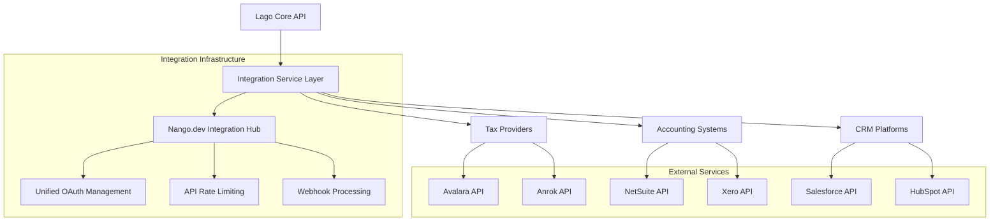
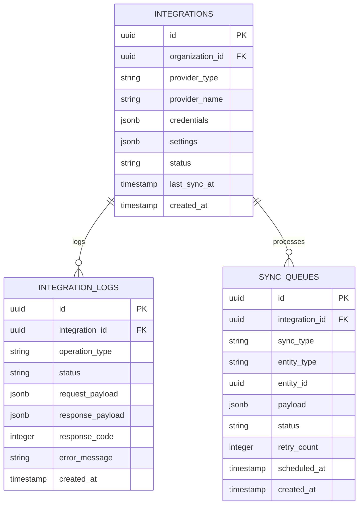

# External Integrations Technical Architecture

## 1. Architecture Design



## 2. Technology Stack

- **Integration Framework**: Ruby on Rails with HTTParty for API calls
- **OAuth Management**: Nango.dev for unified authentication
- **Queue Processing**: Sidekiq for background job processing
- **Webhook Handling**: Custom webhook controllers with signature verification
- **Data Transformation**: Custom mappers for each integration
- **Error Handling**: Circuit breaker pattern with exponential backoff

## 3. Tax Provider Integrations

### 3.1 Avalara Integration

```ruby
# app/services/integrations/tax/avalara_service.rb
module Integrations
  module Tax
    class AvalaraService
      AVA_API_BASE = 'https://rest.avatax.com/api/v2'
      
      def initialize(organization)
        @organization = organization
        @credentials = organization.tax_provider_credentials('avalara')
      end
      
      def calculate_tax(invoice)
        response = post('/transactions/create', build_tax_request(invoice))
        
        if response.success?
          parse_tax_response(response.body, invoice)
        else
          handle_error(response, 'Avalara tax calculation failed')
        end
      end
      
      def validate_address(address)
        response = post('/addresses/resolve', address_params(address))
        
        if response.success?
          parse_address_validation(response.body)
        else
          handle_error(response, 'Avalara address validation failed')
        end
      end
      
      private
      
      def build_tax_request(invoice)
        {
          type: 'SalesInvoice',
          companyCode: @credentials['company_code'],
          date: invoice.issuing_date.iso8601,
          customerCode: invoice.customer.external_id,
          addresses: build_addresses(invoice.customer),
          lines: build_lines(invoice.fees),
          commit: false
        }
      end
      
      def build_lines(fees)
        fees.map.with_index do |fee, index|
          {
            number: index.to_s,
            quantity: 1,
            amount: fee.amount_cents,
            itemCode: fee.item_code,
            description: fee.description,
            taxCode: fee.tax_code || 'P0000000'
          }
        end
      end
      
      def build_addresses(customer)
        {
          singleLocation: {
            line1: customer.address_line1,
            line2: customer.address_line2,
            city: customer.city,
            region: customer.state,
            country: customer.country,
            postalCode: customer.zipcode
          }
        }
      end
      
      def post(endpoint, payload)
        HTTParty.post(
          "#{AVA_API_BASE}#{endpoint}",
          body: payload.to_json,
          headers: {
            'Content-Type' => 'application/json',
            'Authorization' => "Basic #{basic_auth_token}"
          },
          timeout: 30
        )
      end
      
      def basic_auth_token
        Base64.strict_encode64("#{@credentials['account_id']}:#{@credentials['license_key']}")
      end
      
      def parse_tax_response(response_body, invoice)
        data = JSON.parse(response_body)
        
        {
          total_tax: data['totalTax'],
          tax_lines: data['lines'].map do |line|
            {
              fee_id: invoice.fees[line['number'].to_i].id,
              tax_amount: line['tax'],
              tax_rate: line['rate'],
              tax_details: line['details']
            }
          end
        }
      end
      
      def handle_error(response, message)
        error_data = JSON.parse(response.body) rescue {}
        
        raise IntegrationError.new(
          message,
          provider: 'avalara',
          status: response.code,
          error_code: error_data['error']['code'],
          details: error_data['error']['message']
        )
      end
    end
  end
end
```

### 3.2 Anrok Integration

```ruby
# app/services/integrations/tax/anrok_service.rb
module Integrations
  module Tax
    class AnrokService
      ANROK_API_BASE = 'https://api.anrok.com/v1'
      
      def initialize(organization)
        @organization = organization
        @api_key = organization.tax_provider_credentials('anrok')['api_key']
      end
      
      def calculate_tax(invoice)
        response = post('/tax/calculate', build_tax_request(invoice))
        
        if response.success?
          parse_tax_response(response.body)
        else
          handle_error(response, 'Anrok tax calculation failed')
        end
      end
      
      def register_transaction(invoice)
        response = post('/transactions', build_transaction_request(invoice))
        
        if response.success?
          JSON.parse(response.body)['id']
        else
          handle_error(response, 'Anrok transaction registration failed')
        end
      end
      
      private
      
      def build_tax_request(invoice)
        {
          transaction: {
            type: 'sale',
            currency: invoice.currency,
            customer: build_customer(invoice.customer),
            lineItems: build_line_items(invoice.fees),
            transactionDate: invoice.issuing_date.iso8601
          }
        }
      end
      
      def build_customer(customer)
        {
          id: customer.external_id,
          name: customer.name,
          address: {
            line1: customer.address_line1,
            line2: customer.address_line2,
            city: customer.city,
            region: customer.state,
            postalCode: customer.zipcode,
            country: customer.country
          }
        }
      end
      
      def build_line_items(fees)
        fees.map do |fee|
          {
            id: fee.id,
            amount: fee.amount_cents,
            productId: fee.item_code,
            description: fee.description,
            taxCode: fee.tax_code
          }
        end
      end
      
      def post(endpoint, payload)
        HTTParty.post(
          "#{ANROK_API_BASE}#{endpoint}",
          body: payload.to_json,
          headers: {
            'Content-Type' => 'application/json',
            'Authorization' => "Bearer #{@api_key}"
          },
          timeout: 30
        )
      end
      
      def parse_tax_response(response_body)
        data = JSON.parse(response_body)
        
        {
          total_tax: data['taxAmount'],
          tax_lines: data['lineItems'].map do |item|
            {
              fee_id: item['id'],
              tax_amount: item['taxAmount'],
              tax_rate: item['taxRate'],
              jurisdictions: item['jurisdictions']
            }
          end
        }
      end
    end
  end
end
```

## 4. Accounting System Integrations

### 4.1 NetSuite Integration

```ruby
# app/services/integrations/accounting/netsuite_service.rb
module Integrations
  module Accounting
    class NetsuiteService
      include HTTParty
      
      NETSUITE_REST_BASE = 'https://{account_id}.suitetalk.api.netsuite.com/services/rest'
      
      def initialize(organization)
        @organization = organization
        @credentials = organization.accounting_credentials('netsuite')
        @account_id = @credentials['account_id']
        @consumer_key = @credentials['consumer_key']
        @consumer_secret = @credentials['consumer_secret']
        @token_id = @credentials['token_id']
        @token_secret = @credentials['token_secret']
      end
      
      def create_customer(customer)
        response = post('/record/v1/customer', build_customer_payload(customer))
        
        if response.success?
          JSON.parse(response.body)['id']
        else
          handle_error(response, 'NetSuite customer creation failed')
        end
      end
      
      def create_invoice(invoice)
        response = post('/record/v1/invoice', build_invoice_payload(invoice))
        
        if response.success?
          JSON.parse(response.body)['id']
        else
          handle_error(response, 'NetSuite invoice creation failed')
        end
      end
      
      def sync_payment(payment)
        response = post('/record/v1/customerpayment', build_payment_payload(payment))
        
        if response.success?
          JSON.parse(response.body)['id']
        else
          handle_error(response, 'NetSuite payment sync failed')
        end
      end
      
      private
      
      def build_customer_payload(customer)
        {
          companyName: customer.name,
          email: customer.email,
          phone: customer.phone,
          addressbook: {
            items: [{
              addressbookAddress: {
                addr1: customer.address_line1,
                addr2: customer.address_line2,
                city: customer.city,
                state: customer.state,
                zip: customer.zipcode,
                country: customer.country
              }
            }]
          }
        }
      end
      
      def build_invoice_payload(invoice)
        {
          entity: { id: invoice.customer.external_accounting_id },
          trandate: invoice.issuing_date.iso8601,
          duedate: invoice.due_date.iso8601,
          currency: { id: get_currency_id(invoice.currency) },
          item: {
            items: invoice.fees.map do |fee|
              {
                item: { id: get_item_id(fee.item_code) },
                quantity: 1,
                rate: fee.amount_cents / 100.0,
                description: fee.description
              }
            end
          }
        }
      end
      
      def build_payment_payload(payment)
        {
          customer: { id: payment.customer.external_accounting_id },
          payment: payment.amount_cents / 100.0,
          currency: { id: get_currency_id(payment.currency) },
          tranDate: payment.payment_date.iso8601,
          apply: {
            items: [{
              doc: { id: payment.invoice.external_accounting_id },
              amount: payment.amount_cents / 100.0
            }]
          }
        }
      end
      
      def get(endpoint)
        self.class.get(
          base_url + endpoint,
          headers: oauth_headers('GET', endpoint),
          timeout: 30
        )
      end
      
      def post(endpoint, payload)
        self.class.post(
          base_url + endpoint,
          body: payload.to_json,
          headers: oauth_headers('POST', endpoint).merge('Content-Type' => 'application/json'),
          timeout: 30
        )
      end
      
      def oauth_headers(method, endpoint)
        OAuth::Helper.oauth_header(
          method: method,
          url: base_url + endpoint,
          consumer_key: @consumer_key,
          consumer_secret: @consumer_secret,
          token: @token_id,
          token_secret: @token_secret
        )
      end
      
      def base_url
        NETSUITE_REST_BASE.sub('{account_id}', @account_id)
      end
      
      def get_currency_id(currency)
        # Cache currency mappings
        @currency_cache ||= {}
        @currency_cache[currency] ||= fetch_currency_id(currency)
      end
      
      def get_item_id(item_code)
        # Cache item mappings
        @item_cache ||= {}
        @item_cache[item_code] ||= fetch_item_id(item_code)
      end
    end
  end
end
```

### 4.2 Xero Integration

```ruby
# app/services/integrations/accounting/xero_service.rb
module Integrations
  module Accounting
    class XeroService
      XERO_API_BASE = 'https://api.xero.com/api.xro/2.0'
      
      def initialize(organization)
        @organization = organization
        @credentials = organization.accounting_credentials('xero')
        @tenant_id = @credentials['tenant_id']
      end
      
      def create_customer(customer)
        response = post('/Contacts', build_customer_payload(customer))
        
        if response.success?
          JSON.parse(response.body)['Contacts'][0]['ContactID']
        else
          handle_error(response, 'Xero customer creation failed')
        end
      end
      
      def create_invoice(invoice)
        response = post('/Invoices', build_invoice_payload(invoice))
        
        if response.success?
          JSON.parse(response.body)['Invoices'][0]
        else
          handle_error(response, 'Xero invoice creation failed')
        end
      end
      
      def create_credit_note(credit_note)
        response = post('/CreditNotes', build_credit_note_payload(credit_note))
        
        if response.success?
          JSON.parse(response.body)['CreditNotes'][0]
        else
          handle_error(response, 'Xero credit note creation failed')
        end
      end
      
      private
      
      def build_customer_payload(customer)
        {
          Contacts: [{
            Name: customer.name,
            EmailAddress: customer.email,
            Phones: [{
              PhoneType: 'DEFAULT',
              PhoneNumber: customer.phone
            }],
            Addresses: [{
              AddressType: 'STREET',
              AddressLine1: customer.address_line1,
              AddressLine2: customer.address_line2,
              City: customer.city,
              Region: customer.state,
              PostalCode: customer.zipcode,
              Country: customer.country
            }]
          }]
        }
      end
      
      def build_invoice_payload(invoice)
        {
          Invoices: [{
            Type: 'ACCREC',
            Contact: { ContactID: invoice.customer.external_accounting_id },
            Date: invoice.issuing_date.iso8601,
            DueDate: invoice.due_date.iso8601,
            LineItems: invoice.fees.map do |fee|
              {
                Description: fee.description,
                Quantity: 1,
                UnitAmount: fee.amount_cents / 100.0,
                AccountCode: get_account_code(fee),
                TaxType: get_tax_type(fee)
              }
            end
          }]
        }
      end
      
      def build_credit_note_payload(credit_note)
        {
          CreditNotes: [{
            Type: 'ACCRECCREDIT',
            Contact: { ContactID: credit_note.customer.external_accounting_id },
            Date: credit_note.credit_note_date.iso8601,
            LineItems: credit_note.items.map do |item|
              {
                Description: item.description,
                Quantity: item.quantity,
                UnitAmount: item.amount_cents / 100.0,
                AccountCode: get_account_code(item),
                TaxType: get_tax_type(item)
              }
            end
          }]
        }
      end
      
      def get(endpoint)
        self.class.get(
          XERO_API_BASE + endpoint,
          headers: auth_headers,
          timeout: 30
        )
      end
      
      def post(endpoint, payload)
        self.class.post(
          XERO_API_BASE + endpoint,
          body: payload.to_json,
          headers: auth_headers.merge('Content-Type' => 'application/json'),
          timeout: 30
        )
      end
      
      def auth_headers
        {
          'Authorization' => "Bearer #{@credentials['access_token']}",
          'Xero-tenant-id' => @tenant_id
        }
      end
      
      def get_account_code(fee)
        # Map fee types to Xero account codes
        case fee.fee_type
        when 'subscription'
          '200'
        when 'charge'
          '201'
        when 'add_on'
          '202'
        else
          '200'
        end
      end
      
      def get_tax_type(fee)
        # Map tax codes to Xero tax types
        fee.tax_code || 'OUTPUT'
      end
    end
  end
end
```

## 5. CRM Platform Integrations

### 5.1 Salesforce Integration

```ruby
# app/services/integrations/crm/salesforce_service.rb
module Integrations
  module CRM
    class SalesforceService
      SALESFORCE_API_BASE = 'https://{instance}.salesforce.com/services/data/v58.0'
      
      def initialize(organization)
        @organization = organization
        @credentials = organization.crm_credentials('salesforce')
        @instance_url = @credentials['instance_url']
        @access_token = @credentials['access_token']
      end
      
      def sync_customer(customer)
        salesforce_id = find_customer_by_email(customer.email)
        
        if salesforce_id
          update_customer(salesforce_id, customer)
        else
          create_customer(customer)
        end
      end
      
      def create_opportunity(invoice)
        response = post('/sobjects/Opportunity', build_opportunity_payload(invoice))
        
        if response.success?
          JSON.parse(response.body)['id']
        else
          handle_error(response, 'Salesforce opportunity creation failed')
        end
      end
      
      def update_subscription_status(customer, subscription)
        salesforce_id = find_customer_by_email(customer.email)
        return unless salesforce_id
        
        response = patch("/sobjects/Account/#{salesforce_id}", {
          Lago_Subscription_Status__c: subscription.status,
          Lago_Plan_Name__c: subscription.plan.name,
          Lago_MRR__c: subscription.plan.amount_cents / 100.0,
          Lago_Subscription_Start_Date__c: subscription.started_at.iso8601
        })
        
        handle_error(response, 'Salesforce subscription update failed') unless response.success?
      end
      
      private
      
      def find_customer_by_email(email)
        response = get("/query?q=SELECT+Id+FROM+Account+WHERE+Email__c='#{email}'")
        
        if response.success?
          data = JSON.parse(response.body)
          data['records'].first&.dig('Id')
        end
      end
      
      def create_customer(customer)
        response = post('/sobjects/Account', build_customer_payload(customer))
        
        if response.success?
          salesforce_id = JSON.parse(response.body)['id']
          customer.update!(external_crm_id: salesforce_id)
          salesforce_id
        else
          handle_error(response, 'Salesforce customer creation failed')
        end
      end
      
      def update_customer(salesforce_id, customer)
        response = patch("/sobjects/Account/#{salesforce_id}", build_customer_payload(customer))
        
        handle_error(response, 'Salesforce customer update failed') unless response.success?
        salesforce_id
      end
      
      def build_customer_payload(customer)
        {
          Name: customer.name,
          Email__c: customer.email,
          Phone: customer.phone,
          BillingStreet: customer.address_line1,
          BillingCity: customer.city,
          BillingState: customer.state,
          BillingPostalCode: customer.zipcode,
          BillingCountry: customer.country,
          Lago_Customer_ID__c: customer.external_id,
          Lago_Created_At__c: customer.created_at.iso8601
        }
      end
      
      def build_opportunity_payload(invoice)
        {
          Name: "Subscription - #{invoice.customer.name}",
          AccountId: invoice.customer.external_crm_id,
          StageName: 'Closed Won',
          Amount: invoice.amount_cents / 100.0,
          CloseDate: invoice.issuing_date.iso8601,
          Type: 'New Business',
          Lago_Invoice_ID__c: invoice.external_id,
          Lago_Subscription_ID__c: invoice.subscription.external_id,
          CurrencyIsoCode: invoice.currency.upcase
        }
      end
      
      def get(endpoint)
        self.class.get(
          base_url + endpoint,
          headers: auth_headers,
          timeout: 30
        )
      end
      
      def post(endpoint, payload)
        self.class.post(
          base_url + endpoint,
          body: payload.to_json,
          headers: auth_headers.merge('Content-Type' => 'application/json'),
          timeout: 30
        )
      end
      
      def patch(endpoint, payload)
        self.class.patch(
          base_url + endpoint,
          body: payload.to_json,
          headers: auth_headers.merge('Content-Type' => 'application/json'),
          timeout: 30
        )
      end
      
      def auth_headers
        {
          'Authorization' => "Bearer #{@access_token}",
          'Accept' => 'application/json'
        }
      end
      
      def base_url
        SALESFORCE_API_BASE.sub('{instance}', @instance_url.split('.').first)
      end
    end
  end
end
```

### 5.2 HubSpot Integration

```ruby
# app/services/integrations/crm/hubspot_service.rb
module Integrations
  module CRM
    class HubspotService
      HUBSPOT_API_BASE = 'https://api.hubapi.com'
      
      def initialize(organization)
        @organization = organization
        @api_key = organization.crm_credentials('hubspot')['api_key']
      end
      
      def sync_customer(customer)
        contact_id = find_contact_by_email(customer.email)
        
        if contact_id
          update_contact(contact_id, customer)
        else
          create_contact(customer)
        end
      end
      
      def create_deal(invoice)
        response = post('/crm/v3/objects/deals', build_deal_payload(invoice))
        
        if response.success?
          deal_id = JSON.parse(response.body)['id']
          associate_deal_with_contact(deal_id, invoice.customer.external_crm_id)
          deal_id
        else
          handle_error(response, 'HubSpot deal creation failed')
        end
      end
      
      def update_subscription_properties(customer, subscription)
        contact_id = find_contact_by_email(customer.email)
        return unless contact_id
        
        response = patch("/crm/v3/objects/contacts/#{contact_id}", {
          properties: {
            lago_subscription_status: subscription.status,
            lago_plan_name: subscription.plan.name,
            lago_mrr: subscription.plan.amount_cents / 100.0,
            lago_subscription_start_date: subscription.started_at.to_i * 1000 # HubSpot expects milliseconds
          }
        })
        
        handle_error(response, 'HubSpot subscription update failed') unless response.success?
      end
      
      private
      
      def find_contact_by_email(email)
        response = get("/contacts/v1/contact/email/#{email}/profile")
        
        if response.success?
          JSON.parse(response.body)['vid']
        end
      end
      
      def create_contact(customer)
        response = post('/contacts/v1/contact', build_contact_payload(customer))
        
        if response.success?
          contact_id = JSON.parse(response.body)['vid']
          customer.update!(external_crm_id: contact_id)
          contact_id
        else
          handle_error(response, 'HubSpot contact creation failed')
        end
      end
      
      def update_contact(contact_id, customer)
        response = put("/contacts/v1/contact/vid/#{contact_id}/profile", build_contact_payload(customer))
        
        handle_error(response, 'HubSpot contact update failed') unless response.success?
        contact_id
      end
      
      def build_contact_payload(customer)
        {
          properties: [
            { property: 'email', value: customer.email },
            { property: 'firstname', value: customer.first_name },
            { property: 'lastname', value: customer.last_name },
            { property: 'phone', value: customer.phone },
            { property: 'address', value: customer.address_line1 },
            { property: 'city', value: customer.city },
            { property: 'state', value: customer.state },
            { property: 'zip', value: customer.zipcode },
            { property: 'country', value: customer.country },
            { property: 'lago_customer_id', value: customer.external_id },
            { property: 'lago_created_at', value: customer.created_at.to_i * 1000 }
          ]
        }
      end
      
      def build_deal_payload(invoice)
        {
          properties: {
            dealname: "Subscription - #{invoice.customer.name}",
            amount: invoice.amount_cents / 100.0,
            closedate: invoice.issuing_date.to_i * 1000,
            dealstage: 'closedwon',
            pipeline: get_default_pipeline_id,
            lago_invoice_id: invoice.external_id,
            lago_subscription_id: invoice.subscription.external_id,
            currency: invoice.currency.upcase
          }
        }
      end
      
      def associate_deal_with_contact(deal_id, contact_id)
        post("/crm/v3/objects/deals/#{deal_id}/associations/contacts/#{contact_id}/195", {})
      end
      
      def get_default_pipeline_id
        # Cache pipeline ID or fetch from API
        @pipeline_id ||= fetch_pipeline_id
      end
      
      def fetch_pipeline_id
        response = get('/crm/v3/pipelines/deals')
        
        if response.success?
          pipelines = JSON.parse(response.body)['results']
          pipelines.find { |p| p['isDefault'] }['id']
        end
      end
      
      def get(endpoint)
        self.class.get(
          HUBSPOT_API_BASE + endpoint,
          headers: auth_headers,
          timeout: 30
        )
      end
      
      def post(endpoint, payload)
        self.class.post(
          HUBSPOT_API_BASE + endpoint,
          body: payload.to_json,
          headers: auth_headers.merge('Content-Type' => 'application/json'),
          timeout: 30
        )
      end
      
      def put(endpoint, payload)
        self.class.put(
          HUBSPOT_API_BASE + endpoint,
          body: payload.to_json,
          headers: auth_headers.merge('Content-Type' => 'application/json'),
          timeout: 30
        )
      end
      
      def patch(endpoint, payload)
        self.class.patch(
          HUBSPOT_API_BASE + endpoint,
          body: payload.to_json,
          headers: auth_headers.merge('Content-Type' => 'application/json'),
          timeout: 30
        )
      end
      
      def auth_headers
        {
          'Authorization' => "Bearer #{@api_key}"
        }
      end
    end
  end
end
```

## 6. Nango.dev Integration Hub

```javascript
// connectors/nango.js
const Nango = require('@nangohq/node');

class NangoIntegrationService {
  constructor() {
    this.nango = new Nango({
      secretKey: process.env.NANGO_SECRET_KEY
    });
  }

  async createConnection(provider, connectionId, organizationId) {
    try {
      const connection = await this.nango.createConnection({
        provider,
        connectionId: `${organizationId}-${provider}`,
        organizationId
      });

      return {
        connectionId: connection.connectionId,
        authUrl: connection.auth_url
      };
    } catch (error) {
      throw new IntegrationError(`Failed to create ${provider} connection: ${error.message}`);
    }
  }

  async refreshToken(provider, connectionId) {
    try {
      const newCredentials = await this.nango.refreshToken(provider, connectionId);
      
      // Update stored credentials
      await this.updateOrganizationCredentials(connectionId, newCredentials);
      
      return newCredentials;
    } catch (error) {
      throw new IntegrationError(`Failed to refresh ${provider} token: ${error.message}`);
    }
  }

  async makeApiCall(provider, connectionId, endpoint, options = {}) {
    try {
      const response = await this.nango.proxy({
        provider,
        connectionId,
        endpoint,
        method: options.method || 'GET',
        data: options.body,
        headers: options.headers || {},
        retries: 3
      });

      return response.data;
    } catch (error) {
      if (error.response?.status === 401) {
        // Token expired, attempt refresh
        await this.refreshToken(provider, connectionId);
        
        // Retry the request
        return this.makeApiCall(provider, connectionId, endpoint, options);
      }
      
      throw new IntegrationError(`API call failed: ${error.message}`);
    }
  }

  async getConnectionStatus(connectionId) {
    try {
      const connection = await this.nango.getConnection(connectionId);
      
      return {
        connected: connection.credentials !== null,
        lastSync: connection.last_sync,
        status: connection.status
      };
    } catch (error) {
      return {
        connected: false,
        error: error.message
      };
    }
  }

  async deleteConnection(connectionId) {
    try {
      await this.nango.deleteConnection(connectionId);
      return true;
    } catch (error) {
      throw new IntegrationError(`Failed to delete connection: ${error.message}`);
    }
  }
}

module.exports = NangoIntegrationService;
```

## 7. Webhook Processing

```ruby
# app/controllers/webhooks_controller.rb
class WebhooksController < ApplicationController
  skip_before_action :verify_authenticity_token
  
  def tax_provider
    provider = params[:provider]
    
    case provider
    when 'avalara'
      process_avalara_webhook
    when 'anrok'
      process_anrok_webhook
    else
      render json: { error: 'Unknown provider' }, status: 400
    end
  end
  
  def accounting
    provider = params[:provider]
    
    case provider
    when 'netsuite'
      process_netsuite_webhook
    when 'xero'
      process_xero_webhook
    else
      render json: { error: 'Unknown provider' }, status: 400
    end
  end
  
  def crm
    provider = params[:provider]
    
    case provider
    when 'salesforce'
      process_salesforce_webhook
    when 'hubspot'
      process_hubspot_webhook
    else
      render json: { error: 'Unknown provider' }, status: 400
    end
  end
  
  private
  
  def process_avalara_webhook
    # Verify webhook signature
    signature = request.headers['X-Avalara-Signature']
    payload = request.body.read
    
    unless verify_avalara_signature(signature, payload)
      render json: { error: 'Invalid signature' }, status: 401
      return
    end
    
    webhook_data = JSON.parse(payload)
    
    case webhook_data['type']
    when 'tax.calculated'
      handle_tax_calculation_update(webhook_data)
    when 'tax.filed'
      handle_tax_filing_update(webhook_data)
    end
    
    render json: { status: 'processed' }
  end
  
  def process_netsuite_webhook
    # NetSuite webhook processing
    webhook_data = JSON.parse(request.body.read)
    
    case webhook_data['eventType']
    when 'customer.created'
      handle_netsuite_customer_created(webhook_data)
    when 'invoice.updated'
      handle_netsuite_invoice_updated(webhook_data)
    end
    
    render json: { status: 'processed' }
  end
  
  def verify_avalara_signature(signature, payload)
    expected_signature = Base64.strict_encode64(
      OpenSSL::HMAC.digest('sha256', @organization.tax_provider_credentials('avalara')['webhook_secret'], payload)
    )
    
    Rack::Utils.secure_compare(signature, expected_signature)
  end
  
  def handle_tax_calculation_update(data)
    # Process tax calculation update
    TaxCalculationUpdateJob.perform_async(data)
  end
  
  def handle_netsuite_customer_created(data)
    # Sync customer from NetSuite to Lago
    CustomerSyncJob.perform_async('netsuite', data)
  end
end
```

## 8. Error Handling and Circuit Breaker

```ruby
# app/services/integrations/circuit_breaker.rb
module Integrations
  class CircuitBreaker
    FAILURE_THRESHOLD = 5
    RECOVERY_TIMEOUT = 60 # seconds
    
    def initialize(service_name)
      @service_name = service_name
      @failure_count = 0
      @last_failure_time = nil
      @state = 'closed' # closed, open, half-open
    end
    
    def call(&block)
      case @state
      when 'closed'
        execute_call(block)
      when 'open'
        if can_attempt_reset?
          @state = 'half-open'
          execute_call(block)
        else
          raise CircuitOpenError.new("Circuit breaker is open for #{@service_name}")
        end
      when 'half-open'
        execute_call(block)
      end
    end
    
    private
    
    def execute_call(block)
      result = block.call
      on_success
      result
    rescue => e
      on_failure
      raise e
    end
    
    def on_success
      @failure_count = 0
      @state = 'closed'
    end
    
    def on_failure
      @failure_count += 1
      @last_failure_time = Time.current
      
      if @failure_count >= FAILURE_THRESHOLD
        @state = 'open'
        Rails.logger.error "Circuit breaker opened for #{@service_name}"
      end
    end
    
    def can_attempt_reset?
      return false unless @last_failure_time
      Time.current - @last_failure_time >= RECOVERY_TIMEOUT
    end
  end
  
  class CircuitOpenError < StandardError; end
end
```

## 9. Data Models



## 10. API Rate Limiting

```ruby
# app/services/integrations/rate_limiter.rb
module Integrations
  class RateLimiter
    def initialize(provider, organization_id)
      @provider = provider
      @organization_id = organization_id
      @redis_key = "rate_limit:#{provider}:#{organization_id}"
    end
    
    def with_rate_limit(&block)
      if rate_limit_exceeded?
        wait_time = time_until_reset
        raise RateLimitExceeded.new("Rate limit exceeded. Try again in #{wait_time}s")
      end
      
      increment_counter
      block.call
    end
    
    private
    
    def rate_limit_exceeded?
      current_count = Redis.current.get(@redis_key).to_i
      current_count >= rate_limit_for_provider
    end
    
    def increment_counter
      Redis.current.multi do |transaction|
        transaction.incr(@redis_key)
        transaction.expire(@redis_key, time_window)
      end
    end
    
    def rate_limit_for_provider
      case @provider
      when 'salesforce'
        100  # requests per 24 hours
      when 'hubspot'
        100  # requests per 10 seconds
      when 'avalara'
        200  # requests per minute
      when 'netsuite'
        10   # requests per second
      else
        60   # default requests per minute
      end
    end
    
    def time_window
      case @provider
      when 'salesforce'
        86400 # 24 hours
      when 'hubspot'
        10    # 10 seconds
      else
        60    # 1 minute
      end
    end
    
    def time_until_reset
      ttl = Redis.current.ttl(@redis_key)
      ttl > 0 ? ttl : 0
    end
  end
  
  class RateLimitExceeded < StandardError; end
end
```