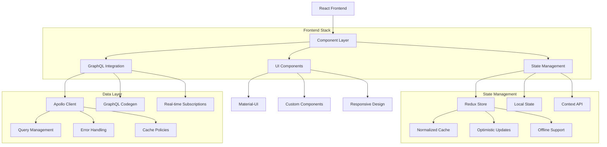

# Frontend Architecture Technical Document

## 1. Architecture Design



## 2. Technology Stack

- **Framework**: React 18+ with TypeScript
- **State Management**: Redux Toolkit with RTK Query
- **GraphQL Client**: Apollo Client 3.0
- **UI Library**: Material-UI (MUI) v5
- **Styling**: Tailwind CSS with CSS-in-JS
- **Build Tool**: Vite with SWC
- **Testing**: Jest, React Testing Library, Cypress
- **Code Quality**: ESLint, Prettier, Husky
- **Real-time**: GraphQL Subscriptions with WebSocket

## 3. Component Architecture

### 3.1 Component Structure

```typescript
// src/components/ComponentStructure.tsx
import React from 'react';
import { styled } from '@mui/material/styles';
import { useTheme } from '@mui/material/styles';
import useMediaQuery from '@mui/material/useMediaQuery';

interface ComponentProps {
  title: string;
  children: React.ReactNode;
  variant?: 'primary' | 'secondary';
  onAction?: () => void;
}

// Styled components with theme integration
const StyledContainer = styled('div')(({ theme }) => ({
  padding: theme.spacing(3),
  backgroundColor: theme.palette.background.paper,
  borderRadius: theme.shape.borderRadius,
  boxShadow: theme.shadows[1],
  [theme.breakpoints.down('sm')]: {
    padding: theme.spacing(2),
  },
}));

const ComponentHeader = styled('div')(({ theme }) => ({
  display: 'flex',
  justifyContent: 'space-between',
  alignItems: 'center',
  marginBottom: theme.spacing(2),
  paddingBottom: theme.spacing(2),
  borderBottom: `1px solid ${theme.palette.divider}`,
}));

// Main component with TypeScript interfaces
export const ComponentStructure: React.FC<ComponentProps> = ({
  title,
  children,
  variant = 'primary',
  onAction,
}) => {
  const theme = useTheme();
  const isMobile = useMediaQuery(theme.breakpoints.down('sm'));
  
  return (
    <StyledContainer>
      <ComponentHeader>
        <h3>{title}</h3>
        {onAction && (
          <button onClick={onAction}>
            {variant === 'primary' ? 'Primary Action' : 'Secondary Action'}
          </button>
        )}
      </ComponentHeader>
      <div>{children}</div>
    </StyledContainer>
  );
};

export default ComponentStructure;
```

### 3.2 Layout Components

```typescript
// src/layouts/NavLayout.tsx
import React, { useState, useEffect } from 'react';
import {
  AppBar,
  Box,
  CssBaseline,
  Drawer,
  IconButton,
  List,
  ListItem,
  ListItemButton,
  ListItemIcon,
  ListItemText,
  Toolbar,
  Typography,
  useTheme,
  useMediaQuery,
} from '@mui/material';
import {
  Menu as MenuIcon,
  Dashboard,
  People,
  Receipt,
  Settings,
  Analytics,
} from '@mui/icons-material';
import { useNavigate, useLocation } from 'react-router-dom';

const drawerWidth = 240;

interface NavLayoutProps {
  children: React.ReactNode;
}

interface MenuItem {
  text: string;
  icon: React.ReactNode;
  path: string;
}

const menuItems: MenuItem[] = [
  { text: 'Dashboard', icon: <Dashboard />, path: '/dashboard' },
  { text: 'Customers', icon: <People />, path: '/customers' },
  { text: 'Invoices', icon: <Receipt />, path: '/invoices' },
  { text: 'Analytics', icon: <Analytics />, path: '/analytics' },
  { text: 'Settings', icon: <Settings />, path: '/settings' },
];

export const NavLayout: React.FC<NavLayoutProps> = ({ children }) => {
  const theme = useTheme();
  const navigate = useNavigate();
  const location = useLocation();
  const isMobile = useMediaQuery(theme.breakpoints.down('sm'));
  
  const [mobileOpen, setMobileOpen] = useState(false);
  const [selectedIndex, setSelectedIndex] = useState(0);
  
  useEffect(() => {
    const currentPath = location.pathname;
    const currentIndex = menuItems.findIndex((item) => 
      currentPath.startsWith(item.path)
    );
    setSelectedIndex(currentIndex !== -1 ? currentIndex : 0);
  }, [location.pathname]);
  
  const handleDrawerToggle = () => {
    setMobileOpen(!mobileOpen);
  };
  
  const handleNavigation = (path: string, index: number) => {
    navigate(path);
    setSelectedIndex(index);
    if (isMobile) {
      setMobileOpen(false);
    }
  };
  
  const drawer = (
    <div>
      <Toolbar>
        <Typography variant="h6" noWrap component="div">
          Lago Billing
        </Typography>
      </Toolbar>
      <List>
        {menuItems.map((item, index) => (
          <ListItem key={item.text} disablePadding>
            <ListItemButton
              selected={selectedIndex === index}
              onClick={() => handleNavigation(item.path, index)}
            >
              <ListItemIcon>{item.icon}</ListItemIcon>
              <ListItemText primary={item.text} />
            </ListItemButton>
          </ListItem>
        ))}
      </List>
    </div>
  );
  
  return (
    <Box sx={{ display: 'flex' }}>
      <CssBaseline />
      <AppBar
        position="fixed"
        sx={{
          width: { sm: `calc(100% - ${drawerWidth}px)` },
          ml: { sm: `${drawerWidth}px` },
        }}
      >
        <Toolbar>
          <IconButton
            color="inherit"
            aria-label="open drawer"
            edge="start"
            onClick={handleDrawerToggle}
            sx={{ mr: 2, display: { sm: 'none' } }}
          >
            <MenuIcon />
          </IconButton>
          <Typography variant="h6" noWrap component="div">
            {menuItems[selectedIndex]?.text || 'Dashboard'}
          </Typography>
        </Toolbar>
      </AppBar>
      
      <Box
        component="nav"
        sx={{ width: { sm: drawerWidth }, flexShrink: { sm: 0 } }}
      >
        {/* Mobile drawer */}
        <Drawer
          variant="temporary"
          open={mobileOpen}
          onClose={handleDrawerToggle}
          ModalProps={{
            keepMounted: true, // Better open performance on mobile.
          }}
          sx={{
            display: { xs: 'block', sm: 'none' },
            '& .MuiDrawer-paper': { boxSizing: 'border-box', width: drawerWidth },
          }}
        >
          {drawer}
        </Drawer>
        
        {/* Desktop drawer */}
        <Drawer
          variant="permanent"
          sx={{
            display: { xs: 'none', sm: 'block' },
            '& .MuiDrawer-paper': { boxSizing: 'border-box', width: drawerWidth },
          }}
          open
        >
          {drawer}
        </Drawer>
      </Box>
      
      <Box
        component="main"
        sx={{
          flexGrow: 1,
          p: 3,
          width: { sm: `calc(100% - ${drawerWidth}px)` },
        }}
      >
        <Toolbar />
        {children}
      </Box>
    </Box>
  );
};

export default NavLayout;
```

## 4. State Management with Redux Toolkit

### 4.1 Store Configuration

```typescript
// src/store/store.ts
import { configureStore } from '@reduxjs/toolkit';
import { setupListeners } from '@reduxjs/toolkit/query';
import { apiSlice } from './api/apiSlice';
import authReducer from './slices/authSlice';
import organizationReducer from './slices/organizationSlice';
import uiReducer from './slices/uiSlice';

export const store = configureStore({
  reducer: {
    [apiSlice.reducerPath]: apiSlice.reducer,
    auth: authReducer,
    organization: organizationReducer,
    ui: uiReducer,
  },
  middleware: (getDefaultMiddleware) =>
    getDefaultMiddleware({
      serializableCheck: {
        ignoredActions: ['persist/PERSIST'],
      },
    }).concat(apiSlice.middleware),
  devTools: process.env.NODE_ENV !== 'production',
});

setupListeners(store.dispatch);

export type RootState = ReturnType<typeof store.getState>;
export type AppDispatch = typeof store.dispatch;
```

### 4.2 API Slice with RTK Query

```typescript
// src/store/api/apiSlice.ts
import { createApi, fetchBaseQuery } from '@reduxjs/toolkit/query/react';
import { RootState } from '../store';

const baseQuery = fetchBaseQuery({
  baseUrl: import.meta.env.VITE_API_URL || '/api',
  prepareHeaders: (headers, { getState }) => {
    const token = (getState() as RootState).auth.accessToken;
    
    if (token) {
      headers.set('authorization', `Bearer ${token}`);
    }
    
    return headers;
  },
});

const baseQueryWithReauth = async (args: any, api: any, extraOptions: any) => {
  let result = await baseQuery(args, api, extraOptions);
  
  if (result.error && result.error.status === 401) {
    // Try to refresh token
    const refreshResult = await baseQuery('/auth/refresh', api, extraOptions);
    
    if (refreshResult.data) {
      // Store new token
      api.dispatch(setCredentials(refreshResult.data));
      
      // Retry original query
      result = await baseQuery(args, api, extraOptions);
    } else {
      // Refresh failed, redirect to login
      api.dispatch(logout());
    }
  }
  
  return result;
};

export const apiSlice = createApi({
  reducerPath: 'api',
  baseQuery: baseQueryWithReauth,
  tagTypes: ['Customer', 'Invoice', 'Subscription', 'Organization', 'User'],
  endpoints: (builder) => ({
    // Auth endpoints
    login: builder.mutation({
      query: (credentials) => ({
        url: '/auth/login',
        method: 'POST',
        body: credentials,
      }),
    }),
    
    refresh: builder.mutation({
      query: () => ({
        url: '/auth/refresh',
        method: 'POST',
      }),
    }),
    
    // Organization endpoints
    getOrganizations: builder.query({
      query: () => '/organizations',
      providesTags: ['Organization'],
    }),
    
    getOrganization: builder.query({
      query: (id) => `/organizations/${id}`,
      providesTags: (result, error, id) => [{ type: 'Organization', id }],
    }),
    
    updateOrganization: builder.mutation({
      query: ({ id, ...patch }) => ({
        url: `/organizations/${id}`,
        method: 'PATCH',
        body: patch,
      }),
      invalidatesTags: (result, error, { id }) => [{ type: 'Organization', id }],
    }),
    
    // Customer endpoints
    getCustomers: builder.query({
      query: (params) => ({
        url: '/customers',
        params,
      }),
      providesTags: ['Customer'],
    }),
    
    getCustomer: builder.query({
      query: (id) => `/customers/${id}`,
      providesTags: (result, error, id) => [{ type: 'Customer', id }],
    }),
    
    createCustomer: builder.mutation({
      query: (customer) => ({
        url: '/customers',
        method: 'POST',
        body: customer,
      }),
      invalidatesTags: ['Customer'],
    }),
    
    updateCustomer: builder.mutation({
      query: ({ id, ...patch }) => ({
        url: `/customers/${id}`,
        method: 'PATCH',
        body: patch,
      }),
      invalidatesTags: (result, error, { id }) => [{ type: 'Customer', id }],
    }),
    
    deleteCustomer: builder.mutation({
      query: (id) => ({
        url: `/customers/${id}`,
        method: 'DELETE',
      }),
      invalidatesTags: ['Customer'],
    }),
    
    // Invoice endpoints
    getInvoices: builder.query({
      query: (params) => ({
        url: '/invoices',
        params,
      }),
      providesTags: ['Invoice'],
    }),
    
    getInvoice: builder.query({
      query: (id) => `/invoices/${id}`,
      providesTags: (result, error, id) => [{ type: 'Invoice', id }],
    }),
    
    createInvoice: builder.mutation({
      query: (invoice) => ({
        url: '/invoices',
        method: 'POST',
        body: invoice,
      }),
      invalidatesTags: ['Invoice'],
    }),
    
    // Subscription endpoints
    getSubscriptions: builder.query({
      query: (params) => ({
        url: '/subscriptions',
        params,
      }),
      providesTags: ['Subscription'],
    }),
    
    createSubscription: builder.mutation({
      query: (subscription) => ({
        url: '/subscriptions',
        method: 'POST',
        body: subscription,
      }),
      invalidatesTags: ['Subscription'],
    }),
  }),
});

export const {
  useLoginMutation,
  useRefreshMutation,
  useGetOrganizationsQuery,
  useGetOrganizationQuery,
  useUpdateOrganizationMutation,
  useGetCustomersQuery,
  useGetCustomerQuery,
  useCreateCustomerMutation,
  useUpdateCustomerMutation,
  useDeleteCustomerMutation,
  useGetInvoicesQuery,
  useGetInvoiceQuery,
  useCreateInvoiceMutation,
  useGetSubscriptionsQuery,
  useCreateSubscriptionMutation,
} = apiSlice;
```

### 4.3 Auth Slice

```typescript
// src/store/slices/authSlice.ts
import { createSlice, PayloadAction } from '@reduxjs/toolkit';

interface AuthState {
  accessToken: string | null;
  refreshToken: string | null;
  user: User | null;
  isAuthenticated: boolean;
  loading: boolean;
  error: string | null;
}

const initialState: AuthState = {
  accessToken: localStorage.getItem('accessToken'),
  refreshToken: localStorage.getItem('refreshToken'),
  user: null,
  isAuthenticated: false,
  loading: false,
  error: null,
};

const authSlice = createSlice({
  name: 'auth',
  initialState,
  reducers: {
    setCredentials: (state, action: PayloadAction<{ accessToken: string; refreshToken: string; user: User }>) => {
      const { accessToken, refreshToken, user } = action.payload;
      state.accessToken = accessToken;
      state.refreshToken = refreshToken;
      state.user = user;
      state.isAuthenticated = true;
      
      localStorage.setItem('accessToken', accessToken);
      localStorage.setItem('refreshToken', refreshToken);
    },
    
    logout: (state) => {
      state.accessToken = null;
      state.refreshToken = null;
      state.user = null;
      state.isAuthenticated = false;
      
      localStorage.removeItem('accessToken');
      localStorage.removeItem('refreshToken');
    },
    
    setLoading: (state, action: PayloadAction<boolean>) => {
      state.loading = action.payload;
    },
    
    setError: (state, action: PayloadAction<string | null>) => {
      state.error = action.payload;
    },
    
    updateUser: (state, action: PayloadAction<Partial<User>>) => {
      if (state.user) {
        state.user = { ...state.user, ...action.payload };
      }
    },
  },
});

export const { setCredentials, logout, setLoading, setError, updateUser } = authSlice.actions;
export default authSlice.reducer;
```

## 5. GraphQL Integration

### 5.1 Apollo Client Configuration

```typescript
// src/graphql/apolloClient.ts
import { ApolloClient, InMemoryCache, createHttpLink, split } from '@apollo/client';
import { setContext } from '@apollo/client/link/context';
import { WebSocketLink } from '@apollo/client/link/ws';
import { getMainDefinition } from '@apollo/client/utilities';
import { onError } from '@apollo/client/link/error';

const httpLink = createHttpLink({
  uri: import.meta.env.VITE_GRAPHQL_URL || '/graphql',
});

const wsLink = new WebSocketLink({
  uri: import.meta.env.VITE_GRAPHQL_WS_URL || 'ws://localhost:4000/graphql',
  options: {
    reconnect: true,
    connectionParams: {
      authToken: localStorage.getItem('accessToken'),
    },
  },
});

const authLink = setContext((_, { headers }) => {
  const token = localStorage.getItem('accessToken');
  
  return {
    headers: {
      ...headers,
      authorization: token ? `Bearer ${token}` : '',
    },
  };
});

const errorLink = onError(({ graphQLErrors, networkError }) => {
  if (graphQLErrors) {
    graphQLErrors.forEach(({ message, locations, path }) => {
      console.error(`GraphQL error: ${message}`, { locations, path });
    });
  }
  
  if (networkError) {
    console.error('Network error:', networkError);
    
    if (networkError.statusCode === 401) {
      // Handle token expiration
      localStorage.removeItem('accessToken');
      window.location.href = '/login';
    }
  }
});

const splitLink = split(
  ({ query }) => {
    const definition = getMainDefinition(query);
    return (
      definition.kind === 'OperationDefinition' &&
      definition.operation === 'subscription'
    );
  },
  wsLink,
  authLink.concat(httpLink)
);

export const apolloClient = new ApolloClient({
  link: errorLink.concat(splitLink),
  cache: new InMemoryCache({
    typePolicies: {
      Query: {
        fields: {
          customers: {
            merge(existing = [], incoming) {
              return [...existing, ...incoming];
            },
          },
          invoices: {
            merge(existing = [], incoming) {
              return [...existing, ...incoming];
            },
          },
        },
      },
      Customer: {
        fields: {
          subscriptions: {
            merge(existing = [], incoming) {
              return incoming;
            },
          },
        },
      },
    },
  }),
  defaultOptions: {
    watchQuery: {
      errorPolicy: 'all',
      fetchPolicy: 'cache-and-network',
    },
    query: {
      errorPolicy: 'all',
      fetchPolicy: 'cache-first',
    },
  },
});
```

### 5.2 GraphQL Queries and Mutations

```typescript
// src/graphql/queries/customerQueries.ts
import { gql } from '@apollo/client';

export const GET_CUSTOMERS = gql`
  query GetCustomers($organizationId: ID!, $limit: Int, $offset: Int, $search: String) {
    customers(organizationId: $organizationId, limit: $limit, offset: $offset, search: $search) {
      id
      externalId
      name
      email
      createdAt
      updatedAt
      subscriptions {
        id
        status
        plan {
          id
          name
          amount
          currency
        }
      }
      invoices {
        id
        amount
        status
        dueDate
      }
    }
  }
`;

export const GET_CUSTOMER = gql`
  query GetCustomer($id: ID!) {
    customer(id: $id) {
      id
      externalId
      name
      email
      phone
      address {
        line1
        line2
        city
        state
        zipcode
        country
      }
      createdAt
      updatedAt
      metadata
      subscriptions {
        id
        status
        startedAt
        plan {
          id
          name
          amount
          currency
        }
      }
      invoices {
        id
        amount
        status
        issuingDate
        dueDate
      }
    }
  }
`;

export const CREATE_CUSTOMER = gql`
  mutation CreateCustomer($input: CreateCustomerInput!) {
    createCustomer(input: $input) {
      id
      externalId
      name
      email
      createdAt
    }
  }
`;

export const UPDATE_CUSTOMER = gql`
  mutation UpdateCustomer($id: ID!, $input: UpdateCustomerInput!) {
    updateCustomer(id: $id, input: $input) {
      id
      name
      email
      phone
      address {
        line1
        line2
        city
        state
        zipcode
        country
      }
      updatedAt
    }
  }
`;

export const DELETE_CUSTOMER = gql`
  mutation DeleteCustomer($id: ID!) {
    deleteCustomer(id: $id) {
      success
      message
    }
  }
`;
```

### 5.3 GraphQL Subscriptions

```typescript
// src/graphql/subscriptions/invoiceSubscriptions.ts
import { gql } from '@apollo/client';

export const INVOICE_CREATED = gql`
  subscription InvoiceCreated($organizationId: ID!) {
    invoiceCreated(organizationId: $organizationId) {
      id
      amount
      status
      customer {
        id
        name
        email
      }
      issuingDate
      dueDate
    }
  }
`;

export const INVOICE_UPDATED = gql`
  subscription InvoiceUpdated($organizationId: ID!) {
    invoiceUpdated(organizationId: $organizationId) {
      id
      amount
      status
      customer {
        id
        name
      }
      updatedAt
    }
  }
`;

export const SUBSCRIPTION_CREATED = gql`
  subscription SubscriptionCreated($organizationId: ID!) {
    subscriptionCreated(organizationId: $organizationId) {
      id
      status
      customer {
        id
        name
      }
      plan {
        id
        name
        amount
        currency
      }
      startedAt
    }
  }
`;
```

## 6. Custom Hooks and Utilities

### 6.1 Authentication Hook

```typescript
// src/hooks/useAuth.ts
import { useSelector, useDispatch } from 'react-redux';
import { useNavigate } from 'react-router-dom';
import { RootState } from '../store/store';
import { logout, setCredentials } from '../store/slices/authSlice';
import { useLoginMutation, useRefreshMutation } from '../store/api/apiSlice';

interface UseAuthReturn {
  user: User | null;
  isAuthenticated: boolean;
  isLoading: boolean;
  error: string | null;
  login: (credentials: LoginCredentials) => Promise<void>;
  logout: () => void;
  refreshToken: () => Promise<void>;
}

export const useAuth = (): UseAuthReturn => {
  const dispatch = useDispatch();
  const navigate = useNavigate();
  const [loginMutation, { isLoading: loginLoading }] = useLoginMutation();
  const [refreshMutation, { isLoading: refreshLoading }] = useRefreshMutation();
  
  const { user, isAuthenticated, error } = useSelector((state: RootState) => state.auth);
  
  const login = async (credentials: LoginCredentials) => {
    try {
      const response = await loginMutation(credentials).unwrap();
      dispatch(setCredentials(response));
      navigate('/dashboard');
    } catch (err) {
      console.error('Login failed:', err);
    }
  };
  
  const handleLogout = () => {
    dispatch(logout());
    navigate('/login');
  };
  
  const refreshToken = async () => {
    try {
      const response = await refreshMutation().unwrap();
      dispatch(setCredentials(response));
    } catch (err) {
      console.error('Token refresh failed:', err);
      handleLogout();
    }
  };
  
  return {
    user,
    isAuthenticated,
    isLoading: loginLoading || refreshLoading,
    error,
    login,
    logout: handleLogout,
    refreshToken,
  };
};
```

### 6.2 Data Fetching Hook

```typescript
// src/hooks/useCustomers.ts
import { useGetCustomersQuery } from '../store/api/apiSlice';
import { useState, useEffect } from 'react';

interface UseCustomersParams {
  organizationId: string;
  limit?: number;
  offset?: number;
  search?: string;
}

interface UseCustomersReturn {
  customers: Customer[];
  isLoading: boolean;
  isError: boolean;
  error: any;
  refetch: () => void;
  totalCount: number;
}

export const useCustomers = ({
  organizationId,
  limit = 20,
  offset = 0,
  search,
}: UseCustomersParams): UseCustomersReturn => {
  const { data, isLoading, isError, error, refetch } = useGetCustomersQuery({
    organizationId,
    limit,
    offset,
    search,
  });
  
  const [customers, setCustomers] = useState<Customer[]>([]);
  const [totalCount, setTotalCount] = useState(0);
  
  useEffect(() => {
    if (data) {
      setCustomers(data.customers || []);
      setTotalCount(data.totalCount || 0);
    }
  }, [data]);
  
  return {
    customers,
    isLoading,
    isError,
    error,
    refetch,
    totalCount,
  };
};
```

### 6.3 Real-time Subscription Hook

```typescript
// src/hooks/useInvoiceSubscriptions.ts
import { useSubscription } from '@apollo/client';
import { INVOICE_CREATED, INVOICE_UPDATED } from '../graphql/subscriptions/invoiceSubscriptions';

interface UseInvoiceSubscriptionsParams {
  organizationId: string;
  onInvoiceCreated?: (invoice: Invoice) => void;
  onInvoiceUpdated?: (invoice: Invoice) => void;
}

export const useInvoiceSubscriptions = ({
  organizationId,
  onInvoiceCreated,
  onInvoiceUpdated,
}: UseInvoiceSubscriptionsParams) => {
  // Subscribe to invoice creation
  const { data: createdData, error: createdError } = useSubscription(INVOICE_CREATED, {
    variables: { organizationId },
    onSubscriptionData: ({ subscriptionData }) => {
      if (subscriptionData.data?.invoiceCreated && onInvoiceCreated) {
        onInvoiceCreated(subscriptionData.data.invoiceCreated);
      }
    },
  });
  
  // Subscribe to invoice updates
  const { data: updatedData, error: updatedError } = useSubscription(INVOICE_UPDATED, {
    variables: { organizationId },
    onSubscriptionData: ({ subscriptionData }) => {
      if (subscriptionData.data?.invoiceUpdated && onInvoiceUpdated) {
        onInvoiceUpdated(subscriptionData.data.invoiceUpdated);
      }
    },
  });
  
  return {
    invoiceCreated: createdData?.invoiceCreated,
    invoiceUpdated: updatedData?.invoiceUpdated,
    error: createdError || updatedError,
  };
};
```

## 7. Responsive Design System

### 7.1 Responsive Grid System

```typescript
// src/components/ResponsiveGrid.tsx
import React from 'react';
import { styled } from '@mui/material/styles';
import { Box, BoxProps } from '@mui/material';

interface ResponsiveGridProps extends BoxProps {
  children: React.ReactNode;
  spacing?: number;
  columns?: number;
  breakpoints?: {
    xs?: number;
    sm?: number;
    md?: number;
    lg?: number;
    xl?: number;
  };
}

const GridContainer = styled(Box)(({ theme }) => ({
  display: 'grid',
  gap: theme.spacing(2),
  gridTemplateColumns: 'repeat(12, 1fr)',
  [theme.breakpoints.down('sm')]: {
    gridTemplateColumns: 'repeat(4, 1fr)',
  },
}));

const GridItem = styled(Box, {
  shouldForwardProp: (prop) => prop !== 'gridColumns',
})<{ gridColumns?: number }>(({ theme, gridColumns = 12 }) => ({
  gridColumn: `span ${gridColumns}`,
  [theme.breakpoints.down('sm')]: {
    gridColumn: 'span 4',
  },
}));

export const ResponsiveGrid: React.FC<ResponsiveGridProps> = ({
  children,
  spacing = 2,
  breakpoints = { xs: 12, sm: 6, md: 4, lg: 3 },
  ...props
}) => {
  return (
    <GridContainer {...props}>
      {React.Children.map(children, (child, index) => (
        <GridItem key={index} gridColumns={breakpoints.lg}>
          {child}
        </GridItem>
      ))}
    </GridContainer>
  );
};

// Usage example
export const DashboardGrid: React.FC = () => {
  return (
    <ResponsiveGrid>
      <Card>Revenue</Card>
      <Card>Customers</Card>
      <Card>Subscriptions</Card>
      <Card>Usage</Card>
    </ResponsiveGrid>
  );
};
```

### 7.2 Mobile-First Components

```typescript
// src/components/MobileOptimizedTable.tsx
import React, { useState } from 'react';
import {
  Table,
  TableBody,
  TableCell,
  TableContainer,
  TableHead,
  TableRow,
  Paper,
  useMediaQuery,
  useTheme,
  Card,
  CardContent,
  Typography,
  Box,
  Chip,
} from '@mui/material';

interface Column {
  id: string;
  label: string;
  minWidth?: number;
  align?: 'right' | 'left' | 'center';
  format?: (value: any) => string | React.ReactNode;
}

interface MobileOptimizedTableProps {
  columns: Column[];
  rows: any[];
  title?: string;
  onRowClick?: (row: any) => void;
}

export const MobileOptimizedTable: React.FC<MobileOptimizedTableProps> = ({
  columns,
  rows,
  title,
  onRowClick,
}) => {
  const theme = useTheme();
  const isMobile = useMediaQuery(theme.breakpoints.down('md'));
  
  if (isMobile) {
    return (
      <Box>
        {title && (
          <Typography variant="h6" gutterBottom>
            {title}
          </Typography>
        )}
        {rows.map((row, index) => (
          <Card key={index} sx={{ mb: 2 }} onClick={() => onRowClick?.(row)}>
            <CardContent>
              {columns.map((column) => (
                <Box key={column.id} sx={{ mb: 1 }}>
                  <Typography variant="caption" color="text.secondary">
                    {column.label}
                  </Typography>
                  <Typography variant="body2">
                    {column.format ? column.format(row[column.id]) : row[column.id]}
                  </Typography>
                </Box>
              ))}
            </CardContent>
          </Card>
        ))}
      </Box>
    );
  }
  
  return (
    <TableContainer component={Paper}>
      {title && (
        <Typography variant="h6" sx={{ p: 2 }}>
          {title}
        </Typography>
      )}
      <Table>
        <TableHead>
          <TableRow>
            {columns.map((column) => (
              <TableCell
                key={column.id}
                align={column.align}
                style={{ minWidth: column.minWidth }}
              >
                {column.label}
              </TableCell>
            ))}
          </TableRow>
        </TableHead>
        <TableBody>
          {rows.map((row, index) => (
            <TableRow
              key={index}
              hover
              onClick={() => onRowClick?.(row)}
              sx={{ cursor: onRowClick ? 'pointer' : 'default' }}
            >
              {columns.map((column) => {
                const value = row[column.id];
                return (
                  <TableCell key={column.id} align={column.align}>
                    {column.format ? column.format(value) : value}
                  </TableCell>
                );
              })}
            </TableRow>
          ))}
        </TableBody>
      </Table>
    </TableContainer>
  );
};

// Usage example
export const CustomerTable: React.FC = () => {
  const { customers } = useCustomers({ organizationId: 'org-123' });
  
  const columns: Column[] = [
    { id: 'name', label: 'Name' },
    { id: 'email', label: 'Email' },
    { 
      id: 'status', 
      label: 'Status',
      format: (value: string) => (
        <Chip 
          label={value} 
          color={value === 'active' ? 'success' : 'default'}
          size="small"
        />
      ),
    },
    { 
      id: 'createdAt', 
      label: 'Created',
      format: (value: string) => new Date(value).toLocaleDateString(),
    },
  ];
  
  return (
    <MobileOptimizedTable
      columns={columns}
      rows={customers}
      title="Customers"
      onRowClick={(row) => console.log('Clicked:', row)}
    />
  );
};
```

## 8. Performance Optimization

### 8.1 Code Splitting and Lazy Loading

```typescript
// src/App.tsx
import React, { Suspense, lazy } from 'react';
import { Routes, Route } from 'react-router-dom';
import { CircularProgress, Box } from '@mui/material';

// Lazy load components
const Dashboard = lazy(() => import('./pages/Dashboard'));
const Customers = lazy(() => import('./pages/Customers'));
const Invoices = lazy(() => import('./pages/Invoices'));
const Analytics = lazy(() => import('./pages/Analytics'));
const Settings = lazy(() => import('./pages/Settings'));

const LoadingFallback = () => (
  <Box display="flex" justifyContent="center" alignItems="center" minHeight="100vh">
    <CircularProgress />
  </Box>
);

function App() {
  return (
    <Suspense fallback={<LoadingFallback />}>
      <Routes>
        <Route path="/" element={<Dashboard />} />
        <Route path="/customers" element={<Customers />} />
        <Route path="/invoices" element={<Invoices />} />
        <Route path="/analytics" element={<Analytics />} />
        <Route path="/settings" element={<Settings />} />
      </Routes>
    </Suspense>
  );
}

export default App;
```

### 8.2 Virtual Scrolling for Large Lists

```typescript
// src/components/VirtualizedList.tsx
import React from 'react';
import { FixedSizeList, ListChildComponentProps } from 'react-window';
import { ListItem, ListItemText, ListItemButton } from '@mui/material';

interface VirtualizedListProps {
  items: any[];
  height: number;
  itemHeight: number;
  onItemClick: (item: any) => void;
  renderItem: (item: any) => React.ReactNode;
}

export const VirtualizedList: React.FC<VirtualizedListProps> = ({
  items,
  height,
  itemHeight,
  onItemClick,
  renderItem,
}) => {
  const Row: React.FC<ListChildComponentProps> = ({ index, style }) => {
    const item = items[index];
    
    return (
      <div style={style}>
        <ListItem disablePadding>
          <ListItemButton onClick={() => onItemClick(item)}>
            {renderItem(item)}
          </ListItemButton>
        </ListItem>
      </div>
    );
  };
  
  return (
    <FixedSizeList
      height={height}
      itemCount={items.length}
      itemSize={itemHeight}
      width="100%"
    >
      {Row}
    </FixedSizeList>
  );
};

// Usage example
export const CustomerList: React.FC = () => {
  const { customers } = useCustomers({ organizationId: 'org-123' });
  
  const renderCustomer = (customer: Customer) => (
    <ListItemText
      primary={customer.name}
      secondary={customer.email}
    />
  );
  
  return (
    <VirtualizedList
      items={customers}
      height={400}
      itemHeight={72}
      onItemClick={(customer) => console.log('Selected:', customer)}
      renderItem={renderCustomer}
    />
  );
};
```

### 8.3 Image Optimization

```typescript
// src/components/OptimizedImage.tsx
import React from 'react';
import { LazyLoadImage } from 'react-lazy-load-image-component';
import 'react-lazy-load-image-component/src/effects/blur.css';

interface OptimizedImageProps {
  src: string;
  alt: string;
  width?: number;
  height?: number;
  className?: string;
  placeholder?: string;
}

export const OptimizedImage: React.FC<OptimizedImageProps> = ({
  src,
  alt,
  width,
  height,
  className,
  placeholder = '/images/placeholder.png',
}) => {
  return (
    <LazyLoadImage
      src={src}
      alt={alt}
      width={width}
      height={height}
      className={className}
      effect="blur"
      placeholderSrc={placeholder}
      threshold={100}
      visibleByDefault={src.includes('placeholder')}
    />
  );
};
```

## 9. Testing Strategy

### 9.1 Component Testing

```typescript
// src/components/__tests__/CustomerTable.test.tsx
import React from 'react';
import { render, screen, fireEvent, waitFor } from '@testing-library/react';
import { Provider } from 'react-redux';
import { store } from '../../store/store';
import { CustomerTable } from '../CustomerTable';
import { useCustomers } from '../../hooks/useCustomers';

// Mock the hook
jest.mock('../../hooks/useCustomers');

const mockCustomers = [
  {
    id: '1',
    name: 'John Doe',
    email: 'john@example.com',
    status: 'active',
    createdAt: '2024-01-01T00:00:00Z',
  },
  {
    id: '2',
    name: 'Jane Smith',
    email: 'jane@example.com',
    status: 'inactive',
    createdAt: '2024-01-02T00:00:00Z',
  },
];

describe('CustomerTable', () => {
  beforeEach(() => {
    (useCustomers as jest.Mock).mockReturnValue({
      customers: mockCustomers,
      isLoading: false,
      isError: false,
      error: null,
      refetch: jest.fn(),
      totalCount: 2,
    });
  });
  
  it('renders customer data correctly', () => {
    render(
      <Provider store={store}>
        <CustomerTable />
      </Provider>
    );
    
    expect(screen.getByText('John Doe')).toBeInTheDocument();
    expect(screen.getByText('john@example.com')).toBeInTheDocument();
    expect(screen.getByText('Jane Smith')).toBeInTheDocument();
  });
  
  it('handles row click correctly', () => {
    const consoleSpy = jest.spyOn(console, 'log');
    
    render(
      <Provider store={store}>
        <CustomerTable />
      </Provider>
    );
    
    const firstRow = screen.getByText('John Doe').closest('tr');
    fireEvent.click(firstRow!);
    
    expect(consoleSpy).toHaveBeenCalledWith('Clicked:', mockCustomers[0]);
  });
  
  it('displays loading state', () => {
    (useCustomers as jest.Mock).mockReturnValue({
      customers: [],
      isLoading: true,
      isError: false,
      error: null,
      refetch: jest.fn(),
      totalCount: 0,
    });
    
    render(
      <Provider store={store}>
        <CustomerTable />
      </Provider>
    );
    
    expect(screen.getByRole('progressbar')).toBeInTheDocument();
  });
  
  it('displays error state', () => {
    (useCustomers as jest.Mock).mockReturnValue({
      customers: [],
      isLoading: false,
      isError: true,
      error: { message: 'Failed to fetch customers' },
      refetch: jest.fn(),
      totalCount: 0,
    });
    
    render(
      <Provider store={store}>
        <CustomerTable />
      </Provider>
    );
    
    expect(screen.getByText('Failed to fetch customers')).toBeInTheDocument();
  });
});
```

### 9.2 Integration Testing

```typescript
// src/__tests__/integration/customerFlow.test.tsx
import React from 'react';
import { render, screen, fireEvent, waitFor } from '@testing-library/react';
import { Provider } from 'react-redux';
import { MemoryRouter } from 'react-router-dom';
import { store } from '../../store/store';
import App from '../../App';
import { server } from '../../mocks/server';
import { rest } from 'msw';

describe('Customer Flow Integration', () => {
  it('allows user to create a new customer', async () => {
    render(
      <Provider store={store}>
        <MemoryRouter initialEntries={['/customers']}>
          <App />
        </MemoryRouter>
      </Provider>
    );
    
    // Wait for customers to load
    await waitFor(() => {
      expect(screen.getByText('Customers')).toBeInTheDocument();
    });
    
    // Click create customer button
    fireEvent.click(screen.getByText('Create Customer'));
    
    // Fill out form
    fireEvent.change(screen.getByLabelText('Name'), {
      target: { value: 'New Customer' },
    });
    
    fireEvent.change(screen.getByLabelText('Email'), {
      target: { value: 'newcustomer@example.com' },
    });
    
    // Submit form
    fireEvent.click(screen.getByText('Save'));
    
    // Verify customer was created
    await waitFor(() => {
      expect(screen.getByText('Customer created successfully')).toBeInTheDocument();
    });
    
    // Verify customer appears in list
    expect(screen.getByText('New Customer')).toBeInTheDocument();
  });
  
  it('handles API errors gracefully', async () => {
    // Mock API error
    server.use(
      rest.post('/api/customers', (req, res, ctx) => {
        return res(
          ctx.status(400),
          ctx.json({
            error: 'Validation failed',
            message: 'Email already exists',
          })
        );
      })
    );
    
    render(
      <Provider store={store}>
        <MemoryRouter initialEntries={['/customers']}>
          <App />
        </MemoryRouter>
      </Provider>
    );
    
    // Try to create customer with existing email
    fireEvent.click(screen.getByText('Create Customer'));
    
    fireEvent.change(screen.getByLabelText('Name'), {
      target: { value: 'Existing Customer' },
    });
    
    fireEvent.change(screen.getByLabelText('Email'), {
      target: { value: 'existing@example.com' },
    });
    
    fireEvent.click(screen.getByText('Save'));
    
    // Verify error message
    await waitFor(() => {
      expect(screen.getByText('Email already exists')).toBeInTheDocument();
    });
  });
});
```

### 9.3 End-to-End Testing

```typescript
// cypress/e2e/customerManagement.cy.ts
describe('Customer Management', () => {
  beforeEach(() => {
    cy.login('test@example.com', 'password123');
    cy.visit('/customers');
  });
  
  it('displays customer list', () => {
    cy.get('[data-testid="customer-table"]').should('be.visible');
    cy.get('[data-testid="customer-row"]').should('have.length.at.least', 1);
  });
  
  it('creates a new customer', () => {
    cy.get('[data-testid="create-customer-button"]').click();
    
    cy.get('[data-testid="customer-name-input"]').type('Test Customer');
    cy.get('[data-testid="customer-email-input"]').type('test@example.com');
    cy.get('[data-testid="customer-phone-input"]').type('+1234567890');
    
    cy.get('[data-testid="save-customer-button"]').click();
    
    cy.get('[data-testid="success-message"]').should('contain', 'Customer created successfully');
    cy.get('[data-testid="customer-table"]').should('contain', 'Test Customer');
  });
  
  it('updates customer information', () => {
    cy.get('[data-testid="customer-row"]').first().click();
    
    cy.get('[data-testid="edit-customer-button"]').click();
    
    cy.get('[data-testid="customer-name-input"]').clear().type('Updated Customer Name');
    cy.get('[data-testid="customer-email-input"]').clear().type('updated@example.com');
    
    cy.get('[data-testid="save-customer-button"]').click();
    
    cy.get('[data-testid="success-message"]').should('contain', 'Customer updated successfully');
    cy.get('[data-testid="customer-name"]').should('contain', 'Updated Customer Name');
  });
  
  it('deletes a customer', () => {
    cy.get('[data-testid="customer-row"]').first().click();
    
    cy.get('[data-testid="delete-customer-button"]').click();
    
    cy.get('[data-testid="confirm-delete-button"]').click();
    
    cy.get('[data-testid="success-message"]').should('contain', 'Customer deleted successfully');
    cy.get('[data-testid="customer-table"]').should('not.contain', 'Deleted Customer');
  });
  
  it('searches customers', () => {
    cy.get('[data-testid="search-input"]').type('John');
    cy.get('[data-testid="search-button"]').click();
    
    cy.get('[data-testid="customer-table"]').should('contain', 'John');
    cy.get('[data-testid="customer-row"]').should('have.length', 1);
  });
  
  it('handles responsive design', () => {
    // Test mobile view
    cy.viewport('iphone-x');
    cy.get('[data-testid="mobile-customer-card"]').should('be.visible');
    
    // Test tablet view
    cy.viewport('ipad-2');
    cy.get('[data-testid="customer-table"]').should('be.visible');
    
    // Test desktop view
    cy.viewport('macbook-15');
    cy.get('[data-testid="customer-table"]').should('be.visible');
  });
});
```

## 10. Build and Deployment Configuration

### 10.1 Vite Configuration

```typescript
// vite.config.ts
import { defineConfig } from 'vite';
import react from '@vitejs/plugin-react-swc';
import path from 'path';

export default defineConfig({
  plugins: [react()],
  resolve: {
    alias: {
      '@': path.resolve(__dirname, './src'),
      '@components': path.resolve(__dirname, './src/components'),
      '@pages': path.resolve(__dirname, './src/pages'),
      '@store': path.resolve(__dirname, './src/store'),
      '@hooks': path.resolve(__dirname, './src/hooks'),
      '@utils': path.resolve(__dirname, './src/utils'),
      '@types': path.resolve(__dirname, './src/types'),
      '@graphql': path.resolve(__dirname, './src/graphql'),
    },
  },
  server: {
    port: 3000,
    proxy: {
      '/api': {
        target: 'http://localhost:3001',
        changeOrigin: true,
      },
      '/graphql': {
        target: 'http://localhost:3001',
        changeOrigin: true,
        ws: true,
      },
    },
  },
  build: {
    target: 'es2015',
    outDir: 'dist',
    sourcemap: true,
    rollupOptions: {
      output: {
        manualChunks: {
          vendor: ['react', 'react-dom', 'react-router-dom'],
          ui: ['@mui/material', '@emotion/react', '@emotion/styled'],
          state: ['@reduxjs/toolkit', 'react-redux'],
          graphql: ['@apollo/client', 'graphql'],
        },
      },
    },
  },
  optimizeDeps: {
    include: ['@mui/material', '@emotion/react', '@emotion/styled'],
  },
});
```

### 10.2 Docker Configuration

```dockerfile
# Dockerfile
FROM node:18-alpine as builder

WORKDIR /app

# Copy package files
COPY package*.json ./
RUN npm ci --only=production

# Copy source code
COPY . .

# Build the application
RUN npm run build

# Production stage
FROM nginx:alpine

# Copy built assets
COPY --from=builder /app/dist /usr/share/nginx/html

# Copy nginx configuration
COPY nginx.conf /etc/nginx/nginx.conf

# Expose port
EXPOSE 80

# Start nginx
CMD ["nginx", "-g", "daemon off;"]
```

### 10.3 Nginx Configuration

```nginx
# nginx.conf
user nginx;
worker_processes auto;
error_log /var/log/nginx/error.log;
pid /run/nginx.pid;

events {
    worker_connections 1024;
}

http {
    log_format main '$remote_addr - $remote_user [$time_local] "$request" '
                    '$status $body_bytes_sent "$http_referer" '
                    '"$http_user_agent" "$http_x_forwarded_for"';

    access_log /var/log/nginx/access.log main;

    sendfile on;
    tcp_nopush on;
    tcp_nodelay on;
    keepalive_timeout 65;
    types_hash_max_size 2048;

    include /etc/nginx/mime.types;
    default_type application/octet-stream;

    # Gzip settings
    gzip on;
    gzip_vary on;
    gzip_min_length 1024;
    gzip_proxied any;
    gzip_comp_level 6;
    gzip_types
        application/atom+xml
        application/javascript
        application/json
        application/rss+xml
        application/vnd.ms-fontobject
        application/x-font-ttf
        application/x-web-app-manifest+json
        application/xhtml+xml
        application/xml
        font/opentype
        image/svg+xml
        image/x-icon
        text/css
        text/plain
        text/x-component;

    server {
        listen 80;
        server_name _;
        root /usr/share/nginx/html;
        index index.html;

        # Security headers
        add_header X-Frame-Options "SAMEORIGIN" always;
        add_header X-Content-Type-Options "nosniff" always;
        add_header X-XSS-Protection "1; mode=block" always;
        add_header Referrer-Policy "strict-origin-when-cross-origin" always;

        # Handle client-side routing
        location / {
            try_files $uri $uri/ /index.html;
        }

        # API proxy
        location /api/ {
            proxy_pass http://backend:3001;
            proxy_http_version 1.1;
            proxy_set_header Upgrade $http_upgrade;
            proxy_set_header Connection 'upgrade';
            proxy_set_header Host $host;
            proxy_set_header X-Real-IP $remote_addr;
            proxy_set_header X-Forwarded-For $proxy_add_x_forwarded_for;
            proxy_set_header X-Forwarded-Proto $scheme;
            proxy_cache_bypass $http_upgrade;
        }

        # GraphQL proxy
        location /graphql {
            proxy_pass http://backend:3001;
            proxy_http_version 1.1;
            proxy_set_header Upgrade $http_upgrade;
            proxy_set_header Connection 'upgrade';
            proxy_set_header Host $host;
            proxy_set_header X-Real-IP $remote_addr;
            proxy_set_header X-Forwarded-For $proxy_add_x_forwarded_for;
            proxy_set_header X-Forwarded-Proto $scheme;
            proxy_cache_bypass $http_upgrade;
        }

        # Static assets with long cache
        location ~* \.(js|css|png|jpg|jpeg|gif|ico|svg|woff|woff2|ttf|eot)$ {
            expires 1y;
            add_header Cache-Control "public, immutable";
        }
    }
}
