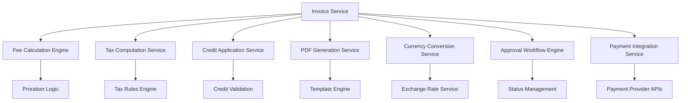
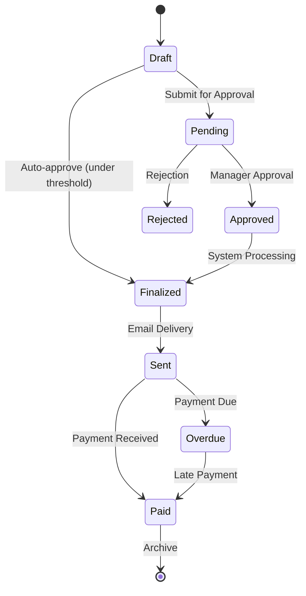

# Invoice Generation & Fee Calculation Technical Specification

## 1. System Architecture



## 2. Invoice Lifecycle Management

### 2.1 Invoice States and Transitions



### 2.2 Invoice Creation Process

```typescript
interface InvoiceCreateRequest {
  customerId: string;
  billingPeriod: {
    startDate: Date;
    endDate: Date;
  };
  services: ServiceLineItem[];
  currency: string;
  applyCredits?: boolean;
  autoApprove?: boolean;
}

interface ServiceLineItem {
  serviceId: string;
  quantity: number;
  unitPrice: number;
  description: string;
  taxCategory: string;
  prorationDetails?: ProrationInfo;
}

class InvoiceService {
  async createInvoice(request: InvoiceCreateRequest): Promise<Invoice> {
    // 1. Validate customer and billing period
    const customer = await this.validateCustomer(request.customerId);
    this.validateBillingPeriod(request.billingPeriod);
    
    // 2. Calculate base fees
    const feeCalculation = await this.feeEngine.calculateFees(
      request.services,
      request.billingPeriod
    );
    
    // 3. Apply proration if applicable
    const proratedFees = await this.applyProration(feeCalculation, request.billingPeriod);
    
    // 4. Calculate taxes
    const taxCalculation = await this.taxService.calculateTaxes(
      proratedFees,
      customer.taxJurisdiction
    );
    
    // 5. Apply credits if requested
    let totalAmount = this.calculateSubtotal(proratedFees) + taxCalculation.totalTax;
    let appliedCredits: CreditApplication[] = [];
    
    if (request.applyCredits) {
      const creditResult = await this.creditService.applyAvailableCredits(
        request.customerId,
        totalAmount
      );
      totalAmount = creditResult.remainingAmount;
      appliedCredits = creditResult.appliedCredits;
    }
    
    // 6. Convert currency if needed
    if (request.currency !== customer.defaultCurrency) {
      totalAmount = await this.currencyService.convert(
        totalAmount,
        customer.defaultCurrency,
        request.currency
      );
    }
    
    // 7. Create invoice entity
    const invoice = new Invoice({
      customerId: request.customerId,
      billingPeriod: request.billingPeriod,
      lineItems: proratedFees,
      taxBreakdown: taxCalculation.breakdown,
      appliedCredits,
      totalAmount,
      currency: request.currency,
      status: request.autoApprove ? 'finalized' : 'draft'
    });
    
    // 8. Handle approval workflow
    if (!request.autoApprove && totalAmount > customer.autoApprovalThreshold) {
      await this.workflowEngine.startApprovalProcess(invoice);
    }
    
    return await this.invoiceRepository.save(invoice);
  }
}
```

## 3. Fee Calculation Engine

### 3.1 Proration Logic

```typescript
interface ProrationInfo {
  type: 'partial_period' | 'mid_cycle_change' | 'upgrade' | 'downgrade';
  billingCycleStart: Date;
  billingCycleEnd: Date;
  serviceStartDate: Date;
  serviceEndDate: Date;
  prorationFactor: number;
}

class FeeCalculationEngine {
  calculateProrationFactor(prorationInfo: ProrationInfo): number {
    const { billingCycleStart, billingCycleEnd, serviceStartDate, serviceEndDate } = prorationInfo;
    
    // Calculate total days in billing cycle
    const totalDays = this.getDaysBetween(billingCycleStart, billingCycleEnd);
    
    // Calculate active days for service
    const effectiveStart = Math.max(serviceStartDate.getTime(), billingCycleStart.getTime());
    const effectiveEnd = Math.min(serviceEndDate.getTime(), billingCycleEnd.getTime());
    const activeDays = this.getDaysBetween(new Date(effectiveStart), new Date(effectiveEnd));
    
    // Calculate proration factor
    const prorationFactor = activeDays / totalDays;
    
    // Round to 4 decimal places for precision
    return Math.round(prorationFactor * 10000) / 10000;
  }
  
  calculateProratedFee(baseFee: number, prorationInfo: ProrationInfo): number {
    const prorationFactor = this.calculateProrationFactor(prorationInfo);
    
    // Apply minimum charge rule (e.g., minimum 1 day charge)
    if (prorationFactor < (1/30)) { // Less than 1 day in 30-day month
      return baseFee / 30; // Minimum daily charge
    }
    
    return baseFee * prorationFactor;
  }
  
  handleMidCycleChange(
    originalService: ServiceLineItem,
    newService: ServiceLineItem,
    changeDate: Date,
    billingPeriod: BillingPeriod
  ): ServiceLineItem[] {
    const proratedOriginal = {
      ...originalService,
      prorationDetails: {
        type: 'partial_period',
        billingCycleStart: billingPeriod.startDate,
        billingCycleEnd: billingPeriod.endDate,
        serviceStartDate: billingPeriod.startDate,
        serviceEndDate: changeDate,
        prorationFactor: this.calculateProrationFactor({
          billingCycleStart: billingPeriod.startDate,
          billingCycleEnd: billingPeriod.endDate,
          serviceStartDate: billingPeriod.startDate,
          serviceEndDate: changeDate
        })
      }
    };
    
    const proratedNew = {
      ...newService,
      prorationDetails: {
        type: 'partial_period',
        billingCycleStart: billingPeriod.startDate,
        billingCycleEnd: billingPeriod.endDate,
        serviceStartDate: changeDate,
        serviceEndDate: billingPeriod.endDate,
        prorationFactor: this.calculateProrationFactor({
          billingCycleStart: billingPeriod.startDate,
          billingCycleEnd: billingPeriod.endDate,
          serviceStartDate: changeDate,
          serviceEndDate: billingPeriod.endDate
        })
      }
    };
    
    return [proratedOriginal, proratedNew];
  }
}
```

### 3.2 Complex Fee Structures

```typescript
interface FeeStructure {
  type: 'flat_rate' | 'tiered' | 'volume_based' | 'usage_based';
  tiers?: FeeTier[];
  baseRate?: number;
  unitRate?: number;
  minimumFee?: number;
  maximumFee?: number;
}

interface FeeTier {
  min: number;
  max?: number;
  rate: number;
  type: 'fixed' | 'percentage';
}

class ComplexFeeCalculator {
  calculateFee(quantity: number, structure: FeeStructure): number {
    switch (structure.type) {
      case 'flat_rate':
        return structure.baseRate || 0;
        
      case 'tiered':
        return this.calculateTieredFee(quantity, structure.tiers!);
        
      case 'volume_based':
        return this.calculateVolumeBasedFee(quantity, structure);
        
      case 'usage_based':
        return this.calculateUsageBasedFee(quantity, structure);
        
      default:
        throw new Error(`Unsupported fee structure type: ${structure.type}`);
    }
  }
  
  private calculateTieredFee(quantity: number, tiers: FeeTier[]): number {
    let totalFee = 0;
    let remainingQuantity = quantity;
    
    for (const tier of tiers) {
      if (remainingQuantity <= 0) break;
      
      const tierQuantity = Math.min(
        remainingQuantity,
        (tier.max || Infinity) - tier.min
      );
      
      if (tier.type === 'fixed') {
        totalFee += tier.rate;
      } else {
        totalFee += tierQuantity * tier.rate;
      }
      
      remainingQuantity -= tierQuantity;
    }
    
    return totalFee;
  }
  
  private calculateVolumeBasedFee(quantity: number, structure: FeeStructure): number {
    // All units at the same rate based on total volume
    const applicableTier = structure.tiers!.find(
      tier => quantity >= tier.min && (tier.max === undefined || quantity <= tier.max)
    );
    
    if (!applicableTier) {
      throw new Error('No applicable tier found');
    }
    
    let fee = quantity * applicableTier.rate;
    
    // Apply minimum/maximum constraints
    if (structure.minimumFee) {
      fee = Math.max(fee, structure.minimumFee);
    }
    if (structure.maximumFee) {
      fee = Math.min(fee, structure.maximumFee);
    }
    
    return fee;
  }
}
```

## 4. Tax Computation Service

### 4.1 Tax Rules Engine

```typescript
interface TaxRule {
  jurisdiction: string;
  taxType: 'vat' | 'sales_tax' | 'gst' | 'pst';
  rate: number;
  applicability: 'standard' | 'reduced' | 'zero_rated' | 'exempt';
  conditions?: TaxCondition[];
}

interface TaxCondition {
  type: 'service_category' | 'customer_type' | 'amount_threshold' | 'location';
  operator: 'equals' | 'greater_than' | 'less_than' | 'contains';
  value: any;
}

interface TaxCalculation {
  totalTax: number;
  breakdown: TaxBreakdown[];
  jurisdiction: string;
}

interface TaxBreakdown {
  taxType: string;
  rate: number;
  taxableAmount: number;
  taxAmount: number;
}

class TaxComputationService {
  async calculateTaxes(
    lineItems: ServiceLineItem[],
    jurisdiction: string,
    customerType: string = 'standard'
  ): Promise<TaxCalculation> {
    const applicableRules = await this.getApplicableTaxRules(jurisdiction, customerType);
    const breakdown: TaxBreakdown[] = [];
    let totalTax = 0;
    
    for (const item of lineItems) {
      const itemTax = this.calculateItemTax(item, applicableRules);
      
      for (const tax of itemTax.breakdown) {
        const existingTax = breakdown.find(t => t.taxType === tax.taxType);
        if (existingTax) {
          existingTax.taxableAmount += tax.taxableAmount;
          existingTax.taxAmount += tax.taxAmount;
        } else {
          breakdown.push({ ...tax });
        }
      }
      
      totalTax += itemTax.totalTax;
    }
    
    return {
      totalTax: Math.round(totalTax * 100) / 100,
      breakdown,
      jurisdiction
    };
  }
  
  private calculateItemTax(item: ServiceLineItem, rules: TaxRule[]): {
    totalTax: number;
    breakdown: TaxBreakdown[];
  } {
    const applicableRules = rules.filter(rule => 
      this.evaluateConditions(rule.conditions || [], item)
    );
    
    const breakdown: TaxBreakdown[] = [];
    let totalTax = 0;
    
    for (const rule of applicableRules) {
      if (rule.applicability === 'exempt') continue;
      
      const taxableAmount = rule.applicability === 'zero_rated' ? 0 : item.unitPrice * item.quantity;
      const taxAmount = rule.applicability === 'zero_rated' ? 0 : taxableAmount * rule.rate;
      
      breakdown.push({
        taxType: rule.taxType,
        rate: rule.rate,
        taxableAmount,
        taxAmount: Math.round(taxAmount * 100) / 100
      });
      
      totalTax += taxAmount;
    }
    
    return {
      totalTax: Math.round(totalTax * 100) / 100,
      breakdown
    };
  }
  
  private evaluateConditions(conditions: TaxCondition[], item: ServiceLineItem): boolean {
    return conditions.every(condition => {
      switch (condition.type) {
        case 'service_category':
          return this.evaluateCondition(condition, item.taxCategory);
        case 'amount_threshold':
          return this.evaluateCondition(condition, item.unitPrice * item.quantity);
        default:
          return true;
      }
    });
  }
  
  private evaluateCondition(condition: TaxCondition, value: any): boolean {
    switch (condition.operator) {
      case 'equals':
        return value === condition.value;
      case 'greater_than':
        return value > condition.value;
      case 'less_than':
        return value < condition.value;
      case 'contains':
        return String(value).includes(condition.value);
      default:
        return false;
    }
  }
}
```

## 5. Credit Application Service

### 5.1 Credit Types and Validation

```typescript
interface CreditSource {
  type: 'coupon' | 'prepaid_credit' | 'credit_note';
  id: string;
  amount: number;
  expiryDate?: Date;
  applicableServices?: string[];
  minimumInvoiceAmount?: number;
}

interface CreditApplication {
  creditSourceId: string;
  creditType: string;
  appliedAmount: number;
  originalAmount: number;
  remainingBalance: number;
}

interface CreditApplicationResult {
  remainingAmount: number;
  appliedCredits: CreditApplication[];
}

class CreditApplicationService {
  async applyAvailableCredits(
    customerId: string,
    invoiceAmount: number,
    serviceIds?: string[]
  ): Promise<CreditApplicationResult> {
    const availableCredits = await this.getAvailableCredits(customerId);
    const appliedCredits: CreditApplication[] = [];
    let remainingAmount = invoiceAmount;
    
    // Sort credits by priority (coupons first, then prepaid, then credit notes)
    const sortedCredits = this.sortCreditsByPriority(availableCredits);
    
    for (const credit of sortedCredits) {
      if (remainingAmount <= 0) break;
      
      // Validate credit applicability
      if (!this.isCreditApplicable(credit, invoiceAmount, serviceIds)) {
        continue;
      }
      
      const applicableAmount = Math.min(credit.amount, remainingAmount);
      
      appliedCredits.push({
        creditSourceId: credit.id,
        creditType: credit.type,
        appliedAmount: applicableAmount,
        originalAmount: credit.amount,
        remainingBalance: credit.amount - applicableAmount
      });
      
      remainingAmount -= applicableAmount;
      
      // Update credit balance
      await this.updateCreditBalance(credit.id, credit.amount - applicableAmount);
    }
    
    return {
      remainingAmount: Math.round(remainingAmount * 100) / 100,
      appliedCredits
    };
  }
  
  private isCreditApplicable(
    credit: CreditSource,
    invoiceAmount: number,
    serviceIds?: string[]
  ): boolean {
    // Check expiry
    if (credit.expiryDate && new Date() > credit.expiryDate) {
      return false;
    }
    
    // Check minimum invoice amount
    if (credit.minimumInvoiceAmount && invoiceAmount < credit.minimumInvoiceAmount) {
      return false;
    }
    
    // Check service applicability
    if (credit.applicableServices && serviceIds) {
      const hasApplicableService = serviceIds.some(serviceId => 
        credit.applicableServices!.includes(serviceId)
      );
      if (!hasApplicableService) {
        return false;
      }
    }
    
    return true;
  }
  
  private sortCreditsByPriority(credits: CreditSource[]): CreditSource[] {
    const priorityOrder = { 'coupon': 1, 'prepaid_credit': 2, 'credit_note': 3 };
    return credits.sort((a, b) => priorityOrder[a.type] - priorityOrder[b.type]);
  }
}
```

## 6. PDF Generation and Templating

### 6.1 Template Engine

```typescript
interface InvoiceTemplate {
  id: string;
  name: string;
  layout: TemplateLayout;
  sections: TemplateSection[];
  styling: TemplateStyling;
  localization: LocalizationConfig;
}

interface TemplateSection {
  type: 'header' | 'customer_info' | 'line_items' | 'totals' | 'payment_info' | 'footer';
  fields: TemplateField[];
  conditionalDisplay?: ConditionalRule[];
}

interface TemplateField {
  name: string;
  type: 'text' | 'number' | 'date' | 'currency' | 'image';
  source: string;
  formatting?: FormattingRule;
}

class PDFGenerationService {
  async generateInvoicePDF(invoice: Invoice, templateId: string): Promise<Buffer> {
    const template = await this.getTemplate(templateId);
    const templateData = await this.prepareTemplateData(invoice);
    
    // Generate HTML from template
    const html = await this.renderTemplate(template, templateData);
    
    // Convert HTML to PDF
    const pdfBuffer = await this.convertToPDF(html, {
      format: 'A4',
      margin: { top: '20mm', right: '20mm', bottom: '20mm', left: '20mm' },
      printBackground: true,
      displayHeaderFooter: true,
      headerTemplate: this.generateHeader(template, templateData),
      footerTemplate: this.generateFooter(template, templateData)
    });
    
    // Store PDF
    const pdfUrl = await this.storePDF(invoice.id, pdfBuffer);
    
    // Update invoice with PDF URL
    await this.invoiceRepository.update(invoice.id, { pdfUrl });
    
    return pdfBuffer;
  }
  
  private async prepareTemplateData(invoice: Invoice): Promise<TemplateData> {
    const customer = await this.customerService.getById(invoice.customerId);
    const company = await this.companyService.getCompanyInfo();
    
    return {
      invoice: {
        number: invoice.invoiceNumber,
        date: invoice.createdAt,
        dueDate: invoice.dueDate,
        status: invoice.status,
        currency: invoice.currency,
        totalAmount: invoice.totalAmount,
        subtotal: invoice.subtotal,
        taxAmount: invoice.taxAmount
      },
      customer: {
        name: customer.name,
        address: customer.billingAddress,
        email: customer.email,
        taxId: customer.taxId
      },
      company: {
        name: company.name,
        address: company.address,
        logo: company.logoUrl,
        taxId: company.taxId,
        bankDetails: company.bankDetails
      },
      lineItems: invoice.lineItems.map(item => ({
        description: item.description,
        quantity: item.quantity,
        unitPrice: item.unitPrice,
        total: item.total,
        taxRate: item.taxRate
      })),
      taxBreakdown: invoice.taxBreakdown,
      appliedCredits: invoice.appliedCredits
    };
  }
}
```

## 7. Multi-Currency Handling

### 7.1 Currency Conversion Service

```typescript
interface ExchangeRate {
  fromCurrency: string;
  toCurrency: string;
  rate: number;
  timestamp: Date;
  source: 'ecb' | 'fixer' | 'xe' | 'manual';
}

interface ConversionRequest {
  amount: number;
  fromCurrency: string;
  toCurrency: string;
  date?: Date;
  useLiveRate?: boolean;
}

class CurrencyConversionService {
  async convert(request: ConversionRequest): Promise<number> {
    const { amount, fromCurrency, toCurrency, date, useLiveRate } = request;
    
    // Same currency, no conversion needed
    if (fromCurrency === toCurrency) {
      return amount;
    }
    
    // Get exchange rate
    const exchangeRate = await this.getExchangeRate(
      fromCurrency,
      toCurrency,
      date || new Date(),
      useLiveRate || false
    );
    
    // Apply conversion with rounding
    const convertedAmount = amount * exchangeRate.rate;
    return this.roundToCurrencyDecimals(convertedAmount, toCurrency);
  }
  
  async getExchangeRate(
    fromCurrency: string,
    toCurrency: string,
    date: Date,
    useLiveRate: boolean
  ): Promise<ExchangeRate> {
    // Try to get cached rate first
    const cachedRate = await this.getCachedRate(fromCurrency, toCurrency, date);
    if (cachedRate && !useLiveRate) {
      return cachedRate;
    }
    
    // Fetch live rate if required or no cached rate
    const liveRate = await this.fetchLiveRate(fromCurrency, toCurrency);
    
    // Cache the rate for future use
    await this.cacheExchangeRate(liveRate);
    
    return liveRate;
  }
  
  private roundToCurrencyDecimals(amount: number, currency: string): number {
    // Get decimal places for currency (most have 2, some have 0 or 3)
    const decimalPlaces = this.getCurrencyDecimalPlaces(currency);
    const multiplier = Math.pow(10, decimalPlaces);
    
    return Math.round(amount * multiplier) / multiplier;
  }
  
  private getCurrencyDecimalPlaces(currency: string): number {
    const currencyDecimals: { [key: string]: number } = {
      'JPY': 0,
      'KRW': 0,
      'CLP': 0,
      'BHD': 3,
      'JOD': 3,
      'KWD': 3,
      'OMR': 3,
      'TND': 3
    };
    
    return currencyDecimals[currency] || 2;
  }
}
```

### 7.2 Multi-Currency Invoice Handling

```typescript
interface MultiCurrencyInvoice {
  baseCurrency: string;
  displayCurrency: string;
  exchangeRate: ExchangeRate;
  baseAmount: number;
  displayAmount: number;
  currencyConversionFee?: number;
}

class MultiCurrencyInvoiceService {
  async createMultiCurrencyInvoice(
    baseInvoice: Invoice,
    displayCurrency: string
  ): Promise<MultiCurrencyInvoice> {
    // Get exchange rate
    const exchangeRate = await this.currencyService.getExchangeRate(
      baseInvoice.currency,
      displayCurrency,
      baseInvoice.createdAt
    );
    
    // Calculate display amount
    const displayAmount = await this.currencyService.convert({
      amount: baseInvoice.totalAmount,
      fromCurrency: baseInvoice.currency,
      toCurrency: displayCurrency
    });
    
    // Calculate conversion fee if applicable
    let conversionFee = 0;
    if (this.shouldApplyConversionFee(baseInvoice.customerId)) {
      conversionFee = displayAmount * 0.02; // 2% conversion fee
    }
    
    return {
      baseCurrency: baseInvoice.currency,
      displayCurrency,
      exchangeRate,
      baseAmount: baseInvoice.totalAmount,
      displayAmount: displayAmount + conversionFee,
      currencyConversionFee: conversionFee
    };
  }
}
```

## 8. Invoice Approval Workflows

### 8.1 Workflow Engine

```typescript
interface ApprovalWorkflow {
  id: string;
  name: string;
  triggerConditions: WorkflowCondition[];
  steps: ApprovalStep[];
  escalationRules?: EscalationRule[];
}

interface ApprovalStep {
  id: string;
  name: string;
  approvers: Approver[];
  approvalType: 'any' | 'all' | 'majority';
  timeout?: number;
  required?: boolean;
}

interface Approver {
  type: 'user' | 'role' | 'manager' | 'department';
  identifier: string;
  escalationLevel?: number;
}

class ApprovalWorkflowEngine {
  async startApprovalProcess(invoice: Invoice): Promise<ApprovalInstance> {
    // Determine applicable workflow
    const workflow = await this.determineWorkflow(invoice);
    if (!workflow) {
      // Auto-approve if no workflow matches
      return this.autoApprove(invoice);
    }
    
    // Create approval instance
    const instance = await this.createApprovalInstance(invoice, workflow);
    
    // Start first step
    await this.startApprovalStep(instance, workflow.steps[0]);
    
    return instance;
  }
  
  async processApprovalAction(
    instanceId: string,
    action: 'approve' | 'reject' | 'escalate',
    userId: string,
    comments?: string
  ): Promise<ApprovalInstance> {
    const instance = await this.getApprovalInstance(instanceId);
    const currentStep = instance.currentStep;
    
    // Record approval action
    await this.recordApprovalAction(instanceId, userId, action, comments);
    
    // Check if step is complete
    const stepResult = await this.evaluateStepCompletion(instance, currentStep);
    
    if (stepResult.complete) {
      if (stepResult.approved) {
        // Move to next step or complete approval
        const nextStep = await this.getNextStep(instance);
        if (nextStep) {
          await this.startApprovalStep(instance, nextStep);
        } else {
          await this.completeApproval(instance, 'approved');
        }
      } else {
        // Reject the invoice
        await this.completeApproval(instance, 'rejected');
      }
    }
    
    return instance;
  }
  
  private async evaluateStepCompletion(
    instance: ApprovalInstance,
    step: ApprovalStep
  ): Promise<{ complete: boolean; approved: boolean }> {
    const responses = await this.getStepResponses(instance.id, step.id);
    
    switch (step.approvalType) {
      case 'any':
        const hasApproval = responses.some(r => r.action === 'approve');
        const hasRejection = responses.some(r => r.action === 'reject');
        return { complete: hasApproval || hasRejection, approved: hasApproval };
        
      case 'all':
        const allApproved = responses.length === step.approvers.length && 
                           responses.every(r => r.action === 'approve');
        const anyRejected = responses.some(r => r.action === 'reject');
        return { complete: allApproved || anyRejected, approved: allApproved };
        
      case 'majority':
        const approvalCount = responses.filter(r => r.action === 'approve').length;
        const rejectionCount = responses.filter(r => r.action === 'reject').length;
        const majority = Math.ceil(step.approvers.length / 2);
        return { 
          complete: approvalCount >= majority || rejectionCount >= majority,
          approved: approvalCount >= majority
        };
        
      default:
        return { complete: false, approved: false };
    }
  }
}
```

### 8.2 Status Management

```typescript
enum InvoiceStatus {
  DRAFT = 'draft',
  PENDING_APPROVAL = 'pending_approval',
  APPROVED = 'approved',
  REJECTED = 'rejected',
  FINALIZED = 'finalized',
  SENT = 'sent',
  PAID = 'paid',
  OVERDUE = 'overdue',
  CANCELLED = 'cancelled'
}

class InvoiceStatusManager {
  async transitionStatus(
    invoiceId: string,
    newStatus: InvoiceStatus,
    userId?: string,
    reason?: string
  ): Promise<Invoice> {
    const invoice = await this.invoiceRepository.findById(invoiceId);
    const currentStatus = invoice.status;
    
    // Validate transition
    if (!this.isValidTransition(currentStatus, newStatus)) {
      throw new Error(`Invalid status transition from ${currentStatus} to ${newStatus}`);
    }
    
    // Perform status-specific actions
    await this.performStatusActions(invoice, newStatus);
    
    // Update status
    invoice.status = newStatus;
    invoice.statusHistory.push({
      fromStatus: currentStatus,
      toStatus: newStatus,
      timestamp: new Date(),
      userId,
      reason
    });
    
    return await this.invoiceRepository.save(invoice);
  }
  
  private isValidTransition(current: InvoiceStatus, next: InvoiceStatus): boolean {
    const validTransitions: { [key: string]: InvoiceStatus[] } = {
      [InvoiceStatus.DRAFT]: [InvoiceStatus.PENDING_APPROVAL, InvoiceStatus.FINALIZED, InvoiceStatus.CANCELLED],
      [InvoiceStatus.PENDING_APPROVAL]: [InvoiceStatus.APPROVED, InvoiceStatus.REJECTED, InvoiceStatus.CANCELLED],
      [InvoiceStatus.APPROVED]: [InvoiceStatus.FINALIZED, InvoiceStatus.CANCELLED],
      [InvoiceStatus.REJECTED]: [InvoiceStatus.DRAFT, InvoiceStatus.CANCELLED],
      [InvoiceStatus.FINALIZED]: [InvoiceStatus.SENT, InvoiceStatus.PAID, InvoiceStatus.OVERDUE],
      [InvoiceStatus.SENT]: [InvoiceStatus.PAID, InvoiceStatus.OVERDUE],
      [InvoiceStatus.OVERDUE]: [InvoiceStatus.PAID, InvoiceStatus.CANCELLED],
      [InvoiceStatus.PAID]: [],
      [InvoiceStatus.CANCELLED]: []
    };
    
    return validTransitions[current]?.includes(next) || false;
  }
}
```

## 9. Payment Integration

### 9.1 Payment Provider Integration

```typescript
interface PaymentProvider {
  id: string;
  name: string;
  type: 'stripe' | 'paypal' | 'adyen' | 'braintree' | 'custom';
  supportedCurrencies: string[];
  supportedPaymentMethods: PaymentMethod[];
  configuration: ProviderConfiguration;
}

interface PaymentRequest {
  invoiceId: string;
  amount: number;
  currency: string;
  paymentMethod: PaymentMethod;
  customerInfo: CustomerPaymentInfo;
  returnUrl?: string;
  cancelUrl?: string;
}

interface PaymentResponse {
  status: 'success' | 'pending' | 'failed' | 'cancelled';
  transactionId: string;
  providerTransactionId: string;
  amount: number;
  currency: string;
  timestamp: Date;
  errorMessage?: string;
}

class PaymentIntegrationService {
  async processPayment(request: PaymentRequest): Promise<PaymentResponse> {
    // Get invoice
    const invoice = await this.invoiceRepository.findById(request.invoiceId);
    if (invoice.status !== 'sent' && invoice.status !== 'overdue') {
      throw new Error('Invoice is not in payable status');
    }
    
    // Select payment provider
    const provider = await this.selectPaymentProvider(request);
    
    // Create payment method-specific processor
    const processor = this.createPaymentProcessor(provider);
    
    // Process payment
    const response = await processor.processPayment(request);
    
    // Update invoice status based on response
    await this.updateInvoiceAfterPayment(invoice, response);
    
    // Record transaction
    await this.recordTransaction(invoice, request, response);
    
    return response;
  }
  
  async handleWebhook(
    providerId: string,
    eventType: string,
    payload: any
  ): Promise<void> {
    const provider = await this.getPaymentProvider(providerId);
    const processor = this.createPaymentProcessor(provider);
    
    // Process webhook event
    const paymentEvent = await processor.processWebhook(eventType, payload);
    
    // Update invoice and transaction based on event
    if (paymentEvent.invoiceId) {
      const invoice = await this.invoiceRepository.findById(paymentEvent.invoiceId);
      await this.updateInvoiceAfterPayment(invoice, paymentEvent);
    }
  }
  
  private async selectPaymentProvider(request: PaymentRequest): Promise<PaymentProvider> {
    const availableProviders = await this.getAvailableProviders();
    
    // Filter by currency support
    const currencySupported = availableProviders.filter(p => 
      p.supportedCurrencies.includes(request.currency)
    );
    
    // Filter by payment method support
    const methodSupported = currencySupported.filter(p => 
      p.supportedPaymentMethods.some(m => m.type === request.paymentMethod.type)
    );
    
    // Select provider based on configuration priority and cost
    return methodSupported.sort((a, b) => {
      const priorityA = a.configuration.priority || 0;
      const priorityB = b.configuration.priority || 0;
      return priorityB - priorityA;
    })[0];
  }
}

// Stripe Implementation Example
class StripePaymentProcessor implements PaymentProcessor {
  constructor(private stripe: Stripe, private configuration: ProviderConfiguration) {}
  
  async processPayment(request: PaymentRequest): Promise<PaymentResponse> {
    try {
      const paymentIntent = await this.stripe.paymentIntents.create({
        amount: this.convertToSmallestCurrencyUnit(request.amount, request.currency),
        currency: request.currency.toLowerCase(),
        customer: request.customerInfo.providerCustomerId,
        payment_method: request.paymentMethod.providerPaymentMethodId,
        confirmation_method: 'automatic',
        confirm: true,
        return_url: request.returnUrl,
        metadata: {
          invoiceId: request.invoiceId,
          customerId: request.customerInfo.customerId
        }
      });
      
      return {
        status: this.mapPaymentIntentStatus(paymentIntent.status),
        transactionId: `stripe_${paymentIntent.id}`,
        providerTransactionId: paymentIntent.id,
        amount: request.amount,
        currency: request.currency,
        timestamp: new Date()
      };
    } catch (error) {
      return {
        status: 'failed',
        transactionId: `stripe_error_${Date.now()}`,
        providerTransactionId: '',
        amount: request.amount,
        currency: request.currency,
        timestamp: new Date(),
        errorMessage: error.message
      };
    }
  }
  
  private convertToSmallestCurrencyUnit(amount: number, currency: string): number {
    const decimalPlaces = this.getCurrencyDecimalPlaces(currency);
    return Math.round(amount * Math.pow(10, decimalPlaces));
  }
  
  private mapPaymentIntentStatus(status: string): PaymentResponse['status'] {
    const statusMap: { [key: string]: PaymentResponse['status'] } = {
      'succeeded': 'success',
      'processing': 'pending',
      'requires_payment_method': 'failed',
      'requires_confirmation': 'pending',
      'requires_action': 'pending',
      'canceled': 'cancelled'
    };
    
    return statusMap[status] || 'pending';
  }
}
```

## 10. Error Handling and Logging

### 10.1 Error Types and Handling

```typescript
enum InvoiceErrorType {
  VALIDATION_ERROR = 'VALIDATION_ERROR',
  CALCULATION_ERROR = 'CALCULATION_ERROR',
  CURRENCY_CONVERSION_ERROR = 'CURRENCY_CONVERSION_ERROR',
  TAX_CALCULATION_ERROR = 'TAX_CALCULATION_ERROR',
  PAYMENT_PROCESSING_ERROR = 'PAYMENT_PROCESSING_ERROR',
  WORKFLOW_ERROR = 'WORKFLOW_ERROR',
  PDF_GENERATION_ERROR = 'PDF_GENERATION_ERROR'
}

class InvoiceError extends Error {
  constructor(
    public type: InvoiceErrorType,
    public code: string,
    message: string,
    public details?: any,
    public recoverable: boolean = true
  ) {
    super(message);
    this.name = 'InvoiceError';
  }
}

class ErrorHandlingService {
  async handleInvoiceError(error: InvoiceError, context: ErrorContext): Promise<void> {
    // Log error
    await this.logger.logError({
      errorType: error.type,
      errorCode: error.code,
      message: error.message,
      details: error.details,
      context,
      timestamp: new Date()
    });
    
    // Send alerts for critical errors
    if (this.isCriticalError(error)) {
      await this.alertService.sendAlert({
        severity: 'critical',
        errorType: error.type,
        message: error.message,
        context
      });
    }
    
    // Attempt recovery for recoverable errors
    if (error.recoverable) {
      await this.attemptErrorRecovery(error, context);
    }
  }
  
  private async attemptErrorRecovery(error: InvoiceError, context: ErrorContext): Promise<void> {
    switch (error.type) {
      case InvoiceErrorType.CURRENCY_CONVERSION_ERROR:
        // Retry with different provider
        await this.retryCurrencyConversion(context);
        break;
        
      case InvoiceErrorType.TAX_CALCULATION_ERROR:
        // Use fallback tax rules
        await this.applyFallbackTaxCalculation(context);
        break;
        
      case InvoiceErrorType.PAYMENT_PROCESSING_ERROR:
        // Switch to backup payment provider
        await this.switchPaymentProvider(context);
        break;
        
      default:
        // No automatic recovery for other error types
        break;
    }
  }
}
```

## 11. Performance Optimization

### 11.1 Caching Strategy

```typescript
interface CacheConfig {
  exchangeRates: { ttl: number; keyPattern: string };
  taxRules: { ttl: number; keyPattern: string };
  customerData: { ttl: number; keyPattern: string };
  invoiceTemplates: { ttl: number; keyPattern: string };
}

class InvoiceCachingService {
  private cache: RedisClient;
  
  async getCachedExchangeRate(
    fromCurrency: string,
    toCurrency: string,
    date: Date
  ): Promise<ExchangeRate | null> {
    const key = `exchange_rate:${fromCurrency}:${toCurrency}:${date.toISOString().split('T')[0]}`;
    const cached = await this.cache.get(key);
    
    if (cached) {
      return JSON.parse(cached);
    }
    
    return null;
  }
  
  async cacheExchangeRate(rate: ExchangeRate): Promise<void> {
    const key = `exchange_rate:${rate.fromCurrency}:${rate.toCurrency}:${rate.timestamp.toISOString().split('T')[0]}`;
    await this.cache.setex(key, 3600, JSON.stringify(rate)); // 1 hour TTL
  }
  
  async invalidateRelatedCaches(invoiceId: string): Promise<void> {
    const patterns = [
      `invoice:*:${invoiceId}`,
      `customer:*`,
      `exchange_rate:*`
    ];
    
    for (const pattern of patterns) {
      const keys = await this.cache.keys(pattern);
      if (keys.length > 0) {
        await this.cache.del(...keys);
      }
    }
  }
}
```

### 11.2 Batch Processing

```typescript
class BatchInvoiceProcessor {
  async processInvoicesBatch(invoiceIds: string[]): Promise<BatchProcessingResult> {
    const results: BatchProcessingResult = {
      successful: [],
      failed: [],
      total: invoiceIds.length
    };
    
    // Process in chunks to avoid memory issues
    const chunks = this.chunkArray(invoiceIds, 100);
    
    for (const chunk of chunks) {
      const chunkResults = await Promise.allSettled(
        chunk.map(invoiceId => this.processInvoice(invoiceId))
      );
      
      chunkResults.forEach((result, index) => {
        const invoiceId = chunk[index];
        if (result.status === 'fulfilled') {
          results.successful.push(invoiceId);
        } else {
          results.failed.push({
            invoiceId,
            error: result.reason
          });
        }
      });
    }
    
    return results;
  }
  
  private async processInvoice(invoiceId: string): Promise<void> {
    const invoice = await this.invoiceRepository.findById(invoiceId);
    
    // Perform all calculations
    const calculatedInvoice = await this.performCalculations(invoice);
    
    // Generate PDF
    const pdfBuffer = await this.pdfService.generateInvoicePDF(calculatedInvoice);
    
    // Send invoice
    await this.sendInvoice(calculatedInvoice, pdfBuffer);
    
    // Update status
    await this.updateInvoiceStatus(invoiceId, 'sent');
  }
}
```

This comprehensive technical specification covers all aspects of the Invoice Generation & Fee Calculation submodule, including detailed code implementations, workflow diagrams, mathematical calculations, and integration patterns. The system is designed to be scalable, maintainable, and extensible to support various business requirements and regulatory compliance needs.