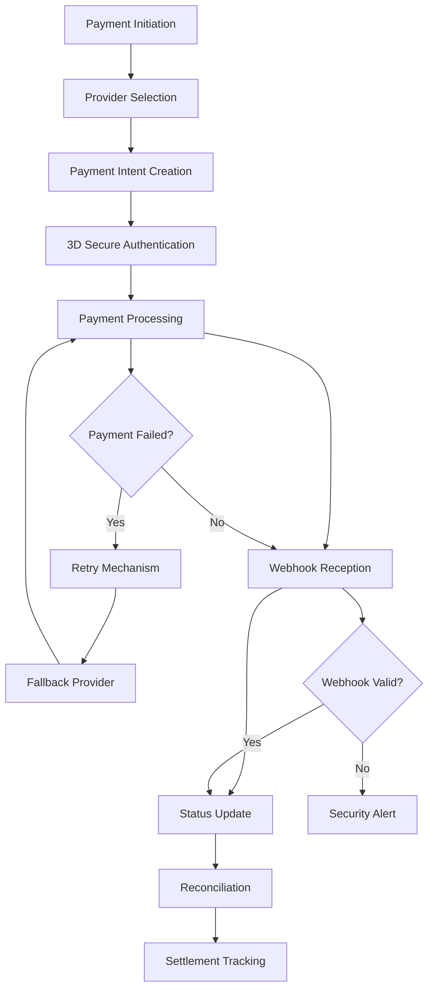

## 1. Product Overview
Payment Processing & Integrations submodule provides comprehensive payment orchestration capabilities for billing systems, supporting multiple payment providers, methods, and currencies while ensuring PCI compliance and security. This module handles payment flows, webhook processing, retry mechanisms, and reconciliation for enterprise-grade billing operations.

- Solves complex multi-provider payment processing challenges for subscription billing
- Enables secure payment collection across global markets with local payment methods
- Provides automated payment reconciliation and failure recovery for business continuity

## 2. Core Features

### 2.1 User Roles
| Role | Registration Method | Core Permissions |
|------|---------------------|------------------|
| System Admin | Internal assignment | Configure payment providers, view all transactions, manage webhooks |
| Finance Manager | Admin invitation | View payment reports, reconciliation data, settlement tracking |
| Developer | API key generation | Access payment APIs, configure webhooks, test integrations |
| Customer Support | Admin assignment | View customer payment history, process refunds, handle disputes |

### 2.2 Feature Module
Our payment processing system consists of the following main components:
1. **Payment Provider Hub**: Multi-provider integration management, API configuration, credential management
2. **Payment Flow Engine**: Intent creation, method selection, 3D Secure handling, payment orchestration
3. **Webhook Processor**: Event reception, status updates, retry logic, failure handling
4. **Security & Compliance**: Tokenization, PCI DSS compliance, encryption, audit logging
5. **Reconciliation Center**: Settlement tracking, dispute management, reporting, analytics

### 2.3 Page Details
| Page Name | Module Name | Feature description |
|-----------|-------------|---------------------|
| Provider Configuration | Provider Setup | Configure Stripe, Adyen, GoCardless, PayPal APIs with credentials and webhooks. Test connectivity and validate configurations. |
| Payment Methods | Method Management | Tokenize and store payment methods securely. Support cards, bank transfers, digital wallets, and local payment methods. |
| Payment Flow | Transaction Processing | Create payment intents, handle 3D Secure authentication, process payments across providers with fallback logic. |
| Webhook Dashboard | Event Monitoring | Receive and process webhooks from all providers. Track payment status changes, handle retries, and log events. |
| Security Center | Compliance Management | Manage PCI compliance, encryption keys, audit logs, and security policies. Monitor compliance status. |
| Reconciliation | Settlement Tracking | Match payments with settlements, handle disputes, generate financial reports, track payment lifecycle. |
| Multi-Currency | Currency Management | Configure exchange rates, handle currency conversion, support local payment methods per region. |
| Retry Mechanisms | Failure Recovery | Configure retry policies, handle failed payments, implement smart retry logic with exponential backoff. |

## 3. Core Process
**Payment Processing Flow**: Customer initiates payment → System creates payment intent → Provider processes payment → Webhook updates status → Reconciliation matches settlement → Reporting generates insights

**Multi-Provider Fallback**: Primary provider fails → System attempts secondary provider → Notifies operations team → Logs all attempts for analysis

**Webhook Processing**: Provider sends webhook → System validates signature → Updates payment status → Triggers downstream processes → Sends confirmation notifications

## 4. User Interface Design

### 4.1 Design Style
- **Primary Colors**: Professional blue (#1E40AF) for primary actions, green (#10B981) for success states
- **Secondary Colors**: Gray scale for neutral elements, red (#EF4444) for errors/warnings
- **Button Style**: Rounded corners (8px radius), clear hover states, loading indicators
- **Typography**: Inter font family, 14px base size, clear hierarchy with 1.25 ratio
- **Layout**: Card-based design with consistent spacing (8px grid system)
- **Icons**: Feather Icons set for consistency, payment provider logos for recognition

### 4.2 Page Design Overview
| Page Name | Module Name | UI Elements |
|-----------|-------------|-------------|
| Provider Configuration | Setup Cards | Two-column layout with provider cards showing status, configuration forms with validation, test connection buttons |
| Payment Methods | Method Grid | Grid layout showing tokenized methods, card preview with last 4 digits, provider logos, security badges |
| Payment Flow | Transaction Timeline | Step-by-step progress indicator, real-time status updates, 3D Secure modal overlay |
| Webhook Dashboard | Event Log | Table with filtering, status badges, retry buttons, detailed event viewer with JSON payload |
| Security Center | Compliance Dashboard | Status indicators for PCI compliance, encryption key management, audit log viewer with search |
| Reconciliation | Settlement Table | Date-range picker, match status indicators, dispute resolution workflow, export capabilities |

### 4.3 Responsiveness
Desktop-first design approach with responsive breakpoints at 768px and 1024px. Touch interaction optimization for mobile devices with larger tap targets and swipe gestures for navigation.

### 4.4 Security Considerations
- PCI DSS Level 1 compliance indicators and status monitoring
- Encryption status visualization with key rotation alerts
- Audit trail viewer with tamper-evident logging
- Real-time security incident notifications and response workflows