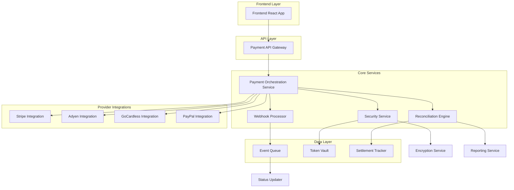
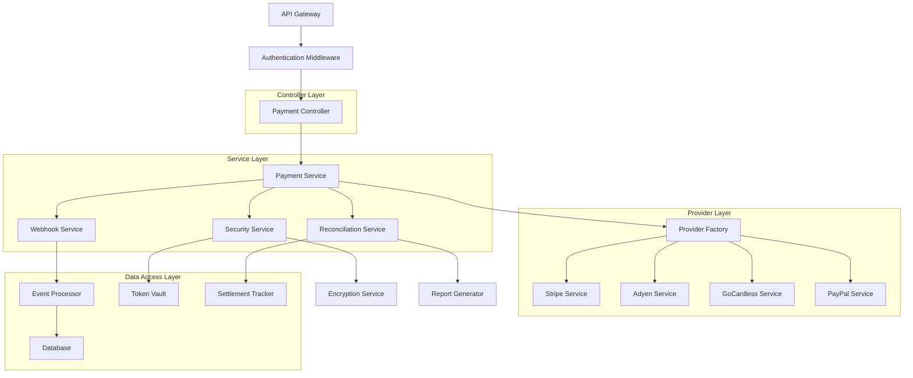
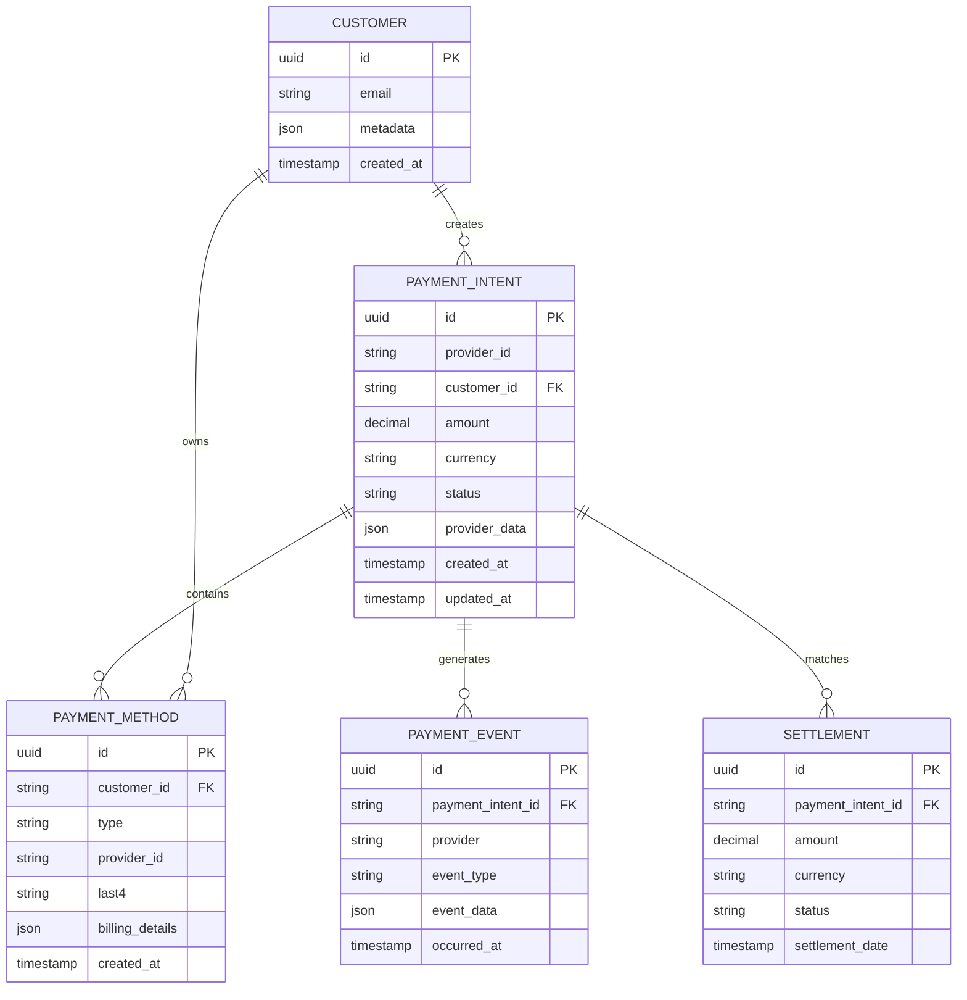

## 1. Architecture Design



## 2. Technology Description
- **Frontend**: React@18 + TypeScript@5 + TailwindCSS@3 + Vite
- **Backend**: Node.js@20 + Express@4 + TypeScript@5
- **Database**: PostgreSQL@15 + Redis@7 (caching)
- **Message Queue**: Bull Queue (Redis-based)
- **Payment SDKs**: stripe@13, @adyen/api-library@16, gocardless-nodejs@3, @paypal/checkout-server-sdk@1
- **Security**: bcrypt@5, jsonwebtoken@9, helmet@7, cors@2
- **Monitoring**: Winston@3, Prometheus@14, Grafana@10
- **Initialization Tool**: create-vite

## 3. Route Definitions
| Route | Purpose |
|-------|---------|
| /api/payments/intents | Create and manage payment intents |
| /api/payments/methods | Tokenize and store payment methods |
| /api/payments/process | Execute payment transactions |
| /api/payments/status/:id | Get payment status and details |
| /api/webhooks/stripe | Receive Stripe webhook events |
| /api/webhooks/adyen | Receive Adyen webhook events |
| /api/webhooks/gocardless | Receive GoCardless webhook events |
| /api/webhooks/paypal | Receive PayPal webhook events |
| /api/reconciliation/match | Match payments with settlements |
| /api/reconciliation/disputes | Handle payment disputes |
| /api/security/tokens | Manage payment tokenization |
| /api/currency/convert | Handle multi-currency conversions |
| /api/retry/payments | Manage payment retry mechanisms |

## 4. API Definitions

### 4.1 Payment Intent API
```
POST /api/payments/intents
```

Request:
| Param Name | Param Type | isRequired | Description |
|------------|------------|------------|-------------|
| amount | number | true | Payment amount in cents |
| currency | string | true | ISO 4217 currency code |
| customer_id | string | true | Customer identifier |
| payment_method_types | array | false | Supported payment methods |
| metadata | object | false | Additional transaction data |

Response:
| Param Name | Param Type | Description |
|------------|------------|-------------|
| client_secret | string | Payment intent client secret |
| status | string | Current payment status |
| payment_intent_id | string | Unique payment intent identifier |

Example:
```json
{
  "amount": 2500,
  "currency": "usd",
  "customer_id": "cus_123456",
  "payment_method_types": ["card", "sepa_debit"],
  "metadata": {
    "subscription_id": "sub_789",
    "invoice_id": "inv_456"
  }
}
```

### 4.2 Payment Method Tokenization
```
POST /api/payments/methods
```

Request:
| Param Name | Param Type | isRequired | Description |
|------------|------------|------------|-------------|
| type | string | true | Payment method type (card, sepa, etc.) |
| card | object | conditional | Card details (if type is card) |
| billing_details | object | true | Billing address information |
| customer_id | string | true | Customer identifier |

Response:
| Param Name | Param Type | Description |
|------------|------------|-------------|
| payment_method_id | string | Tokenized payment method ID |
| type | string | Payment method type |
| last4 | string | Last 4 digits of card/account |

### 4.3 Webhook Processing
```
POST /api/webhooks/:provider
```

Headers:
| Header Name | Description |
|-------------|-------------|
| stripe-signature | Stripe webhook signature |
| adyen-hmac-signature | Adyen HMAC signature |

Request Body: Provider-specific event data

## 5. Server Architecture Diagram



## 6. Data Model

### 6.1 Database Schema


### 6.2 Data Definition Language

**Payment Intents Table**
```sql
CREATE TABLE payment_intents (
    id UUID PRIMARY KEY DEFAULT gen_random_uuid(),
    provider_id VARCHAR(255) NOT NULL,
    customer_id UUID NOT NULL,
    amount DECIMAL(10,2) NOT NULL CHECK (amount > 0),
    currency VARCHAR(3) NOT NULL,
    status VARCHAR(50) NOT NULL DEFAULT 'pending',
    provider_data JSONB,
    metadata JSONB,
    created_at TIMESTAMP WITH TIME ZONE DEFAULT NOW(),
    updated_at TIMESTAMP WITH TIME ZONE DEFAULT NOW(),
    CONSTRAINT fk_customer FOREIGN KEY (customer_id) REFERENCES customers(id)
);

CREATE INDEX idx_payment_intents_customer ON payment_intents(customer_id);
CREATE INDEX idx_payment_intents_status ON payment_intents(status);
CREATE INDEX idx_payment_intents_created ON payment_intents(created_at DESC);
```

**Payment Methods Table**
```sql
CREATE TABLE payment_methods (
    id UUID PRIMARY KEY DEFAULT gen_random_uuid(),
    customer_id UUID NOT NULL,
    type VARCHAR(50) NOT NULL,
    provider_id VARCHAR(255) NOT NULL,
    last4 VARCHAR(4),
    billing_details JSONB,
    is_default BOOLEAN DEFAULT false,
    created_at TIMESTAMP WITH TIME ZONE DEFAULT NOW(),
    CONSTRAINT fk_customer FOREIGN KEY (customer_id) REFERENCES customers(id)
);

CREATE INDEX idx_payment_methods_customer ON payment_methods(customer_id);
CREATE INDEX idx_payment_methods_provider ON payment_methods(provider_id);
```

**Payment Events Table**
```sql
CREATE TABLE payment_events (
    id UUID PRIMARY KEY DEFAULT gen_random_uuid(),
    payment_intent_id UUID NOT NULL,
    provider VARCHAR(50) NOT NULL,
    event_type VARCHAR(100) NOT NULL,
    event_data JSONB,
    occurred_at TIMESTAMP WITH TIME ZONE DEFAULT NOW(),
    CONSTRAINT fk_payment_intent FOREIGN KEY (payment_intent_id) REFERENCES payment_intents(id)
);

CREATE INDEX idx_payment_events_intent ON payment_events(payment_intent_id);
CREATE INDEX idx_payment_events_provider ON payment_events(provider);
CREATE INDEX idx_payment_events_type ON payment_events(event_type);
```

**Settlements Table**
```sql
CREATE TABLE settlements (
    id UUID PRIMARY KEY DEFAULT gen_random_uuid(),
    payment_intent_id UUID NOT NULL,
    amount DECIMAL(10,2) NOT NULL,
    currency VARCHAR(3) NOT NULL,
    status VARCHAR(50) NOT NULL,
    settlement_date DATE,
    provider_data JSONB,
    created_at TIMESTAMP WITH TIME ZONE DEFAULT NOW(),
    CONSTRAINT fk_payment_intent FOREIGN KEY (payment_intent_id) REFERENCES payment_intents(id)
);

CREATE INDEX idx_settlements_intent ON settlements(payment_intent_id);
CREATE INDEX idx_settlements_date ON settlements(settlement_date);
```

## 7. Security Implementation

### 7.1 PCI Compliance
- **Tokenization**: All sensitive payment data is tokenized using provider-specific tokens
- **Encryption**: AES-256 encryption for data at rest, TLS 1.3 for data in transit
- **Network Security**: VPC isolation, security groups, and WAF protection
- **Access Control**: Role-based access control (RBAC) with principle of least privilege

### 7.2 Webhook Security
```typescript
// Stripe webhook signature verification
const verifyStripeWebhook = (payload: string, signature: string, secret: string): boolean => {
  const event = stripe.webhooks.constructEvent(payload, signature, secret);
  return event !== null;
};

// Adyen HMAC verification
const verifyAdyenWebhook = (payload: any, hmacSignature: string, secret: string): boolean => {
  const expectedSignature = crypto
    .createHmac('sha256', secret)
    .update(JSON.stringify(payload))
    .digest('base64');
  return hmacSignature === expectedSignature;
};
```

### 7.3 Rate Limiting
- **API Rate Limits**: 100 requests per minute per API key
- **Webhook Processing**: 50 events per second per provider
- **Payment Attempts**: Maximum 3 attempts per payment method per hour

## 8. Multi-Currency Support

### 8.1 Currency Conversion
```typescript
interface CurrencyConversion {
  from: string;
  to: string;
  rate: number;
  timestamp: Date;
  provider: string;
}

const convertCurrency = async (
  amount: number,
  fromCurrency: string,
  toCurrency: string
): Promise<number> => {
  const rate = await getExchangeRate(fromCurrency, toCurrency);
  return Math.round(amount * rate);
};
```

### 8.2 Local Payment Methods
- **SEPA Direct Debit**: Supported for EUR transactions
- **ACH**: Supported for USD transactions
- **BACS**: Supported for GBP transactions
- **Local Cards**: Support for country-specific card schemes

## 9. Retry Mechanisms

### 9.1 Exponential Backoff
```typescript
const calculateRetryDelay = (attempt: number): number => {
  const baseDelay = 1000; // 1 second
  const maxDelay = 86400000; // 24 hours
  const delay = Math.min(baseDelay * Math.pow(2, attempt), maxDelay);
  return delay;
};
```

### 9.2 Smart Retry Logic
- **Card Failures**: Retry with different payment method
- **Network Failures**: Retry with exponential backoff
- **Insufficient Funds**: Retry after 3 days
- **Fraud Detection**: Block and notify security team

## 10. Monitoring and Observability

### 10.1 Key Metrics
- **Payment Success Rate**: Target >98%
- **Webhook Processing Time**: Target <500ms
- **Settlement Reconciliation**: Daily accuracy >99.9%
- **Security Incident Response**: Target <15 minutes

### 10.2 Alerting
- **Critical**: Payment provider downtime, security incidents
- **High**: Payment failure rate >5%, webhook delivery failures
- **Medium**: Settlement discrepancies, slow response times
- **Low**: Daily reconciliation summaries, performance metrics