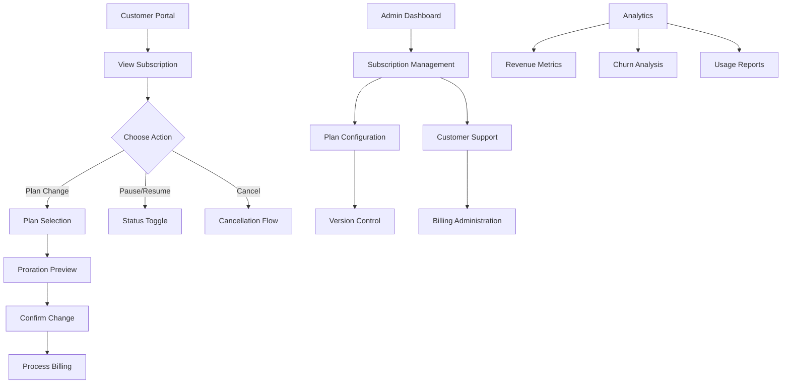

## 1. Product Overview
A comprehensive subscription management system that handles the complete lifecycle of customer subscriptions, from creation to cancellation, with support for plan changes, billing cycles, and customer self-service capabilities. This system enables businesses to manage recurring revenue streams efficiently while providing customers with flexible subscription options.

The product solves the problem of complex subscription billing by automating prorations, handling plan transitions, and providing real-time analytics for revenue optimization. Target users include SaaS businesses, subscription-based services, and any company requiring recurring billing management.

## 2. Core Features

### 2.1 User Roles
| Role | Registration Method | Core Permissions |
|------|---------------------|------------------|
| Customer | Email registration | View/manage own subscriptions, update payment methods, access billing history |
| Business Admin | Admin panel invitation | Manage all subscriptions, configure plans, view analytics, handle customer support |
| Billing Manager | Admin assignment | Manage billing cycles, process refunds, configure pricing tiers |
| Support Agent | Admin assignment | View customer subscriptions, process cancellations, handle billing inquiries |

### 2.2 Feature Module
Our subscription management system consists of the following main pages:
1. **Subscription Dashboard**: Overview of active subscriptions, key metrics, and quick actions.
2. **Plan Management**: Create and configure subscription plans with pricing tiers and features.
3. **Customer Portal**: Self-service interface for customers to manage their subscriptions.
4. **Analytics & Reporting**: Revenue metrics, churn analysis, and subscription health indicators.
5. **Billing Administration**: Handle prorations, refunds, and billing cycle management.

### 2.3 Page Details
| Page Name | Module Name | Feature description |
|-----------|-------------|---------------------|
| Subscription Dashboard | Subscription Overview | Display active subscription count, monthly recurring revenue, churn rate, and growth metrics with real-time updates. |
| Subscription Dashboard | Quick Actions | Provide shortcuts to create new subscriptions, process cancellations, and view pending plan changes. |
| Subscription Dashboard | Subscription List | Show all customer subscriptions with status, plan details, next billing date, and search/filter capabilities. |
| Plan Management | Plan Configuration | Create subscription plans with name, description, pricing tiers, billing intervals, and feature limits. |
| Plan Management | Version Control | Track plan changes over time with version history and migration options for existing subscribers. |
| Plan Management | Pricing Rules | Set up volume discounts, promotional pricing, and regional pricing variations. |
| Customer Portal | Subscription Details | Display current plan, billing history, payment method, and next billing date for customers. |
| Customer Portal | Plan Changes | Allow customers to upgrade/downgrade plans with real-time proration calculations and previews. |
| Customer Portal | Self-Service Actions | Enable subscription pause/resume, cancellation with feedback collection, and payment method updates. |
| Analytics & Reporting | Revenue Analytics | Show monthly recurring revenue, annual recurring revenue, average revenue per user, and growth trends. |
| Analytics & Reporting | Churn Analysis | Display subscription cancellation rates, reasons for churn, and retention cohort analysis. |
| Analytics & Reporting | Usage Metrics | Track feature usage, plan utilization, and upgrade/downgrade patterns. |
| Billing Administration | Proration Management | Calculate and display prorated charges for mid-cycle plan changes with transparent breakdowns. |
| Billing Administration | Refund Processing | Process full or partial refunds with reason tracking and impact on metrics. |
| Billing Administration | Billing Cycles | Configure billing frequencies, align billing dates, and handle billing failures with retry logic. |

## 3. Core Process

### Customer Self-Service Flow
Customers begin at the Customer Portal where they can view their subscription details. From there, they can initiate plan changes, pause/resume subscriptions, or cancel. All changes include real-time proration previews before confirmation. Payment method updates are handled securely through integrated payment processors.

### Business Admin Flow
Admins start at the Subscription Dashboard to get an overview of business health. They can drill down into specific subscriptions, create new plans in Plan Management, or handle customer support requests through the admin interface. Analytics provide insights for business decisions.

### Billing Operations Flow
Billing Managers handle complex billing scenarios like manual refunds, billing cycle adjustments, and usage-based billing calculations. They can override automatic prorations and handle edge cases in billing administration.

## 4. User Interface Design

### 4.1 Design Style
- **Primary Colors**: Deep blue (#1E40AF) for primary actions, green (#10B981) for success states
- **Secondary Colors**: Gray (#6B7280) for secondary text, red (#EF4444) for cancellations
- **Button Style**: Rounded corners (8px radius), clear hover states, loading spinners for async actions
- **Font**: Inter font family, 14px base size, clear hierarchy with 16px and 18px for headers
- **Layout**: Card-based design with consistent spacing (16px grid), top navigation with sidebar for desktop
- **Icons**: Heroicons for consistency, with color coding for different subscription states

### 4.2 Page Design Overview
| Page Name | Module Name | UI Elements |
|-----------|-------------|-------------|
| Subscription Dashboard | Metrics Cards | Large numeric displays with trend indicators, sparkline graphs for time-series data, color-coded status badges. |
| Subscription Dashboard | Data Tables | Sortable columns with status filters, inline actions (edit, pause, cancel), pagination for large datasets. |
| Plan Management | Plan Editor | Multi-step form with validation, pricing calculator sidebar, feature checklist with toggles. |
| Customer Portal | Subscription Card | Clean card layout showing plan details, billing timeline, prominent action buttons with clear CTAs. |
| Analytics & Reporting | Chart Components | Interactive charts with date range selectors, export functionality, drill-down capabilities. |
| Billing Administration | Proration Calculator | Real-time calculation display, itemized breakdown, manual override options with warnings. |

### 4.3 Responsiveness
Desktop-first design approach with responsive breakpoints at 768px and 1024px. Mobile views prioritize essential information with collapsible sections. Touch interactions are optimized with larger tap targets (minimum 44px) and swipe gestures for navigation.

### 4.4 3D Scene Guidance
Not applicable for this subscription management system as it focuses on business logic and data visualization rather than 3D content