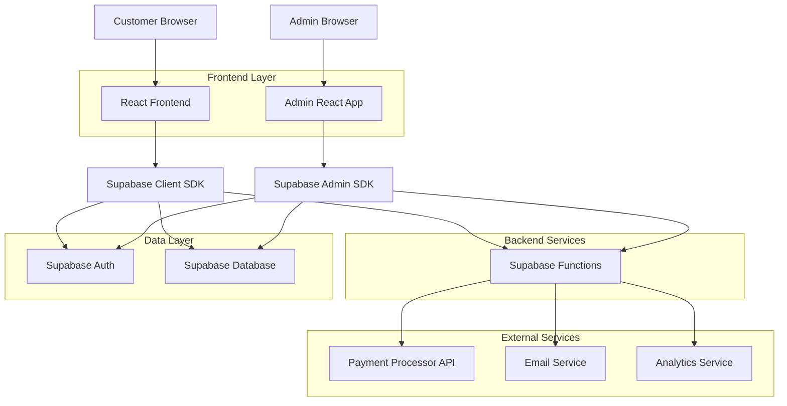
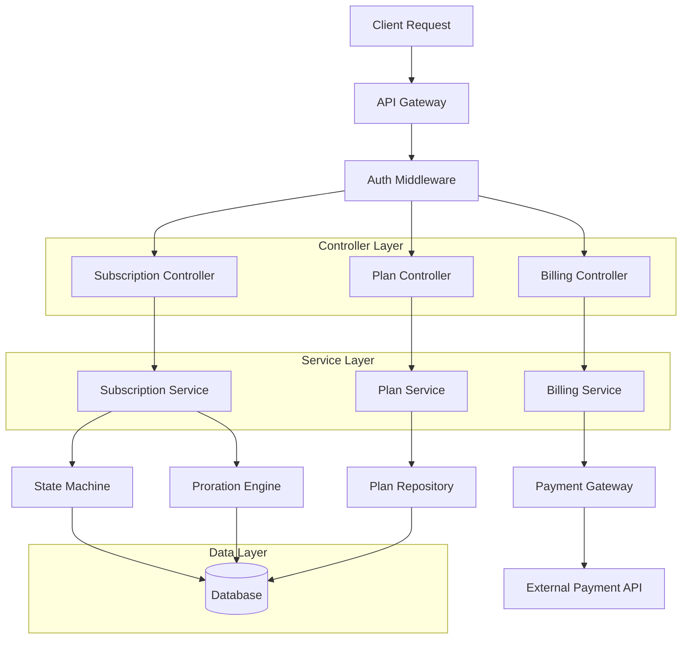
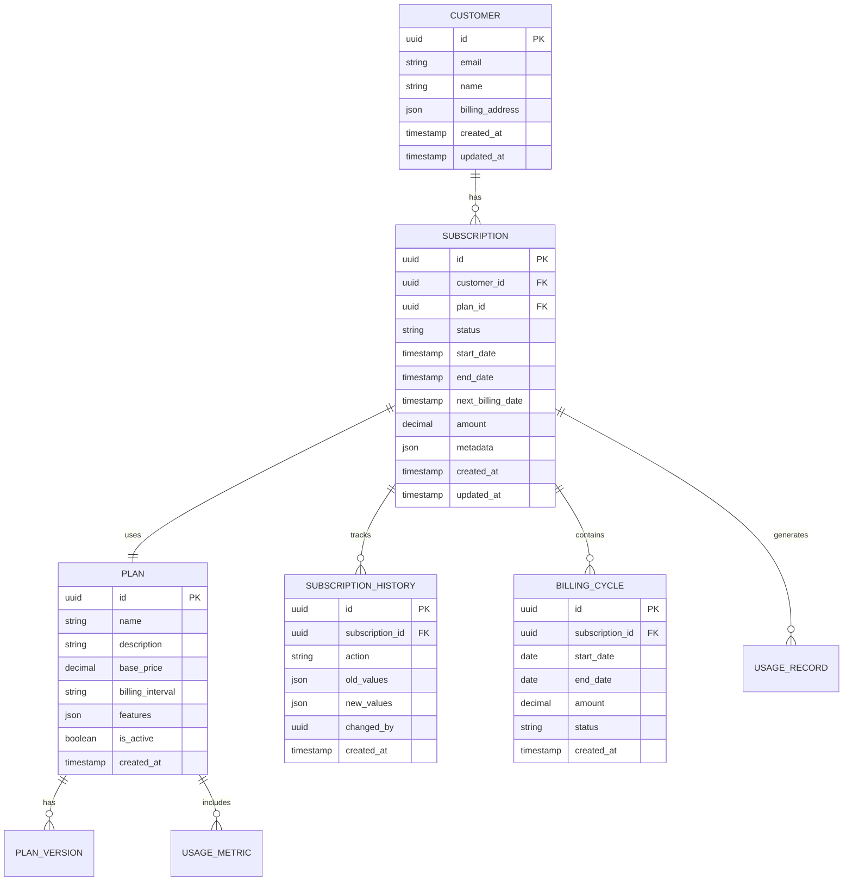
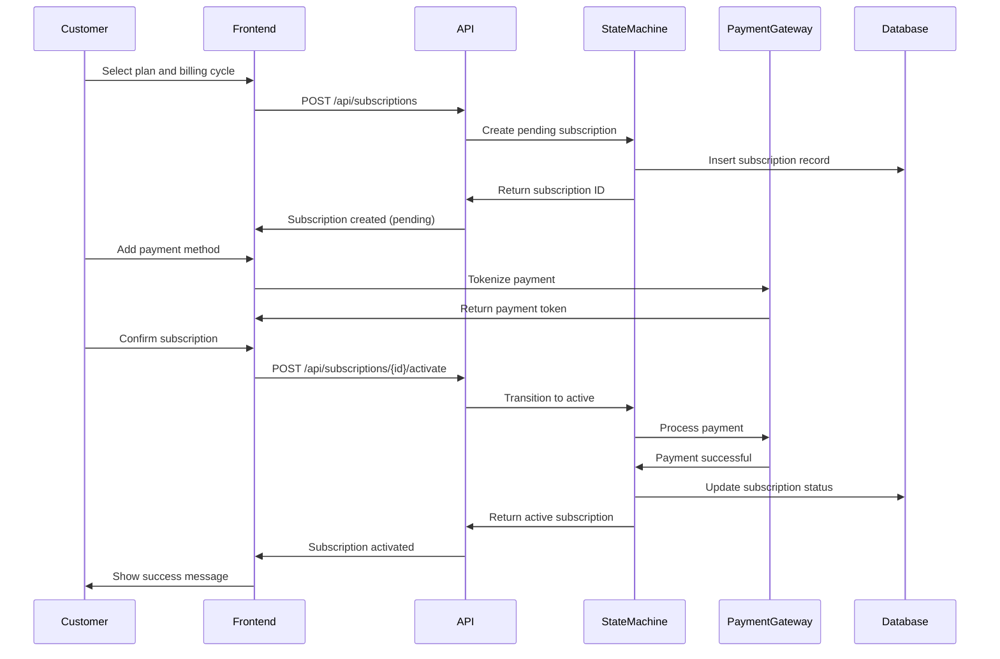
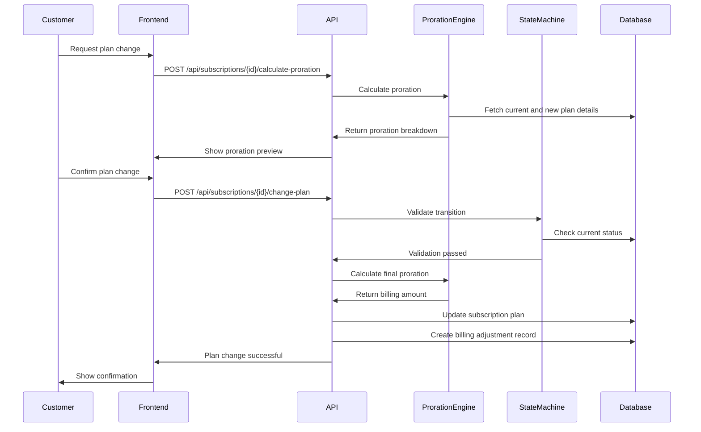

## 1. Architecture Design



## 2. Technology Description

- **Frontend**: React@18 + TypeScript@5 + TailwindCSS@3 + Vite
- **Initialization Tool**: vite-init
- **Backend**: Supabase (PostgreSQL, Authentication, Edge Functions)
- **State Management**: Zustand for client state, React Query for server state
- **Payment Integration**: Stripe SDK for payment processing
- **UI Components**: HeadlessUI + Heroicons
- **Charts**: Recharts for analytics visualization
- **Date Handling**: date-fns for date calculations and formatting

## 3. Route Definitions

| Route | Purpose |
|-------|---------|
| / | Customer portal dashboard |
| /subscriptions | List and manage customer subscriptions |
| /subscriptions/:id | Detailed subscription view with billing history |
| /billing | Payment method management and billing history |
| /admin | Admin dashboard with analytics |
| /admin/subscriptions | Admin view of all subscriptions |
| /admin/plans | Plan management and configuration |
| /admin/analytics | Revenue and churn analytics |
| /auth/login | Customer authentication |
| /auth/register | Customer registration |

## 4. API Definitions

### 4.1 Core API Endpoints

#### Subscription Management
```
POST /api/subscriptions
GET /api/subscriptions/:id
PUT /api/subscriptions/:id
DELETE /api/subscriptions/:id
POST /api/subscriptions/:id/upgrade
POST /api/subscriptions/:id/downgrade
POST /api/subscriptions/:id/pause
POST /api/subscriptions/:id/resume
POST /api/subscriptions/:id/cancel
```

#### Plan Management
```
GET /api/plans
POST /api/plans
PUT /api/plans/:id
GET /api/plans/:id/versions
```

#### Billing Operations
```
POST /api/billing/calculate-proration
POST /api/billing/process-payment
POST /api/billing/refund
GET /api/billing/history/:subscription_id
```

### 4.2 Request/Response Types

#### Create Subscription Request
```typescript
interface CreateSubscriptionRequest {
  customer_id: string;
  plan_id: string;
  billing_cycle: 'monthly' | 'quarterly' | 'annually';
  start_date: string;
  payment_method_id: string;
  coupon_code?: string;
}

interface CreateSubscriptionResponse {
  subscription_id: string;
  status: 'active' | 'pending' | 'failed';
  next_billing_date: string;
  amount: number;
  proration_details?: ProrationBreakdown;
}
```

#### Plan Change Request
```typescript
interface PlanChangeRequest {
  subscription_id: string;
  new_plan_id: string;
  change_type: 'upgrade' | 'downgrade';
  effective_date: 'immediate' | 'next_cycle';
}

interface ProrationBreakdown {
  remaining_days: number;
  unused_amount: number;
  new_plan_amount: number;
  proration_credit: number;
  net_amount: number;
}
```

## 5. Server Architecture Diagram



## 6. Data Model

### 6.1 Entity Relationship Diagram



### 6.2 Data Definition Language

```sql
-- Customers table
CREATE TABLE customers (
    id UUID PRIMARY KEY DEFAULT gen_random_uuid(),
    email VARCHAR(255) UNIQUE NOT NULL,
    name VARCHAR(255) NOT NULL,
    billing_address JSONB,
    created_at TIMESTAMP WITH TIME ZONE DEFAULT NOW(),
    updated_at TIMESTAMP WITH TIME ZONE DEFAULT NOW()
);

-- Subscription plans table
CREATE TABLE plans (
    id UUID PRIMARY KEY DEFAULT gen_random_uuid(),
    name VARCHAR(100) NOT NULL,
    description TEXT,
    base_price DECIMAL(10,2) NOT NULL,
    billing_interval VARCHAR(20) NOT NULL CHECK (billing_interval IN ('monthly', 'quarterly', 'annually')),
    features JSONB DEFAULT '{}',
    is_active BOOLEAN DEFAULT true,
    created_at TIMESTAMP WITH TIME ZONE DEFAULT NOW()
);

-- Subscriptions table with state management
CREATE TABLE subscriptions (
    id UUID PRIMARY KEY DEFAULT gen_random_uuid(),
    customer_id UUID REFERENCES customers(id) ON DELETE CASCADE,
    plan_id UUID REFERENCES plans(id),
    status VARCHAR(50) NOT NULL CHECK (status IN ('active', 'paused', 'cancelled', 'expired', 'pending')),
    start_date TIMESTAMP WITH TIME ZONE NOT NULL,
    end_date TIMESTAMP WITH TIME ZONE,
    next_billing_date TIMESTAMP WITH TIME ZONE,
    amount DECIMAL(10,2) NOT NULL,
    metadata JSONB DEFAULT '{}',
    created_at TIMESTAMP WITH TIME ZONE DEFAULT NOW(),
    updated_at TIMESTAMP WITH TIME ZONE DEFAULT NOW()
);

-- Subscription history for audit trail
CREATE TABLE subscription_history (
    id UUID PRIMARY KEY DEFAULT gen_random_uuid(),
    subscription_id UUID REFERENCES subscriptions(id) ON DELETE CASCADE,
    action VARCHAR(100) NOT NULL,
    old_values JSONB,
    new_values JSONB,
    changed_by UUID REFERENCES customers(id),
    created_at TIMESTAMP WITH TIME ZONE DEFAULT NOW()
);

-- Billing cycles for usage tracking
CREATE TABLE billing_cycles (
    id UUID PRIMARY KEY DEFAULT gen_random_uuid(),
    subscription_id UUID REFERENCES subscriptions(id) ON DELETE CASCADE,
    start_date DATE NOT NULL,
    end_date DATE NOT NULL,
    amount DECIMAL(10,2) NOT NULL,
    status VARCHAR(50) NOT NULL CHECK (status IN ('pending', 'processed', 'failed')),
    created_at TIMESTAMP WITH TIME ZONE DEFAULT NOW()
);

-- Usage metrics for usage-based billing
CREATE TABLE usage_metrics (
    id UUID PRIMARY KEY DEFAULT gen_random_uuid(),
    plan_id UUID REFERENCES plans(id) ON DELETE CASCADE,
    metric_name VARCHAR(100) NOT NULL,
    metric_type VARCHAR(50) NOT NULL CHECK (metric_type IN ('counter', 'gauge', 'histogram')),
    unit_price DECIMAL(10,4),
    free_tier_limit INTEGER DEFAULT 0,
    created_at TIMESTAMP WITH TIME ZONE DEFAULT NOW()
);

-- Usage records for billing calculations
CREATE TABLE usage_records (
    id UUID PRIMARY KEY DEFAULT gen_random_uuid(),
    subscription_id UUID REFERENCES subscriptions(id) ON DELETE CASCADE,
    metric_id UUID REFERENCES usage_metrics(id),
    usage_count INTEGER NOT NULL,
    recorded_at TIMESTAMP WITH TIME ZONE DEFAULT NOW()
);

-- Create indexes for performance
CREATE INDEX idx_subscriptions_customer_id ON subscriptions(customer_id);
CREATE INDEX idx_subscriptions_status ON subscriptions(status);
CREATE INDEX idx_subscriptions_next_billing ON subscriptions(next_billing_date);
CREATE INDEX idx_subscription_history_subscription_id ON subscription_history(subscription_id);
CREATE INDEX idx_billing_cycles_subscription_id ON billing_cycles(subscription_id);

-- Grant permissions
GRANT SELECT ON ALL TABLES TO anon;
GRANT ALL PRIVILEGES ON ALL TABLES TO authenticated;
```

## 7. State Machine Implementation

### 7.1 Subscription State Machine

```typescript
// State machine configuration
enum SubscriptionStatus {
  PENDING = 'pending',
  ACTIVE = 'active',
  PAUSED = 'paused',
  CANCELLED = 'cancelled',
  EXPIRED = 'expired'
}

interface StateTransition {
  from: SubscriptionStatus;
  to: SubscriptionStatus;
  action: string;
  validate: (subscription: Subscription) => boolean;
  execute: (subscription: Subscription, context: any) => Promise<Subscription>;
}

class SubscriptionStateMachine {
  private transitions: StateTransition[] = [
    {
      from: SubscriptionStatus.PENDING,
      to: SubscriptionStatus.ACTIVE,
      action: 'activate',
      validate: (sub) => !!sub.payment_method_id,
      execute: async (sub, context) => {
        // Process initial payment
        const payment = await this.processPayment(sub, context);
        if (payment.success) {
          return this.updateSubscription(sub, { 
            status: SubscriptionStatus.ACTIVE,
            next_billing_date: this.calculateNextBillingDate(sub.start_date, sub.billing_interval)
          });
        }
        throw new Error('Payment failed');
      }
    },
    {
      from: SubscriptionStatus.ACTIVE,
      to: SubscriptionStatus.PAUSED,
      action: 'pause',
      validate: (sub) => sub.status === SubscriptionStatus.ACTIVE,
      execute: async (sub, context) => {
        return this.updateSubscription(sub, { 
          status: SubscriptionStatus.PAUSED,
          paused_at: new Date(),
          pause_reason: context.reason
        });
      }
    },
    {
      from: SubscriptionStatus.PAUSED,
      to: SubscriptionStatus.ACTIVE,
      action: 'resume',
      validate: (sub) => sub.status === SubscriptionStatus.PAUSED,
      execute: async (sub, context) => {
        // Adjust next billing date based on pause duration
        const adjustedBillingDate = this.adjustBillingDateForPause(sub);
        return this.updateSubscription(sub, { 
          status: SubscriptionStatus.ACTIVE,
          next_billing_date: adjustedBillingDate,
          resumed_at: new Date()
        });
      }
    },
    {
      from: SubscriptionStatus.ACTIVE,
      to: SubscriptionStatus.CANCELLED,
      action: 'cancel',
      validate: (sub) => sub.status === SubscriptionStatus.ACTIVE,
      execute: async (sub, context) => {
        // Calculate refund if applicable
        const refund = await this.calculateRefund(sub);
        if (refund.amount > 0) {
          await this.processRefund(sub, refund);
        }
        
        return this.updateSubscription(sub, { 
          status: SubscriptionStatus.CANCELLED,
          cancelled_at: new Date(),
          cancellation_reason: context.reason,
          end_date: context.immediate ? new Date() : sub.next_billing_date
        });
      }
    }
  ];

  async transition(subscription: Subscription, action: string, context: any = {}): Promise<Subscription> {
    const transition = this.transitions.find(t => 
      t.from === subscription.status && t.action === action
    );
    
    if (!transition) {
      throw new Error(`Invalid transition: ${subscription.status} -> ${action}`);
    }
    
    if (!transition.validate(subscription)) {
      throw new Error(`Validation failed for transition: ${action}`);
    }
    
    // Record history before transition
    await this.recordHistory(subscription, action, context);
    
    // Execute transition
    return await transition.execute(subscription, context);
  }
}
```

### 7.2 Proration Engine

```typescript
class ProrationEngine {
  calculateProration(
    currentPlan: Plan,
    newPlan: Plan,
    currentBillingDate: Date,
    effectiveDate: Date,
    billingInterval: string
  ): ProrationBreakdown {
    const daysInCycle = this.getDaysInBillingCycle(billingInterval);
    const remainingDays = this.calculateRemainingDays(currentBillingDate, effectiveDate);
    const usedDays = daysInCycle - remainingDays;
    
    // Calculate unused amount from current plan
    const dailyRateCurrent = currentPlan.base_price / daysInCycle;
    const unusedAmount = dailyRateCurrent * remainingDays;
    
    // Calculate new plan cost for remaining period
    const dailyRateNew = newPlan.base_price / daysInCycle;
    const newPlanCost = dailyRateNew * remainingDays;
    
    // Calculate proration credit
    const prorationCredit = Math.max(0, unusedAmount - newPlanCost);
    const netAmount = newPlanCost - unusedAmount;
    
    return {
      remainingDays,
      unusedAmount: Math.round(unusedAmount * 100) / 100,
      newPlanAmount: Math.round(newPlanCost * 100) / 100,
      prorationCredit: Math.round(prorationCredit * 100) / 100,
      netAmount: Math.round(netAmount * 100) / 100,
      dailyRate: Math.round(dailyRateNew * 100) / 100
    };
  }
  
  private getDaysInBillingCycle(interval: string): number {
    switch (interval) {
      case 'monthly': return 30;
      case 'quarterly': return 90;
      case 'annually': return 365;
      default: return 30;
    }
  }
  
  private calculateRemainingDays(currentBillingDate: Date, effectiveDate: Date): number {
    const timeDiff = currentBillingDate.getTime() - effectiveDate.getTime();
    return Math.ceil(timeDiff / (1000 * 3600 * 24));
  }
}
```

## 8. Workflow Sequences

### 8.1 Subscription Creation Workflow



### 8.2 Plan Change with Proration Workflow



## 9. Usage-Based Billing Integration

```typescript
// Usage tracking service
class UsageTrackingService {
  async recordUsage(
    subscriptionId: string,
    metricName: string,
    usageCount: number,
    timestamp: Date = new Date()
  ): Promise<void> {
    const metric = await this.getUsageMetric(metricName);
    if (!metric) {
      throw new Error(`Usage metric ${metricName} not found`);
    }
    
    await supabase.from('usage_records').insert({
      subscription_id: subscriptionId,
      metric_id: metric.id,
      usage_count: usageCount,
      recorded_at: timestamp
    });
    
    // Check if billing threshold reached
    await this.checkBillingThreshold(subscriptionId, metric);
  }
  
  private async checkBillingThreshold(subscriptionId: string, metric: UsageMetric): Promise<void> {
    const currentUsage = await this.getCurrentPeriodUsage(subscriptionId, metric.id);
    const planLimit = await this.getPlanLimit(subscriptionId, metric.id);
    
    if (currentUsage > planLimit) {
      // Trigger overage billing
      const overageAmount = (currentUsage - planLimit) * metric.unit_price;
      await this.createOverageCharge(subscriptionId, overageAmount, currentUsage - planLimit);
    }
  }
  
  async calculateUsageBill(subscriptionId: string, billingCycleStart: Date, billingCycleEnd: Date): Promise<UsageBilling> {
    const usageMetrics = await this.getSubscriptionMetrics(subscriptionId);
    let totalUsageAmount = 0;
    const usageBreakdown: UsageBreakdownItem[] = [];
    
    for (const metric of usageMetrics) {
      const usage = await this.getUsageForPeriod(subscriptionId, metric.id, billingCycleStart, billingCycleEnd);
      const planLimit = await this.getPlanLimit(subscriptionId, metric.id);
      const overage = Math.max(0, usage - planLimit);
      const overageCost = overage * metric.unit_price;
      
      totalUsageAmount += overageCost;
      
      usageBreakdown.push({
        metric_name: metric.metric_name,
        usage_count: usage,
        plan_limit: planLimit,
        overage_count: overage,
        overage_cost: overageCost
      });
    }
    
    return {
      total_usage_amount: totalUsageAmount,
      breakdown: usageBreakdown,
      billing_period: {
        start: billingCycleStart,
        end: billingCycleEnd
      }
    };
  }
}
```

## 10. Analytics and Reporting Implementation

```typescript
// Analytics service for subscription metrics
class SubscriptionAnalyticsService {
  async getRevenueMetrics(dateRange: DateRange): Promise<RevenueMetrics> {
    const [
      mrr,
      arr,
      newMrr,
      churnedMrr,
      expansionMrr,
      contractionMrr
    ] = await Promise.all([
      this.calculateMRR(dateRange.end),
      this.calculateARR(dateRange.end),
      this.calculateNewMRR(dateRange),
      this.calculateChurnedMRR(dateRange),
      this.calculateExpansionMRR(dateRange),
      this.calculateContractionMRR(dateRange)
    ]);
    
    return {
      monthly_recurring_revenue: mrr,
      annual_recurring_revenue: arr,
      net_mrr_growth: newMrr - churnedMrr + expansionMrr - contractionMrr,
      mrr_churn_rate: churnedMrr / (mrr - newMrr + churnedMrr),
      revenue_growth_rate: (newMrr + expansionMrr - churnedMrr - contractionMrr) / (mrr - newMrr + churnedMrr)
    };
  }
  
  async getChurnAnalysis(dateRange: DateRange): Promise<ChurnAnalysis> {
    const churnedSubscriptions = await this.getChurnedSubscriptions(dateRange);
    const totalActiveSubscriptions = await this.getActiveSubscriptions(dateRange.start);
    
    const churnRate = churnedSubscriptions.length / totalActiveSubscriptions.length;
    const churnReasons = this.analyzeChurnReasons(churnedSubscriptions);
    const cohortAnalysis = await this.performCohortAnalysis(dateRange);
    
    return {
      churn_rate: churnRate,
      churned_subscriptions: churnedSubscriptions.length,
      average_churn_time: this.calculateAverageChurnTime(churnedSubscriptions),
      top_churn_reasons: churnReasons,
      cohort_retention: cohortAnalysis
    };
  }
  
  async getSubscriptionHealth(subscriptionId: string): Promise<SubscriptionHealth> {
    const subscription = await this.getSubscription(subscriptionId);
    const billingHistory = await this.getBillingHistory(subscriptionId);
    const usageData = await this.getUsageData(subscriptionId);
    
    const healthScore = this.calculateHealthScore(subscription, billingHistory, usageData);
    const riskFactors = this.identifyRiskFactors(subscription, billingHistory);
    
    return {
      subscription_id: subscriptionId,
      health_score: healthScore,
      risk_level: this.determineRiskLevel(healthScore),
      risk_factors: riskFactors,
      recommended_actions: this.generateRecommendations(riskFactors),
      predicted_churn_probability: this.predictChurnProbability(subscription, billingHistory, usageData)
    };
  }
  
  private calculateHealthScore(subscription: Subscription, billingHistory: BillingHistory[], usageData: UsageData): number {
    let score = 100;
    
    // Deduct points for payment failures
    const recentFailures = billingHistory.filter(b => 
      b.status === 'failed' && 
      b.created_at > new Date(Date.now() - 30 * 24 * 60 * 60 * 1000)
    );
    score -= recentFailures.length * 15;
    
    // Deduct points for low usage
    if (usageData.utilization_rate < 0.3) {
      score -= 20;
    }
    
    // Deduct points for frequent plan changes
    const recentChanges = subscription.history.filter(h => 
      h.created_at > new Date(Date.now() - 90 * 24 * 60 * 60 * 1000)
    );
    score -= recentChanges.length * 10;
    
    return Math.max(0, score);
  }
}
```

This comprehensive technical architecture provides a complete implementation guide for the Subscription Management submodule with all requested features including lifecycle management, proration handling, usage-based billing, analytics, and customer self-service capabilities.