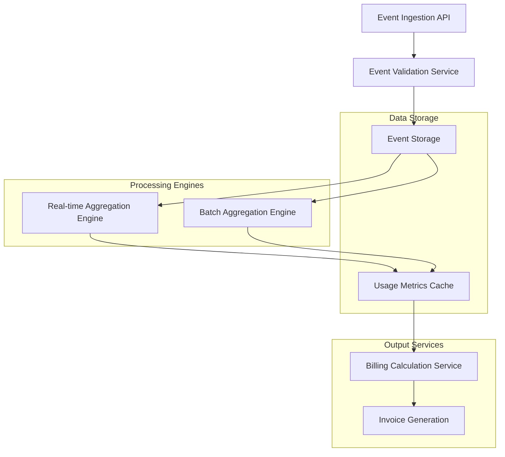
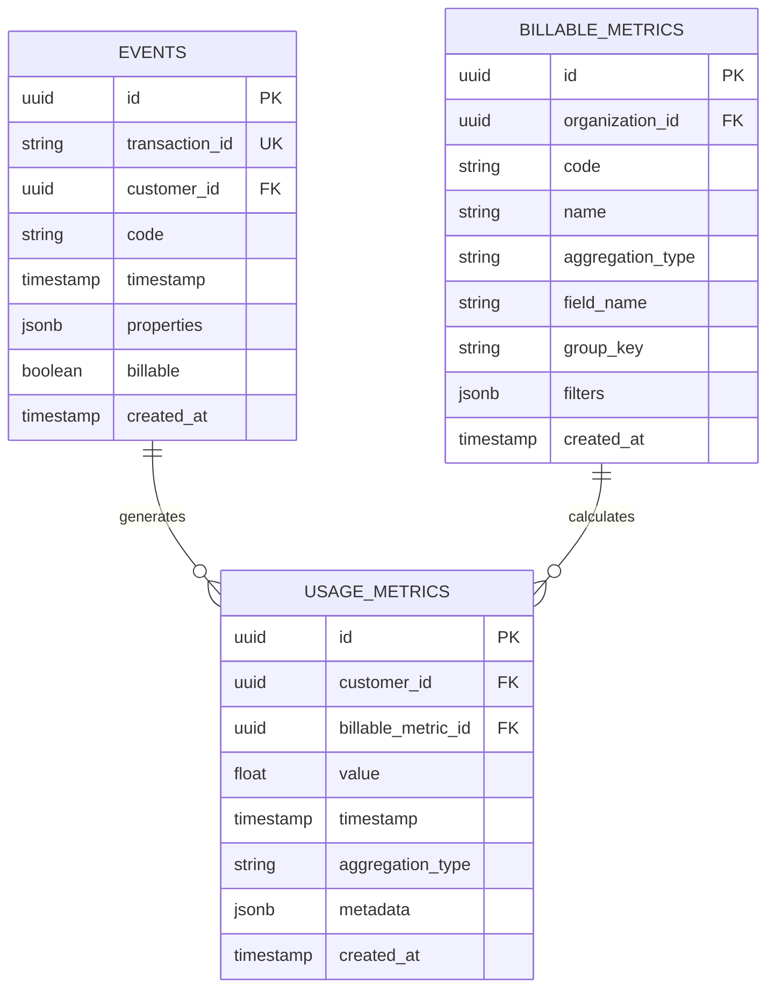

# Usage Metering & Aggregation Technical Architecture

## 1. Architecture Design



## 2. Technology Description

- **Event Processing**: Ruby on Rails API with Kafka streaming
- **Real-time Engine**: Go-based event processor with Redis caching
- **Batch Processing**: Sidekiq workers with PostgreSQL
- **Storage**: PostgreSQL for events, Redis for cached metrics, ClickHouse for analytics
- **Metrics Calculation**: Custom aggregation algorithms with time-window support

## 3. Event Processing Pipeline

### 3.1 Event Ingestion

```ruby
# app/models/event.rb
class Event < ApplicationRecord
  validates :transaction_id, presence: true, uniqueness: true
  validates :customer_id, presence: true
  validates :code, presence: true
  validates :timestamp, presence: true
  validates :properties, presence: true
  
  scope :billable, -> { where(billable: true) }
  scope :within_period, ->(start_date, end_date) { where(timestamp: start_date..end_date) }
  
  def self.process_batch(events)
    events.each do |event|
      EventProcessorJob.perform_async(event.id)
    end
  end
end
```

### 3.2 Event Validation Service

```ruby
# app/services/events/validation_service.rb
module Events
  class ValidationService
    def initialize(event)
      @event = event
    end
    
    def valid?
      validate_transaction_id &&
      validate_customer_exists &&
      validate_code_format &&
      validate_timestamp &&
      validate_properties_schema
    end
    
    private
    
    def validate_transaction_id
      return false if @event.transaction_id.blank?
      !Event.exists?(transaction_id: @event.transaction_id)
    end
    
    def validate_customer_exists
      Customer.exists?(@event.customer_id)
    end
    
    def validate_code_format
      @event.code =~ /^[a-zA-Z0-9_-]+$/
    end
    
    def validate_timestamp
      @event.timestamp <= Time.current && @event.timestamp >= 1.year.ago
    end
    
    def validate_properties_schema
      return false unless @event.properties.is_a?(Hash)
      
      billable_metric = BillableMetric.find_by(code: @event.code)
      return true unless billable_metric
      
      billable_metric.validate_properties(@event.properties)
    end
  end
end
```

## 4. Real-time Aggregation Engine

### 4.1 Go Event Processor

```go
// events-processor/main.go
package main

import (
    "context"
    "encoding/json"
    "log"
    "time"
    
    "github.com/go-redis/redis/v8"
    "github.com/lago/lago/events-processor/models"
)

type EventProcessor struct {
    redisClient *redis.Client
    store       models.EventStore
}

func (ep *EventProcessor) ProcessEvent(ctx context.Context, event models.Event) error {
    // Validate event
    if err := ep.validateEvent(event); err != nil {
        return err
    }
    
    // Store event
    if err := ep.store.StoreEvent(ctx, event); err != nil {
        return err
    }
    
    // Update real-time metrics
    return ep.updateMetrics(ctx, event)
}

func (ep *EventProcessor) updateMetrics(ctx context.Context, event models.Event) error {
    metricKey := ep.generateMetricKey(event)
    
    // Increment counter
    pipe := ep.redisClient.Pipeline()
    pipe.HIncrBy(ctx, metricKey, "count", 1)
    pipe.HIncrBy(ctx, metricKey, "value", event.Value)
    
    // Set expiration
    pipe.Expire(ctx, metricKey, 24*time.Hour)
    
    _, err := pipe.Exec(ctx)
    return err
}

func (ep *EventProcessor) generateMetricKey(event models.Event) string {
    return fmt.Sprintf("metrics:%s:%s:%s:%s",
        event.CustomerID,
        event.Code,
        event.Timestamp.Format("2006-01-02"),
        event.GroupKey,
    )
}
```

### 4.2 Aggregation Algorithms

```go
// events-processor/models/aggregation.go
package models

import (
    "time"
)

type AggregationWindow struct {
    StartTime time.Time
    EndTime   time.Time
    Interval  string // "hour", "day", "week", "month"
}

type MetricAggregator struct {
    store EventStore
}

func (ma *MetricAggregator) AggregateEvents(ctx context.Context, window AggregationWindow, metricCode string) (*AggregatedMetric, error) {
    events, err := ma.store.GetEventsByCodeAndTimeRange(ctx, metricCode, window.StartTime, window.EndTime)
    if err != nil {
        return nil, err
    }
    
    aggregated := &AggregatedMetric{
        MetricCode: metricCode,
        Window:     window,
        StartTime:  window.StartTime,
        EndTime:    window.EndTime,
    }
    
    switch ma.getAggregationType(metricCode) {
    case "sum":
        aggregated.Value = ma.sumAggregation(events)
    case "count":
        aggregated.Value = float64(len(events))
    case "max":
        aggregated.Value = ma.maxAggregation(events)
    case "unique_count":
        aggregated.Value = ma.uniqueCountAggregation(events)
    default:
        aggregated.Value = ma.sumAggregation(events)
    }
    
    return aggregated, nil
}

func (ma *MetricAggregator) sumAggregation(events []Event) float64 {
    var sum float64
    for _, event := range events {
        sum += event.Value
    }
    return sum
}

func (ma *MetricAggregator) maxAggregation(events []Event) float64 {
    var max float64
    for _, event := range events {
        if event.Value > max {
            max = event.Value
        }
    }
    return max
}

func (ma *MetricAggregator) uniqueCountAggregation(events []Event) float64 {
    unique := make(map[string]bool)
    for _, event := range events {
        unique[event.TransactionID] = true
    }
    return float64(len(unique))
}
```

## 5. Batch Processing with Sidekiq

```ruby
# app/jobs/event_aggregation_job.rb
class EventAggregationJob < ApplicationJob
  queue_as :default
  
  def perform(organization_id, start_date, end_date, metric_code = nil)
    organization = Organization.find(organization_id)
    
    metrics = if metric_code
      organization.billable_metrics.where(code: metric_code)
    else
      organization.billable_metrics
    end
    
    metrics.each do |metric|
      aggregate_metric(metric, start_date, end_date)
    end
  end
  
  private
  
  def aggregate_metric(metric, start_date, end_date)
    events = fetch_events(metric, start_date, end_date)
    
    case metric.aggregation_type
    when 'sum'
      aggregate_sum(events, metric)
    when 'count'
      aggregate_count(events, metric)
    when 'max'
      aggregate_max(events, metric)
    when 'unique_count'
      aggregate_unique_count(events, metric)
    end
  end
  
  def fetch_events(metric, start_date, end_date)
    base_query = Event
      .where(code: metric.code)
      .where(timestamp: start_date..end_date)
      .billable
    
    if metric.group?
      base_query = base_query.where("properties @> ?", { metric.group_key => metric.group_value }.to_json)
    end
    
    base_query
  end
  
  def aggregate_sum(events, metric)
    grouped_events = events.group_by { |e| e.customer_id }
    
    grouped_events.each do |customer_id, customer_events|
      total_value = customer_events.sum { |e| extract_value(e, metric) }
      
      UsageMetric.create!(
        customer_id: customer_id,
        billable_metric_id: metric.id,
        value: total_value,
        timestamp: Time.current,
        aggregation_type: 'sum'
      )
    end
  end
  
  def extract_value(event, metric)
    if metric.field_name.present?
      event.properties[metric.field_name]&.to_f || 0
    else
      1.0
    end
  end
end
```

## 6. Usage Metrics Cache Management

```ruby
# app/services/usage_metrics_cache_service.rb
class UsageMetricsCacheService
  CACHE_PREFIX = 'usage_metrics'
  CACHE_TTL = 1.hour
  
  def initialize(customer, metric_code)
    @customer = customer
    @metric_code = metric_code
  end
  
  def get_or_compute(start_date, end_date)
    cache_key = generate_cache_key(start_date, end_date)
    
    cached_value = Redis.current.get(cache_key)
    return JSON.parse(cached_value) if cached_value
    
    computed_value = compute_metric(start_date, end_date)
    Redis.current.setex(cache_key, CACHE_TTL, computed_value.to_json)
    
    computed_value
  end
  
  def invalidate_cache
    pattern = "#{CACHE_PREFIX}:#{@customer.id}:#{@metric_code}:*"
    Redis.current.scan_each(match: pattern) do |key|
      Redis.current.del(key)
    end
  end
  
  private
  
  def generate_cache_key(start_date, end_date)
    "#{CACHE_PREFIX}:#{@customer.id}:#{@metric_code}:#{start_date.to_date}:#{end_date.to_date}"
  end
  
  def compute_metric(start_date, end_date)
    metric = BillableMetric.find_by(code: @metric_code)
    return 0 unless metric
    
    events = Event
      .where(customer_id: @customer.id, code: @metric_code)
      .where(timestamp: start_date..end_date)
      .billable
    
    case metric.aggregation_type
    when 'sum'
      events.sum { |e| extract_value(e, metric) }
    when 'count'
      events.count
    when 'max'
      events.maximum { |e| extract_value(e, metric) } || 0
    when 'unique_count'
      events.distinct.count(:transaction_id)
    else
      0
    end
  end
  
  def extract_value(event, metric)
    if metric.field_name.present?
      event.properties[metric.field_name]&.to_f || 0
    else
      1.0
    end
  end
end
```

## 7. API Definitions

### 7.1 Event Ingestion API

```ruby
# POST /api/v1/events
{
  "event": {
    "transaction_id": "evt_1234567890",
    "customer_id": "cust_abc123",
    "code": "api_calls",
    "timestamp": "2024-01-01T12:00:00Z",
    "properties": {
      "count": 150,
      "region": "us-east-1"
    }
  }
}
```

### 7.2 Usage Query API

```ruby
# GET /api/v1/customers/:id/usage?metric_code=api_calls&start_date=2024-01-01&end_date=2024-01-31
{
  "usage": {
    "metric_code": "api_calls",
    "start_date": "2024-01-01",
    "end_date": "2024-01-31",
    "value": 45230,
    "aggregation_type": "sum",
    "breakdown": [
      {
        "date": "2024-01-01",
        "value": 1250
      },
      {
        "date": "2024-01-02",
        "value": 1380
      }
    ]
  }
}
```

## 8. Data Models



## 9. Performance Optimizations

### 9.1 Database Indexes

```sql
-- Event table indexes
CREATE INDEX idx_events_customer_timestamp ON events(customer_id, timestamp DESC);
CREATE INDEX idx_events_code_timestamp ON events(code, timestamp DESC);
CREATE INDEX idx_events_transaction_id ON events(transaction_id);
CREATE INDEX idx_events_timestamp_billable ON events(timestamp, billable) WHERE billable = true;

-- Usage metrics indexes
CREATE INDEX idx_usage_metrics_customer_metric ON usage_metrics(customer_id, billable_metric_id);
CREATE INDEX idx_usage_metrics_timestamp ON usage_metrics(timestamp DESC);
CREATE INDEX idx_usage_metrics_aggregation_type ON usage_metrics(aggregation_type);
```

### 9.2 Caching Strategy

```ruby
# app/services/usage_optimization_service.rb
class UsageOptimizationService
  def self.warm_cache(organization_id, date_range)
    organization = Organization.find(organization_id)
    
    organization.customers.find_each do |customer|
      organization.billable_metrics.find_each do |metric|
        cache_service = UsageMetricsCacheService.new(customer, metric.code)
        cache_service.get_or_compute(date_range.first, date_range.last)
      end
    end
  end
  
  def self.precompute_daily_usage
    yesterday = Date.yesterday
    
    BillableMetric.find_each do |metric|
      EventAggregationJob.perform_async(
        metric.organization_id,
        yesterday.beginning_of_day,
        yesterday.end_of_day,
        metric.code
      )
    end
  end
end
```

## 10. Monitoring and Alerting

```ruby
# app/services/usage_monitoring_service.rb
class UsageMonitoringService
  def self.monitor_aggregation_performance
    start_time = Time.current
    
    # Monitor event processing time
    events_processed = Event.where('created_at > ?', 1.hour.ago).count
    processing_time = Time.current - start_time
    
    if processing_time > 300 # 5 minutes
      AlertService.send_alert(
        type: 'aggregation_slow',
        message: "Event aggregation is taking too long: #{processing_time}s for #{events_processed} events"
      )
    end
    
    # Monitor cache hit rate
    cache_stats = Redis.current.info('stats')
    hit_rate = cache_stats['keyspace_hits'].to_f / (cache_stats['keyspace_hits'].to_f + cache_stats['keyspace_misses'].to_f)
    
    if hit_rate < 0.8
      AlertService.send_alert(
        type: 'cache_low_hit_rate',
        message: "Cache hit rate is low: #{hit_rate.round(2)}"
      )
    end
  end
end
```